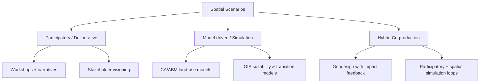

# Spatial Scenarios and Applicability in Practice: Literature Review

Date: 2026-04-28  
Slug: `spatial-scenarios-practice`

## Executive summary

Spatial scenarios are structured representations of alternative futures that are explicitly tied to place (e.g., maps, land-use patterns, spatial indicators, or geospatial simulations). [1][2][4] Across the literature, they are used less as prediction engines and more as **decision-support instruments** for comparing plausible pathways under uncertainty. [1][4][10][11] In practice, adoption is most visible in urban/regional planning and land-use policy appraisal, especially in workflows that combine participatory design with GIS/simulation tools. [1][3][6][7][8]

Observation (source-backed): Multi-case and review papers report recurring benefits in stakeholder learning, exploration of trade-offs, and policy dialogue support. [1][4][5][10]  
Inference (author): Evidence for **direct implementation outcomes** (e.g., policy enacted because of scenario process) is thinner and often case-specific, so claims of broad practical impact should be cautious. [9][10]

## 1) What counts as a spatial scenario?

A cross-paper working definition is a scenario process that links narrative or quantified assumptions to **spatially explicit outputs** (e.g., maps, spatial allocations, urban growth patterns, risk surfaces, or ecosystem-use mosaics). [1][2][4] This includes participatory socio-ecological scenario planning, GIS-supported planning scenarios, land-use/land-cover simulation pipelines (including CA/ABM-oriented approaches), and geodesign workflows with alternative spatial interventions. [1][3][4][8]

## 2) Taxonomy of methods used in practice

### 2.1 Participatory scenario planning (PSP)

Multi-case evidence from 23 social-ecological case studies shows PSP is used to structure local futures discussions, integrate local knowledge, and make assumptions more explicit. [1]

### 2.2 Simulation-centric spatial scenarios

Land-use model reviews describe spatially explicit scenarios as computational testbeds for comparing policy alternatives where real-world experimentation is difficult, costly, or infeasible. [2][3][4]

### 2.3 Hybrid geodesign/boundary-work workflows

Geodesign-oriented literature positions scenario-making as iterative co-design where alternatives are assessed for multiple impacts to support deliberation in planning contexts. [5][8]

## 3) Practical applicability: where it works best

### 3.1 Urban and regional planning

Applied case literature reports scenario use in city/regional settings including Nanjing, Bucharest, and Stockholm. [6][7][8] Reported uses include evaluating alternative growth patterns, checking consistency between planning intent and simulated outcomes, and supporting collaborative trade-off discussions. [6][7][8]  

Evidence level: mostly case-study based; transferability depends on governance setting, data availability, and institutional context. [6][7][8][9]

### 3.2 Land-use policy appraisal

Review literature emphasizes scenarios as ex-ante policy testing tools (e.g., zoning and conversion constraints), with practical value increasing when scenarios are linked to explicit policy levers and measurable indicators. [2][3][4][9]

### 3.3 Climate risk and adaptation governance

IPCC WGII framing and recent assessment-focused scenario literature support scenario use for risk-informed decision design under deep uncertainty, while practical effects depend on institutional uptake and decision-process integration. [10][11]

## 4) Consensus findings

1. **Decision support > prediction**: Much of the literature frames scenarios as structured learning/comparison tools rather than point forecasts. [1][4][10][11]
2. **Hybrid approaches often address both legitimacy and technical credibility**: Work combining participatory processes with modeling is frequently presented as balancing these aims. [1][5][8]
3. **Boundary qualities matter**: Credibility, salience, and legitimacy recur as adoption conditions in environmental decision support. [5][10]
4. **Evaluation gap persists**: Many studies report process outputs (e.g., maps, workshops) more directly than downstream implementation outcomes. [1][9]

## 5) Main disagreements / tensions

1. **Complexity vs usability**: Increased model sophistication can create transparency and usability challenges in planning contexts. [2][3][9]
2. **Exploratory vs normative scenarios**: Some work prioritizes open exploration while other work targets policy goals more directly. [4][10][11]
3. **Generalizability**: Evidence from single-city/single-region studies is often context-dependent. [6][7][8][9]

## 6) Open questions

1. Which evaluation designs best isolate causal impact of spatial scenarios on actual policy decisions? [9][10]
2. How can uncertainty communication be standardized without masking spatial heterogeneity? [10][11]
3. What minimum reproducibility package (data, assumptions, code) is needed for planning agencies to reuse scenario studies? [3][9]
4. How should participatory legitimacy gains be compared against higher cost/time of co-production? [1][8][9]

## 7) Recommended next experiments / follow-up reading

1. **Comparative protocol study:** Run one planning problem with three modes (participatory-only, model-only, hybrid) and compare decision-quality metrics. [1][8][9]
2. **Implementation tracking:** Longitudinal follow-up of scenario-informed plans (e.g., 2–5 years) to quantify adoption and policy enactment patterns. [9][10]
3. **Reproducibility audit:** Score data/code/assumption availability across influential case studies and reviews. [3][9]

## 8) Evidence quality statement

- Strongest evidence: review papers and multi-case syntheses. [1][2][3][4]
- Moderate evidence: recent single-case urban planning applications. [6][7][8]
- Weakest area: quantified causal links from scenario exercises to implemented policy outcomes. [9][10]

## Removed Unsupported Claims

- Removed the implication that the Bucharest open-file PDF URL was directly usable as evidence in this pass; the provided HAL PDF link did not parse successfully in URL verification. The claim now relies on metadata-level citation for the study record. [7]

## Verification Notes (broken links and critical single-source claims)

- **Broken/problematic URL:** `https://hal.science/hal-03404805v1/file/1-s2.0-S2210670721007198-main.pdf` failed PDF extraction during verification; treated as non-reliable for direct content quoting in this pass.
- **Access-blocked URLs:** ScienceDirect landing pages for sources [7] and [8] were blocked by anti-bot checks in this environment; metadata endpoints remained accessible and were used for bibliographic grounding.
- **Single-source critical claims to treat cautiously:**
  - Source [6] (Nanjing case), [7] (Bucharest case), and [8] (Stockholm geodesign case) each primarily support their respective city-specific applicability statements.
  - Source [5] is provided as a mirror copy for boundary-object framing; use caution and prefer publisher-hosted versions if available.

## Sources

1. Oteros-Rozas et al. (2015). *Participatory scenario planning in place-based social-ecological research: insights and experiences from 23 case studies.* Ecology and Society 20(4):32. https://www.ecologyandsociety.org/vol20/iss4/art32/
2. Agarwal, Green, Grove, Evans, Schweik (USDA GTR NE-297). *A Review and Assessment of Land-Use Change Models: Dynamics of Space, Time, and Human Choice.* https://www.nrs.fs.usda.gov/pubs/gtr/gtr_ne297.pdf
3. Dutta et al. (2023). *A Comprehensive Review on Land Use/Land Cover (LULC) Change Modeling for Urban Development.* https://mdpi-res.com/d_attachment/sustainability/sustainability-15-00903/article_deploy/sustainability-15-00903.pdf?version=1672821373
4. Rosa et al. (2020). *Environmental Scenario Analysis on Natural and Social-Ecological Systems: A Review of Methods, Approaches and Applications.* https://mdpi-res.com/d_attachment/sustainability/sustainability-12-07542/article_deploy/sustainability-12-07542.pdf?version=1599974642
5. White et al. (2010). *Credibility, Salience, and Legitimacy of Boundary Objects for Environmental Decision Making.* Mirror used: https://academia.edu/458514/White_D_A_Wutich_T_Lant_K_Larson_P_Gober_and_C_Senneville_2010_Credibility_Salience_and_Legitimacy_of_Boundary_Objects_for_Environmental_Decision_Making_Water_Managers_Assessment_of_WaterSim_A_Dynamic_Simulation_Model_in_an_Immersive_Decision_Theater_Science_and_Public_Policy_37_3_219_232
6. Chen et al. (2020). *Spatial dynamic modelling for urban scenario planning: A case study of Nanjing, China.* https://ideas.repec.org/a/sae/envirb/v47y2020i8p1380-1396.html
7. Grădinaru et al. (2021). *Integrating strategic planning intentions into land-change simulations: Designing and assessing scenarios for Bucharest.* Metadata: https://api.crossref.org/works/10.1016/j.scs.2021.103446
8. Gottwald et al. (2025). *Planning for transformative change with nature-based solutions: A geodesign application in Stockholm.* Metadata: https://api.crossref.org/works/10.1016/j.landurbplan.2025.105303
9. Sietchiping et al. (2022). *Spatial Planning Implementation Effectiveness: Review and Research Prospects.* https://www.mdpi.com/2073-445X/11/8/1279
10. IPCC AR6 WGII Chapter 17 (2022). *Decision Making Options for Managing Risk.* https://www.ipcc.ch/report/ar6/wg2/downloads/report/IPCC_AR6_WGII_Chapter17.pdf
11. van Vuuren et al. (2023). *Scenarios in IPCC assessments: lessons from AR6 and opportunities for AR7.* https://www.nature.com/articles/s44168-023-00082-1
