# Literature Review: Temporality in Planning History in Europe

**Scope:** European planning history and historically informed planning scholarship on temporality, 2015 onward with a few foundational exceptions.

## 1) Executive summary

In the planning history literature, **temporality is usually not treated as a single concept with a fixed definition**. Instead, it appears through a cluster of historically minded terms: **path dependence, palimpsest, historical institutionalism, long-termism, short-termism, transition, continuity, rupture, and temporal governance**. Across the European context, these terms are used to explain how planning institutions evolve, how past spatial decisions sediment into present planning regimes, and how historical sequences shape the range of future planning options.

Three broad conclusions stand out.

1. **Planning history is increasingly being reframed as a temporal rather than purely chronological field.** Recent work asks not only what happened when, but how planning itself organizes time: through reform cycles, plan-making sequences, deadlines, horizons, and governance rhythms.
2. **European planning history is strongly shaped by institutional layering and transnational exchange.** The literature repeatedly returns to long-run processes of policy sedimentation, path dependence, and cross-border circulation of planning ideas.
3. **The key methodological shift is from static historiography toward historical institutionalism, comparative historical analysis, and new spatial-digital methods.** This gives planning history a stronger vocabulary for continuity and change, but it also introduces a risk of overemphasizing institutional persistence at the expense of contingency, conflict, and uneven temporal experience.

A usable working definition from this literature would be:

> **Temporality in planning history is the historically produced organization of planning time across institutions, practices, and territories, including how past decisions persist, how planning sequences unfold, and how actors frame future change through narratives of continuity, rupture, and long-term transition.**

## 2) Scope and approach

### Key questions
- How is temporality defined or implied in planning history and historically informed planning research?
- How do planning historians use time to explain urban development, institutional change, and territorial transformation?
- How do continuity, rupture, transition, and path dependence structure European planning histories?
- How are infrastructure, climate, landscape, and territorial change historicized through temporal concepts?
- What methods are used to study temporality historically?

### Source types prioritized
- Peer-reviewed journal articles and book chapters in planning history, planning theory, and urban history
- European edited volumes and special issues on planning history
- Major European research outputs where they directly address long-term planning, historical institutionalism, or temporal planning reform

### Method note
This is a **curated literature review**, not an exhaustive systematic review. I prioritized sources that explicitly discuss time, temporality, temporal governance, path dependence, or long-term/short-term planning.

## 3) Conceptual map

```mermaid
flowchart TD
  A[Temporality in planning history] --> B[Historical time]
  A --> C[Planning time]
  A --> D[Governance time]
  A --> E[Long-term / short-term]
  A --> F[Continuity / rupture]
  A --> G[Path dependence / layering]
  A --> H[Cross-border / multi-scalar time]
  A --> I[Methods]

  B --> B1[Periodization]
  B --> B2[Legacy / memory]
  B --> B3[Historical sequences]

  C --> C1[Plan-making sequences]
  C --> C2[Deadlines / reform cycles]
  C --> C3[Clock time / pace]

  D --> D1[Institutional time]
  D --> D2[Temporal governance]
  D --> D3[Long-termism / short-termism]

  E --> E1[Fast reforms]
  E --> E2[Slow planning]
  E --> E3[Future horizons]

  F --> F1[Sedimentation]
  F --> F2[Breaks and critical junctures]
  F --> F3[Reorientation]

  G --> G1[Historical institutionalism]
  G --> G2[Palimpsest]
  G --> G3[Self-reinforcement]

  H --> H1[Transnational planning history]
  H --> H2[Territorial cooperation]
  H --> H3[Urban networks]

  I --> I1[Comparative historical analysis]
  I --> I2[Archival research]
  I --> I3[GIS / geospatial methods]
  I --> I4[Discourse analysis]
```

## 4) Main thematic findings

### 4.1 Definitions and conceptualizations of temporality in planning history
The literature rarely offers a single formal definition. Instead, temporality is operationalized through related concepts:

- **State planning as temporal regulation:** Abram’s foundational formulation is that state planning has long served as a means to regulate the passage of time. In this sense, planning is not only spatial ordering but also temporal ordering.
- **Planning time as a governance object:** Parker and Dobson argue that time and temporalities have been under-studied, even though clock time, speed, efficiency, and delay are central to planning practice and reform.
- **Institutional time:** Sorensen and others use historical institutionalism to show how planning institutions produce long-run trajectories, positive feedback, and path dependence.
- **Layered time / palimpsest:** Carter, Larsen, and Olesen use the planning palimpsest metaphor to describe how older planning logics remain visible within newer ones.
- **Reflexive historiography:** Bodenschatz argues that the concept of planning history itself shapes what is seen, ignored, or shaded in historical analysis.

### 4.2 Temporal dimensions of spatial planning and urban development
A recurring historical theme is that **planning systems are built through temporal sequences**:
- emergent reform moments,
- consolidation of institutions,
- later reorientation toward growth or neoliberalization,
- and long-term sedimentation of earlier rules and ideas.

The Danish literature is especially clear on this. The planning palimpsest article reads Danish spatial planning as a layered historical formation: liberalist origins, welfare-state planning, and entrepreneurial/neoliberal reform are not separate eras in a clean sequence, but overlapping layers of meaning and materiality. Similarly, the Danish reform literature shows that planning can be reoriented over a 50-year period while preserving institutional residues.

### 4.3 Historical time, planning time, and governance time
The literature distinguishes, even if implicitly, among three temporal registers:

1. **Historical time** — the long durée of institutional formation, policy sedimentation, and urban transformation.
2. **Planning time** — the time of plan-making, consultation, sequencing, implementation, revision, and delay.
3. **Governance time** — the time of institutional authority, reform cycles, and the alignment or mismatch of scales and mandates.

The European spatial planning literature shows these times often diverge. For example, the ESDP and subsequent Territorial Agenda were meant to coordinate across scales and time horizons, but their effects depended on horizontal and vertical cooperation and on the willingness of member states to align temporal and institutional priorities. In England, Parker and Dobson show that planning reform discourse uses speed, efficiency, and delay to produce a neoliberal “timescape,” while also invoking an idealized “proper time” for planning.

### 4.4 Continuity, rupture, transition, and path dependency
This is probably the strongest conceptual cluster in planning history work.

- **Path dependence** is used to explain why early decisions continue to structure later planning systems, often through self-reinforcing processes.
- **Critical junctures** are moments when policy pathways are opened or closed.
- **Continuity** is not treated as stasis but as repeated reproduction of institutional logics.
- **Rupture** often appears in reform moments, political regime shifts, decentralization, or neoliberalization.
- **Transition** is used when historical trajectories are reoriented rather than fully replaced.

Pinoncely’s Saint-Étienne case is exemplary: a critical event, the first spatial plan, triggered self-reinforcing growth beliefs that persisted despite industrial decline and shrinking-city realities. The result was not simple failure, but path-dependent decentralization and inequality. The literature on transport and planning in European cities similarly asks how historical policies create durable correlations between past and present urban forms.

### 4.5 Temporality in relation to climate, infrastructure, landscapes, and territorial transformation
The planning history perspective increasingly intersects with climate, infrastructure, and landscape history.

- **Infrastructure** is a temporal device because large projects have long lifespans, lock-in effects, and inherited pathways. Historical port-city work shows that 19th-century water and shipping infrastructures created path dependencies that still shape contemporary governance.
- **Landscapes** are historical-temporal formations rather than static backdrops. The Danish palimpsest article makes this explicit by treating planning discourses and materialities as layered through time and space.
- **Climate and environmental change** intensify temporal conflict by forcing planning to manage future uncertainty while dealing with inherited spatial systems.
- **Territorial transformation** is often analyzed through historical institutionalism and comparative historical analysis, especially in EU planning and cohesion contexts.

### 4.6 Long-term vs short-term planning perspectives
A central debate concerns whether planning should be accelerated or slowed down.

The more recent literature is skeptical of a simple “faster is better” position. The London planning article argues that slower, more complex temporalities can protect democratic participation and challenge growth-first reform agendas. The English temporal-governance article goes further, showing that planning reform discourse mobilizes “speed,” “efficiency,” and “delay” politically. In the EU context, long-termism is often presented as a source of legitimacy and strategic coherence, but it can also mask exclusion or technocratic control.

The planning-history implication is that **long-term planning should not be equated with progressive planning**, and **short-term reform should not be equated with adaptability**. The key question is who controls the time horizon and whose future it serves.

### 4.7 Multi-scalar and cross-border historical temporalities
European planning history is especially attentive to transnational circulation, border-crossing, and territorial cooperation.

The European planning history volume stresses that planning in Europe developed through dense networks of experts and institutions, with time-shifted parallels across countries. The port-city chapter on London, Rotterdam, and Hamburg shows how local planning decisions are embedded in global flows of goods, people, and ideas, and how 19th-century infrastructure created durable dependencies. The ESDP legacy piece also shows how European planning depends on horizontal and vertical cooperation across Community, transnational, national, regional, and local levels.

This means temporality is not only national or local. It is also **cross-border**, because planning histories are shaped by transfers, translations, and delayed institutional effects across jurisdictions.

### 4.8 Historical approaches and historiographical methods for studying temporality
Methodologically, the literature moves from purely narrative history to a more explicitly analytical and comparative toolkit.

Common methods include:
- **Historical institutionalism**: tracing path dependence, critical junctures, and institutional layering.
- **Macro comparative historical analysis**: comparing long-run trajectories across places and periods.
- **Archival research**: reconstructing planning debates, plans, and reform cycles.
- **Comparative case studies**: especially for cities, regions, and national planning systems.
- **Discourse analysis**: examining how reforms are narrated as urgent, delayed, or inevitable.
- **Geospatial and digital methods**: emerging work argues that GIS and open data can connect planning history more closely to contemporary planning practice and heritage analysis.

The methodological trend is clear: planning history is moving toward a **more explicit theory of time** and a **more mixed toolkit** for studying change over time.

## 5) Major debates and recurring authors

### Recurring authors
- **André Sorensen** — historical institutionalism, path dependence, planning history theory
- **Andreas Faludi** — European spatial planning, historical development of EU spatial policy
- **Max Welch Guerra** — historiography of European planning, reflexive planning history
- **Harald Bodenschatz** — planning history as a reflexive concept
- **Stephen Ward** — European planning tradition, transnational planning history
- **Carola Hein** — transnational planning history, port-city regions, mapping
- **Helen Carter / Kristian Olesen / Henrik Gutzon Larsen** — planning palimpsest and Danish spatial planning history
- **Victoria Pinoncely** — historical planning processes, path dependence, shrinking cities
- **George Parker / Mike Dobson** — temporal governance, speed, delay, and planning reform
- **Lucía Cerrada Morato / Agnieszka Zimnicka / Judi Wilson** — temporalities in planning reform

### Major debates
1. **Is planning history mainly descriptive or theory-generating?**
   The recent literature says it should be theory-generating, especially through historical institutionalism and comparative historical analysis.

2. **Does planning history overstate continuity?**
   Path dependence is useful, but it can flatten rupture, conflict, and agency unless used carefully.

3. **Is speed a planning virtue?**
   The answer in recent European planning scholarship is: not automatically. Speed can reduce participation and reinforce growth-first agendas.

4. **How European is European planning history?**
   There is a persistent tension between national planning historiographies and transnational or European frames.

5. **Can planning history handle digital and spatial methods without losing interpretive depth?**
   Emerging work suggests yes, but only if geospatial tools are combined with archival and interpretive analysis.

## 6) Definitions and usages of temporality

The literature uses temporality in several ways:

- **As duration:** how long planning processes, institutional arrangements, or urban transformations persist.
- **As sequence:** the ordering of events, reforms, and plan cycles.
- **As layering:** how older planning logics survive in newer ones.
- **As pace:** speed, delay, acceleration, and waiting.
- **As horizon:** the future orientation of plans and the political value attached to long-term goals.
- **As historicity:** the relation between planning concepts and their historical contexts.
- **As governance technique:** deadlines, reform timetables, consultation windows, and implementation schedules.

A practical synthesis is that temporality in planning history is used both **analytically** and **normatively**:
- analytically, to explain continuity and change;
- normatively, to judge whether planning gives enough time for participation, adaptation, and justice.

## 7) Gaps and emerging trends

### Gaps
- **No single settled definition of temporality in planning history.** The term remains dispersed across adjacent concepts.
- **Too much emphasis on institutional continuity can obscure conflict and contingency.**
- **European planning historiography remains unevenly transnational.** National case studies still dominate.
- **Temporal experience is under-studied.** The literature tells us a lot about institutional time, but less about lived waiting, speed, or generational difference in planning history.
- **Climate and ecological temporality are still only partially integrated into planning history.**
- **Digital methods are promising but under-developed.**

### Emerging trends
- **Historical institutionalism as a core planning-history method**
- **Planning history as reflexive historiography**
- **Transnational and port-city histories**
- **Palimpsest and layering metaphors**
- **Temporal governance and reform-speed debates**
- **Open-data / GIS-based longitudinal methods**

## 8) Implications for a theoretical framework

A strong theoretical framework on planning-history temporality in Europe can be organized around four propositions:

1. **Planning is a temporal ordering practice.** It sequences futures, allocates waiting, and stabilizes institutional rhythms.
2. **Planning history is layered and path dependent.** Past planning decisions remain active through institutions, infrastructures, and territorial forms.
3. **Temporalities are scalar and relational.** Local, national, EU, and transnational planning times interact and often conflict.
4. **Historical analysis should distinguish between institutional time and lived time.** Planning systems have their own tempos, but groups and places experience those tempos unevenly.

This yields a framework that can connect **historical institutionalism**, **planning historiography**, and **urban governance** without reducing temporality to mere chronology.

## 9) Selected source review

### 1. Abram, S. (2014). *The time it takes: Temporalities of planning.* Journal of the Royal Anthropological Institute, 20(S1), 129–147. https://doi.org/10.1111/1467-9655.12097
- **Short summary:** Foundational statement that state planning has long regulated the passage of time.
- **Key concepts/arguments:** planning as temporal regulation; multiple conflicts and doubts around planning time.
- **Definition / usage of temporality:** temporality as the socially and politically managed passage of time.
- **Relevance to planning history and governance:** foundational for understanding planning as temporal ordering.
- **Methodology:** anthropological/conceptual discussion.

### 2. Adams, D., Larkham, P. J., & Pain, K. (2015). *Re-evaluating the place of urban planning history.* Town Planning Review, 86(4), 373–379. https://doi.org/10.3828/tpr.2015.24
- **Short summary:** Calls for planning history to be re-evaluated in an era of globalization.
- **Key concepts/arguments:** territorial fixing, place-shaping, intercity relations, metropolitan porosity.
- **Definition / usage of temporality:** temporality is implied through legacy, changing urban relations, and historical relevance.
- **Relevance to planning history and governance:** strong, especially for linking legacy to present urban governance.
- **Methodology:** viewpoint/commentary.

### 3. Sorensen, A. (2015). *Taking path dependence seriously: An historical institutionalist research agenda in planning history.* Planning Perspectives, 30(1), 17–38. https://doi.org/10.1080/02665433.2014.927226
- **Short summary:** Argues that historical institutionalism offers planning history a strong framework for continuity and change.
- **Key concepts/arguments:** institutions, path dependence, positive feedback, critical junctures, continuity/change.
- **Definition / usage of temporality:** temporality as institutional sequencing and long-run feedback.
- **Relevance to planning history and governance:** central; makes historical time analytically productive for planning research.
- **Methodology:** historical institutionalist research agenda.

### 4. Carter, H., Larsen, H. G., & Olesen, K. (2015). *A Planning Palimpsest: Neoliberal Planning in a Welfare State Tradition.* European Journal of Spatial Development, 13(3), 1–20. https://doi.org/10.5281/zenodo.5141267
- **Short summary:** Reads Danish spatial planning as layered over time from liberalist to welfare-state to neoliberal forms.
- **Key concepts/arguments:** palimpsest, sedimentation, welfare state, neoliberalization.
- **Definition / usage of temporality:** temporality as layered historical-geographical sedimentation.
- **Relevance to planning history and governance:** very strong for explaining institutional persistence and transformation.
- **Methodology:** historical-interpretive analysis.

### 5. Laurian, L., & Inch, A. (2019). *On Time and Planning: Opening Futures by Cultivating a “Sense of Now”.* Journal of Planning Literature, 34(4), 382–400. https://doi.org/10.1177/0885412218817775
- **Short summary:** Reviews multiple temporalities in planning and argues for a more reflective relation to time.
- **Key concepts/arguments:** clock time, acceleration, Anthropocene, past/present/future relations.
- **Definition / usage of temporality:** multiple temporalities through which lives are lived; planning should cultivate a “sense of now.”
- **Relevance to planning history and governance:** important bridge between history, planning theory, and futures.
- **Methodology:** interdisciplinary conceptual review.

### 6. Looking back to look forward: Reflecting on the legacy and future of the European spatial development perspective. (2020). Transactions of the Association of European Schools of Planning, 4(2), 95–98. https://doi.org/10.24306/TrAESOP.2020.02.001
- **Short summary:** Reflects on the ESDP as a long-run European planning reference point.
- **Key concepts/arguments:** multilevel cooperation, subsidiarity, territorial cooperation, policy legacy.
- **Definition / usage of temporality:** temporality as policy legacy and retrospective/future reflection.
- **Relevance to planning history and governance:** strong for EU spatial planning history.
- **Methodology:** editorial / reflective synthesis.

### 7. Welch Guerra, M. (2022). *Introduction: The Continent of Urban Planning and Its Changing Historiography.* In European Planning History in the 20th Century: A Continent of Urban Planning. https://www.taylorfrancis.com/chapters/oa-edit/10.4324/9781003271666-1/european-planning-history-changing-historiography-max-welch-guerra
- **Short summary:** Frames European planning history as a transnational field with time-shifted parallels and strong international networks.
- **Key concepts/arguments:** changing historiography, Anglo-Saxon bias, expert networks, European field formation.
- **Definition / usage of temporality:** temporality as comparative historical development across countries.
- **Relevance to planning history and governance:** strong, especially for historiography and Europe-wide comparison.
- **Methodology:** historiographical introduction.

### 8. Bodenschatz, H. (2022). *European Planning History in the 20th Century as a Reflexive Concept.* In European Planning History in the 20th Century: A Continent of Urban Planning. https://www.taylorfrancis.com/chapters/oa-edit/10.4324/9781003271666-22/european-planning-history-20th-century-reflexive-concept-harald-bodenschatz
- **Short summary:** Argues that the concept of planning history itself shapes what is seen and ignored.
- **Key concepts/arguments:** reflexivity, concept formation, historiographic choice.
- **Definition / usage of temporality:** temporality appears through how the field periodizes and conceptualizes its object.
- **Relevance to planning history and governance:** very strong for historiography.
- **Methodology:** conceptual-historiographic reflection.

### 9. Hein, C. (2022). *Mapping Transnational Planning History in Port City Regions – London, Rotterdam, Hamburg.* In European Planning History in the 20th Century: A Continent of Urban Planning. https://www.taylorfrancis.com/chapters/oa-edit/10.4324/9781003271666-24/mapping-transnational-planning-history-port-city-regions-london-rotterdam-hamburg-carola-hein
- **Short summary:** Shows how port-city planning is shaped by global flows and 19th-century infrastructural path dependencies.
- **Key concepts/arguments:** port cities, transnational urbanism, infrastructure, path dependence, territorial justice.
- **Definition / usage of temporality:** temporality as long-run infrastructural legacy and transnational historical sequence.
- **Relevance to planning history and governance:** strong for cross-border and multi-scalar historical temporalities.
- **Methodology:** comparative historical mapping.

### 10. Pinoncely, V. (2022). *Uneven Trajectories and Decentralisation: Lessons From Historical Planning Processes in Saint-Étienne.* Urban Planning, 7(3), 63–74. https://doi.org/10.17645/up.v7i3.5483
- **Short summary:** Uses path dependence to explain why planning strategies failed to adapt to urban shrinkage.
- **Key concepts/arguments:** critical event, self-reinforcing processes, decentralization, inequality.
- **Definition / usage of temporality:** temporality as historical sequence and self-reinforcing planning pathways.
- **Relevance to planning history and governance:** very strong for historical planning process analysis.
- **Methodology:** historical institutionalist case study.

### 11. Dobson, M., & Parker, G. (2025). *The temporal governance of planning in England: planning reform, Uchronia and ‘Proper Time'.* Planning Theory, 24(1), 21–42. https://doi.org/10.1177/14730952241226570
- **Short summary:** Shows how English planning reform mobilizes speed, efficiency, and delay as political framings.
- **Key concepts/arguments:** clock time, speed, efficiency, delay, neoliberal timescaping, proper time.
- **Definition / usage of temporality:** temporality as governance through the management of clock time and reform timing.
- **Relevance to planning history and governance:** strong, especially for contemporary historical interpretation.
- **Methodology:** planning theory and temporal analysis.

### 12. Parker, G., & Dobson, M. (2025). *Time and the ‘temporal turn’ in planning theory and practice: an agenda.* Town Planning Review. https://doi.org/10.3828/tpr.2025.35
- **Short summary:** Calls for stronger research on time and temporalities in planning theory and practice.
- **Key concepts/arguments:** temporal turn, planning and urban governance, research agenda.
- **Definition / usage of temporality:** temporality as under-researched but necessary for planning inquiry.
- **Relevance to planning history and governance:** strong agenda-setting piece.
- **Methodology:** commentary / research agenda.

### 13. van Mil, Y., Hein, C. M., & Baptist, V. (2025). *The potential of geospatial technologies and open data in planning history.* Planning Perspectives. https://doi.org/10.1080/02665433.2025.2561881
- **Short summary:** Argues that digital and geospatial tools can connect planning history more closely to contemporary planning and heritage methods.
- **Key concepts/arguments:** open data, GIS, longitudinal analysis, spatial-temporal comparison.
- **Definition / usage of temporality:** temporality as multi-temporal spatial evidence and change over time.
- **Relevance to planning history and governance:** strong methodological relevance.
- **Methodology:** digital humanities / geospatial historical analysis.

### 14. Olesen, K., & Carter, H. (2017). *Planning as a barrier for growth: Analysing storylines on the reform of the Danish Planning Act.* Environment and Planning C: Politics and Space, 36(4), 679–695. https://doi.org/10.1177/2399654417719285
- **Short summary:** Shows how planning reform is narrated through growth/anti-growth storylines.
- **Key concepts/arguments:** barriers to growth, reform storylines, rural Denmark, spatial critique.
- **Definition / usage of temporality:** temporality is implicit in reform narratives that frame planning as outdated or in need of acceleration.
- **Relevance to planning history and governance:** strong for long-term vs short-term reform debates.
- **Methodology:** discourse analysis.

### 15. Melman, P., Kaufmann, V., Pattaroni, L., & Jemelin, C. (2009). *How Does Urban Public Transport Change Cities? Correlations between Past and Present Transport and Urban Planning Policies.* Urban Studies, 46(7), 1421–1439. https://doi.org/10.1177/0042098009104572
- **Short summary:** Foundational European historical case study asking whether urban policies show path dependencies.
- **Key concepts/arguments:** correlations between past and present policies, historical archives, urban change.
- **Definition / usage of temporality:** temporality as historical correlation and dependency across policy eras.
- **Relevance to planning history and governance:** foundational for methods and path-dependence reasoning.
- **Methodology:** archival comparative historical study of six European cities.

## 10) Bottom line

For planning history in Europe, temporality is best treated as a **framework for understanding how planning institutions endure, adapt, and reorient over time**. The field’s strongest analytic tools are historical institutionalism, palimpsest/layering, comparative historical analysis, and transnational historiography. The main unresolved issue is how to connect **institutional time** with **lived temporal experience** and with the increasingly urgent temporal politics of climate, infrastructure, and territorial transformation.

## Sources

- Abram, S. (2014). *The time it takes: Temporalities of planning.* Journal of the Royal Anthropological Institute, 20(S1), 129–147. https://doi.org/10.1111/1467-9655.12097
- Adams, D., Larkham, P. J., & Pain, K. (2015). *Re-evaluating the place of urban planning history.* Town Planning Review, 86(4), 373–379. https://doi.org/10.3828/tpr.2015.24
- Sorensen, A. (2015). *Taking path dependence seriously: An historical institutionalist research agenda in planning history.* Planning Perspectives, 30(1), 17–38. https://doi.org/10.1080/02665433.2014.927226
- Carter, H., Larsen, H. G., & Olesen, K. (2015). *A Planning Palimpsest: Neoliberal Planning in a Welfare State Tradition.* European Journal of Spatial Development, 13(3), 1–20. https://doi.org/10.5281/zenodo.5141267
- Laurian, L., & Inch, A. (2019). *On Time and Planning: Opening Futures by Cultivating a “Sense of Now”.* Journal of Planning Literature, 34(4), 382–400. https://doi.org/10.1177/0885412218817775
- *Looking back to look forward: Reflecting on the legacy and future of the European spatial development perspective.* (2020). Transactions of the Association of European Schools of Planning, 4(2), 95–98. https://doi.org/10.24306/TrAESOP.2020.02.001
- Welch Guerra, M. (2022). *Introduction: The Continent of Urban Planning and Its Changing Historiography.* In *European Planning History in the 20th Century: A Continent of Urban Planning.* https://www.taylorfrancis.com/chapters/oa-edit/10.4324/9781003271666-1/european-planning-history-changing-historiography-max-welch-guerra
- Bodenschatz, H. (2022). *European Planning History in the 20th Century as a Reflexive Concept.* In *European Planning History in the 20th Century: A Continent of Urban Planning.* https://www.taylorfrancis.com/chapters/oa-edit/10.4324/9781003271666-22/european-planning-history-20th-century-reflexive-concept-harald-bodenschatz
- Hein, C. (2022). *Mapping Transnational Planning History in Port City Regions – London, Rotterdam, Hamburg.* In *European Planning History in the 20th Century: A Continent of Urban Planning.* https://www.taylorfrancis.com/chapters/oa-edit/10.4324/9781003271666-24/mapping-transnational-planning-history-port-city-regions-london-rotterdam-hamburg-carola-hein
- Pinoncely, V. (2022). *Uneven Trajectories and Decentralisation: Lessons From Historical Planning Processes in Saint-Étienne.* Urban Planning, 7(3), 63–74. https://doi.org/10.17645/up.v7i3.5483
- Dobson, M., & Parker, G. (2025). *The temporal governance of planning in England: planning reform, Uchronia and ‘Proper Time'.* Planning Theory, 24(1), 21–42. https://doi.org/10.1177/14730952241226570
- Parker, G., & Dobson, M. (2025). *Time and the ‘temporal turn’ in planning theory and practice: an agenda.* Town Planning Review. https://doi.org/10.3828/tpr.2025.35
- van Mil, Y., Hein, C. M., & Baptist, V. (2025). *The potential of geospatial technologies and open data in planning history.* Planning Perspectives. https://doi.org/10.1080/02665433.2025.2561881
- Olesen, K., & Carter, H. (2017). *Planning as a barrier for growth: Analysing storylines on the reform of the Danish Planning Act.* Environment and Planning C: Politics and Space, 36(4), 679–695. https://doi.org/10.1177/2399654417719285
- Melman, P., Kaufmann, V., Pattaroni, L., & Jemelin, C. (2009). *How Does Urban Public Transport Change Cities? Correlations between Past and Present Transport and Urban Planning Policies.* Urban Studies, 46(7), 1421–1439. https://doi.org/10.1177/0042098009104572

### Foundational background used in interpretation
- Faludi, A., & Waterhout, B. (2002). *The Making of the European Spatial Development Perspective: No Masterplan.* Routledge.
- Faludi, A. (2009). *Centenary paper: European spatial planning: past, present and future.* Town Planning Review, 80(1), 1–20. https://doi.org/10.3828/tpr.2009.21
- Adams, D., Larkham, P. J., & Pain, K. (2015). *Re-evaluating the place of urban planning history.* Town Planning Review, 86(4), 373–379. https://doi.org/10.3828/tpr.2015.24
