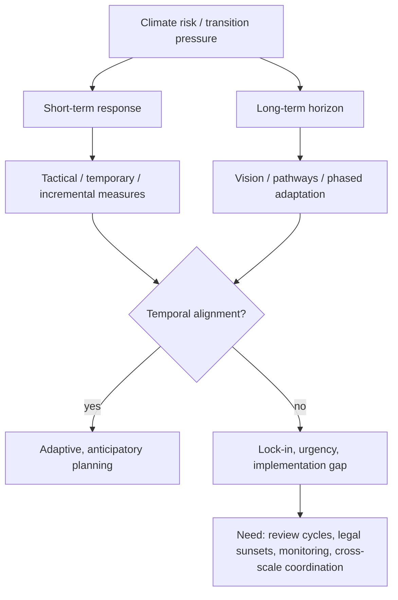

# Temporality, climate, and spatial planning/design in Europe

## Scope and method
This review covers literature from **2015 onward**, with one **foundational pre-2015 source** (BBSR 2010) retained because it is a key spatial-planning reference for European adaptation policy.

Evidence base used here:
- peer-reviewed articles and book chapters located through web search and Crossref metadata
- major European reports and official policy pages
- direct article/report pages where available

**Important limitation:** alphaXiv paper search was unavailable in this session because alpha login was not active. I therefore relied on accessible primary sources, direct pages, and Crossref metadata rather than alpha-backed retrieval.

## Executive synthesis
The literature converges on a simple but important claim: **climate planning is a temporal problem as much as a spatial one**. European planning systems are repeatedly shown to operate on shorter political and statutory timeframes than the lifecycles of infrastructure, landscapes, and climate risk. Across the literature, temporality is described through several overlapping lenses: **rhythms**, **timescapes**, **lifecycles**, **windows of opportunity**, **adaptive pathways**, **legal review cycles**, and **temporal resilience**.

Four patterns stand out:

1. **Static planning versus dynamic change.** Urban design and land-use planning still tend to assume stable futures, while climate change produces continuous, uneven, and uncertain change.
2. **Implementation over adoption.** Many cities have adaptation plans, but monitoring, participation, prioritisation, and evaluation remain weak; time is often handled as a publication date rather than as a design problem.
3. **Infrastructure and delta systems have long temporalities.** Flood protection, coastal systems, and land-sea interfaces require long-horizon, phased, and reversible decisions that exceed electoral cycles.
4. **Governance mismatch is the central bottleneck.** Institutional coordination exists, but it is frequently too weak to realign short-term decision rules with long-term climate trajectories.

The emerging theoretical direction is toward a framework in which planning is understood as **the governance of change over time** rather than the allocation of space once and for all.

### Suggested theoretical framework dimensions
A useful framework for temporality, climate, and spatial planning/design should include at least seven dimensions:
- **Temporal horizon**: short / medium / long term
- **Temporal object**: building, district, infrastructure, landscape, delta, basin, institution
- **Temporal operation**: anticipate, phase, sequence, iterate, review, retreat, defer
- **Temporal scale**: site, city, region, cross-border, sea basin
- **Governance mode**: dedicated plan, mainstreaming, adaptive governance, polycentric coordination
- **Temporal conflict type**: lock-in, urgency, mismatch, depoliticisation, path dependence
- **Justice dimension**: whose time, whose risk, whose future, and who bears transition costs

## Source annotations

### A. Temporality in spatial design and planning

#### 1) Wunderlich, Filipa Matos. 2023. *Time and temporality in urban design*. In *Temporal Urban Design*.
URL: https://doi.org/10.4324/9781315600581-3
- **Short summary:** A foundational conceptual chapter for thinking about urban design through time, rhythm, and place.
- **Key concepts/arguments:** place-time relations, rhythms, atmosphere, temporality as a design variable.
- **Relevance:** Gives the review a design-side vocabulary; useful for showing that temporality is not only a governance issue but also a spatial/design issue.
- **Methodology:** theoretical / conceptual chapter.

#### 2) Monstadt, Jochen. 2022. *Urban and Infrastructural Rhythms and the Politics of Temporal Alignment*. *Journal of Urban Technology* 29(1): 69–77.
URL: https://doi.org/10.1080/10630732.2021.2007205
- **Short summary:** Argues that infrastructures actively shape urban temporalities and that aligning or realigning rhythms is a political process.
- **Key concepts/arguments:** infrastructural rhythms, temporal alignment, power, urban temporality.
- **Relevance:** Strong for explaining how infrastructure produces temporal lock-in and why planning must address rhythm mismatch.
- **Methodology:** conceptual article.

#### 3) Egerer, Monika et al. 2021. *Urban change as an untapped opportunity for climate adaptation*. *npj Urban Sustainability* 1.
URL: https://doi.org/10.1038/s42949-021-00024-y
- **Short summary:** Treats active urban change as an adaptation opportunity rather than only a hazard response.
- **Key concepts/arguments:** SETS change, windows of opportunity, incremental change, adaptation through transformation.
- **Relevance:** Important for short-term vs long-term planning because it reframes moments of change as temporal openings for adaptation.
- **Methodology:** conceptual synthesis.

#### 4) Krishnan, Supriya; Aydin, Nazli Yonca; Comes, Tina. 2024. *TIMEWISE: Temporal Dynamics for Urban Resilience - theoretical insights and empirical reflections from Amsterdam and Mumbai*. *npj Urban Sustainability*.
URL: https://doi.org/10.1038/s42949-024-00140-5
- **Short summary:** Develops a framework of endogenous and exogenous temporal dynamics and tests it in Amsterdam and Mumbai.
- **Key concepts/arguments:** timescapes, endogenous lifecycles, exogenous drivers, short-/medium-/long-term planning, temporal flexibility.
- **Relevance:** Probably the single strongest directly relevant source for a temporality framework in climate-resilient planning.
- **Methodology:** conceptual framework + multi-case qualitative analysis.

#### 5) Cerrada Morato, Lucía; Zimnicka, Agnieszka; Wilson, Judi. 2025. *Temporalities for, of, and in Planning: Exploring Post-Growth, Participation, and Devolution Across European Planning Reforms*. *Urban Planning*.
URL: https://doi.org/10.17645/up.9121
- **Short summary:** Shows that planning reforms mobilise time strategically and relationally, often to depoliticise consensus and advance regressive agendas.
- **Key concepts/arguments:** relational temporalities, speed-up, consensus-building, post-growth, participation, devolution.
- **Relevance:** Highly useful for governance temporalities and for showing that “faster planning” is not inherently progressive.
- **Methodology:** comparative analysis across three European countries.

#### 6) Marušić, Damjan; Goličnik Marušić, Barbara. 2026. *Planning in Time: Temporal Resilience and the Governance of Urban Land Use Change*. *Land* 15(5): 780.
URL: https://doi.org/10.3390/land15050780
- **Short summary:** Recasts land-use planning as governance of land-use change over time.
- **Key concepts/arguments:** temporal resilience, land-use change, dynamic urban form, time quality assessment.
- **Relevance:** Helps turn “temporality” into a core principle of spatial planning theory rather than a side issue.
- **Methodology:** conceptual/theoretical synthesis.

### B. Climate adaptation, resilience, and transition planning

#### 7) García-Blanco, Gemma et al. 2025. *Dilemmas in Statutory Urban Planning When Addressing the Climate Adaptation Implementation Gap: Insights from Six European Cities*. *Land* 14(12): 2304.
URL: https://doi.org/10.3390/land14122304
- **Short summary:** Uses the BRIDGE framework to test whether statutory plans can support climate adaptation implementation.
- **Key concepts/arguments:** BRIDGE, agility, robustness, legal certainty, complexity, uncertainty, flexibility.
- **Relevance:** Directly addresses one of the major temporal problems in planning: how to maintain implementable plans under uncertainty over time.
- **Methodology:** indicator-based screening tool applied to six European cities.

#### 8) Reckien, Diana et al. 2023. *Quality of urban climate adaptation plans over time*. *npj Urban Sustainability*.
URL: https://doi.org/10.1038/s42949-023-00085-1
- **Short summary:** Finds that European city adaptation plans improved between 2005 and 2020, but participation and monitoring remain weak.
- **Key concepts/arguments:** ADAQA, plan quality, learning over time, consistency, monitoring and evaluation.
- **Relevance:** Strong evidence that temporal improvement happens, but the most time-sensitive elements of adaptation remain underdeveloped.
- **Methodology:** large-N comparative plan-quality assessment of 327 European cities.

#### 9) Reckien, Diana et al. 2019. *Dedicated versus mainstreaming approaches in local climate plans in Europe*. *Renewable and Sustainable Energy Reviews* 101: 333–343.
URL: https://doi.org/10.1016/j.rser.2019.05.014
- **Short summary:** Compares dedicated climate plans with mainstreamed climate planning approaches.
- **Key concepts/arguments:** mainstreaming, dedicated plans, implementation, integration, institutional embedding.
- **Relevance:** Central for the debate on whether climate action should be treated as a separate temporal track or embedded in ordinary planning cycles.
- **Methodology:** comparative analysis of local climate plans.

#### 10) Grafakos, S. et al. 2020. *Integration of mitigation and adaptation in urban climate change action plans in Europe: A systematic assessment*. *Renewable and Sustainable Energy Reviews* 121: 109623.
URL: https://doi.org/10.1016/j.rser.2019.109623
- **Short summary:** Assesses how well European urban climate plans integrate mitigation and adaptation.
- **Key concepts/arguments:** integration, co-benefits, trade-offs, coherence, mainstreaming.
- **Relevance:** Important for climate transition planning because it addresses the coordination of multiple temporal agendas in one planning process.
- **Methodology:** systematic assessment of urban climate action plans.

#### 11) Russel, Duncan et al. 2020. *Policy Coordination for National Climate Change Adaptation in Europe: All Process, but Little Power*. *Sustainability* 12(13): 5393.
URL: https://doi.org/10.3390/su12135393
- **Short summary:** Finds that coordination mechanisms exist, but they often lack the authority to alter institutional hierarchies.
- **Key concepts/arguments:** coordination, long-term challenge, multi-level governance, hierarchy, power.
- **Relevance:** Good source for the gap between procedural coordination and actual temporal change in policy systems.
- **Methodology:** comparative policy analysis across six EU member states.

#### 12) Nowak, Maciej J. et al. 2024. *Comparison of Urban Climate Change Adaptation Plans in Selected European Cities from a Legal and Spatial Perspective*. *Sustainability* 16(15): 6327.
URL: https://doi.org/10.3390/su16156327
- **Short summary:** Compares the legal and spatial features of adaptation plans in Greece, Spain, and Poland.
- **Key concepts/arguments:** legal-spatial coherence, strategic planning, supra-local diagnosis, municipal planning.
- **Relevance:** Useful for identifying temporal mismatches between national/ supra-local climate diagnoses and city-level planning.
- **Methodology:** comparative legal-spatial case study.

#### 13) van der Berg, Angela. 2023. *Climate Adaptation Planning for Resilient and Sustainable Cities: Perspectives from the City of Rotterdam (Netherlands) and the City of Antwerp (Belgium)*. *European Journal of Risk Regulation*.
URL: https://www.cambridge.org/core/journals/european-journal-of-risk-regulation/article/climate-adaptation-planning-for-resilient-and-sustainable-cities-perspectives-from-the-city-of-rotterdam-netherlands-and-the-city-of-antwerp-belgium/E697D3660B0344EC60E5716667631F4E
- **Short summary:** Compares how Rotterdam and Antwerp integrate climate adaptation into urban planning, stressing synergies and trade-offs.
- **Key concepts/arguments:** integration, resilience, sustainability, delta-city planning, monitoring.
- **Relevance:** Strong example of temporal planning in a European delta context where long-term sustainability depends on phased integration.
- **Methodology:** comparative legal-policy analysis.

### C. Temporal dimensions of infrastructure, landscapes, and delta/coastal territories

#### 14) Dijstelbloem, Huub; Toom, Victor; de Vries, Annick. 2024. *Tides of Time: The Dutch Delta Works as Time-Mediating Climate Adaptation Infrastructure*. *Tecnoscienza* 15(2): 17–37.
URL: https://doi.org/10.6092/issn.2038-3460/18434
- **Short summary:** Reads the Delta Works as infrastructure that mediates between different temporal regimes.
- **Key concepts/arguments:** kairos/krisis, temporal regimes, infrastructural compromise, climate adaptation infrastructure.
- **Relevance:** A key source for the temporal logic of long-lived flood infrastructure and adaptation design.
- **Methodology:** conceptual-historical analysis.

#### 15) Paauw, Mandy et al. 2022. *Adaptive Governance of River Deltas Under Accelerating Environmental Change*. *Utrecht Law Review* 18(2): 30–50.
URL: https://doi.org/10.36633/ulr.803
- **Short summary:** Compares the Dutch Delta Programme and the Mekong Delta Plan using adaptive governance principles.
- **Key concepts/arguments:** adaptive governance, legal sunsets, reflexive law, participation, flexibility, SESs.
- **Relevance:** Excellent for governance temporality because it treats periodic review and legal design as adaptation instruments.
- **Methodology:** comparative content analysis of delta policy documents.

#### 16) Sayers, Paul et al. 2022. *A Framework for Cloud to Coast Adaptation: Maturity and Experiences from across the North Sea*. *Land* 11(6): 950.
URL: https://doi.org/10.3390/land11060950
- **Short summary:** Develops a whole-system flood adaptation framework spanning the cloud-to-coast continuum.
- **Key concepts/arguments:** whole-system perspective, flood pathways, maturity, long-term adaptation.
- **Relevance:** Useful for cross-scalar temporal planning in coastal and river-basin systems.
- **Methodology:** framework development with case-study experience across the North Sea region.

#### 17) Maragno, Denis et al. 2020. *Land–Sea Interaction: Integrating Climate Adaptation Planning and Maritime Spatial Planning in the North Adriatic Basin*. *Sustainability* 12(13): 5319.
URL: https://doi.org/10.3390/su12135319
- **Short summary:** Proposes integrating climate adaptation planning with maritime spatial planning in land-sea interaction contexts.
- **Key concepts/arguments:** MSP, CAP, land-sea interaction, integrated coastal planning.
- **Relevance:** Important for thinking across terrestrial and marine temporalities and planning jurisdictions.
- **Methodology:** methodological guideline plus case application in the North Adriatic Basin.

#### 18) Bisaro, Alexander et al. 2024. *Sea Level Rise in Europe: Governance context and challenges*. *State of the Planet*.
URL: https://sp.copernicus.org/articles/3-slre1/7/2024/
- **Short summary:** Reviews coastal adaptation governance across European sea basins and highlights transboundary coordination challenges.
- **Key concepts/arguments:** sea-level rise governance, sea-basin context, policy coordination, cross-border challenges.
- **Relevance:** Strong for the multi-scalar and transboundary part of the review.
- **Methodology:** comparative governance review.

#### 19) Vila-Lage, Roberto et al. 2025. *Developing Cross-Border Spatial Planning: Establishing a Common Understanding Through a Forthcoming European Grouping of Territorial Cooperation Between Galicia and Portugal*. *Land* 14(3): 542.
URL: https://doi.org/10.3390/land14030542
- **Short summary:** Examines how a cross-border EGTC can help create a common spatial-planning understanding between Galicia and Northern Portugal.
- **Key concepts/arguments:** cross-border planning, EGTC, common understanding, functional region, territorial cooperation.
- **Relevance:** Useful for the cross-border planning and multi-scalar coordination theme.
- **Methodology:** comparative cross-border regional case study.

### D. Major European reports and policy sources

#### 20) European Environment Agency. 2024. *Urban adaptation in Europe: what works?* EEA Report 14/2023.
URL: https://www.eea.europa.eu/en/analysis/publications/urban-adaptation-in-europe-what-works
- **Short summary:** Synthesises adaptation measures and enabling conditions for implementation in European cities.
- **Key concepts/arguments:** enabling factors, long-term political support, funding, monitoring, evaluation, city implementation.
- **Relevance:** Excellent policy-level overview of temporal implementation problems in urban adaptation.
- **Methodology:** report synthesis based on EEA publications, surveys, city interviews, and plan databases.

#### 21) European Scientific Advisory Board on Climate Change. 2026. *Strengthening resilience to climate change – Recommendations for an effective EU adaptation policy framework*.
URL: https://climate-advisory-board.europa.eu/reports-and-publications/strengthening-resilience-to-climate-change-recommendations-for-an-effective-eu-adaptation-policy-framework
- **Short summary:** Calls for a stronger EU adaptation framework, with common risk assessments, a long-term vision, and fair climate resilience by design.
- **Key concepts/arguments:** long-term direction, common reference for adaptation, monitoring and learning, adaptation investment.
- **Relevance:** Strong recent policy signal that the EU now frames adaptation explicitly as a long-horizon governance problem.
- **Methodology:** expert advisory report.

#### 22) BBSR / BMVBS. 2010. *National strategies of European countries for climate change adaptation: A review from a spatial planning and territorial development perspective*.
URL: https://www.bbsr.bund.de/BBSR/EN/publications/ministries/BMVBS/Online/2010/ON212010.html
- **Short summary:** Foundational European review connecting national adaptation strategies with spatial planning and territorial development.
- **Key concepts/arguments:** spatial planning, territorial development, national adaptation strategies, no-regret principle.
- **Relevance:** Older, but foundational for the spatial-planning side of the literature.
- **Methodology:** comparative review of national strategies.

### E. Cross-cutting institutional and territorial experiments

#### 23) Territorial Agenda 2030. 2023. *Climate change adaptation and resilience through landscape transition*.
URL: https://territorialagenda.eu/pilot-actions/climate-change-adaptation-and-resilience-through-landscape-transition/
- **Short summary:** A European pilot action linking Portuguese landscape transition and Croatian coastal vulnerability analysis.
- **Key concepts/arguments:** landscape transition, territorial resilience, environmental risk management, long-term commitment, stakeholder participation.
- **Relevance:** Useful for the landscape/territorial transition dimension and for bridging short-term needs with long-term horizons.
- **Methodology:** pilot action with experimental policy learning and final report.

## Major debates
1. **Bounce-back versus transformation.** Some work still treats adaptation as faster recovery or incremental mainstreaming; other work argues for transformation, phasing, and restructuring of spatial systems.
2. **Dedicated plans versus mainstreaming.** Dedicated adaptation strategies may create visibility, but mainstreaming can improve coherence; however, it can also be used to dilute ambition or advance regressive agendas.
3. **Speed-up versus temporal justice.** Planning reform literature shows that “faster” is not automatically better; acceleration may reduce participation, favour private rights, or ignore situated concerns.
4. **One framework versus case-specific adaptive governance.** Delta governance studies suggest that no single adaptive-governance blueprint fits all cases; legal sunsets, review cycles, and institutional design must be context-sensitive.
5. **Temporal opportunity versus temporal lock-in.** Urban change can open windows for adaptation, but infrastructures, finance, and political cycles can also harden lock-ins that resist change.

## Recurring authors and clusters
- **European adaptation planning:** Diana Reckien, Marta Olazabal, Sofia G. Simoes, Felipe Pietrapertosa, Sergio Castellari, Giuseppe Grafakos, Marc Salvia.
- **Temporality / infrastructure / design:** Jochen Monstadt, Filipa Matos Wunderlich, Supriya Krishnan, Tina Comes.
- **Governance and deltas:** Huub Dijstelbloem, Victor Toom, Annick de Vries, Mandy Paauw, Murray Scown, Ahjond Garmestani, Paul Sayers, Berry Gersonius, Gül Özerol, Cor Schipper.
- **Cross-border / territorial planning:** Roberto Vila-Lage, Valerià Paül, Frédéric Durand, Antoine Decoville.

## Key conceptual frameworks
- **Timescapes / temporal dynamics**: especially TIMEWISE’s endogenous vs exogenous change dynamics.
- **Temporal resilience**: planning as governance of change over time, not fixed allocation.
- **Rhythm / infrastructural politics**: infrastructures order time and can be aligned or misaligned with social and policy rhythms.
- **Adaptive governance**: reflexive law, legal sunsets, participation, and flexible review cycles.
- **Mainstreaming / integration**: climate objectives embedded in ordinary planning and sectoral policy.
- **Adaptive pathways / phased planning**: staged actions and periodic reassessment under uncertainty.

## Gaps and emerging trends
### Gaps
- Weak evidence on **how temporal concepts are operationalised in statutory design standards**.
- Limited work on **decommissioning, retreat, reversal, and reversibility** as design/planning temporalities.
- Little direct treatment of **whose time counts** in temporal planning: justice, labour, care, and unequal exposure.
- Cross-border planning remains underdeveloped compared with city-level adaptation.
- Still too few longitudinal studies connecting **plan quality** with **actual climate-risk reduction** over time.

### Emerging trends
- Shift from static plans to **iterative, monitored, and revisable pathways**.
- Growth of **time-based urbanism** and temporal design language.
- More explicit attention to **long-term horizons** in EU adaptation policy.
- Increasing use of **whole-system** and **land-sea** framings.
- Rising interest in **phased, anticipatory, and adaptive** planning under climate uncertainty.
