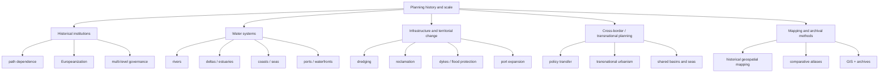

# Literature Review: Scale, Planning History, and Land–Water Transformations in Europe

**Slug:** `planning-history-land-water-scale`

## Executive summary

In European planning history, **scale is not just a hierarchy of administrative levels**. It is a historically produced relation between **territory, infrastructure, governance, and water**. Across ports, coasts, rivers, deltas, and cross-border basins, planning decisions repeatedly rework the spatial scale at which land and water are understood, controlled, and transformed.

Three ideas recur across the literature:

1. **Scale is made through historical processes.** Ports are expanded, deltas are reclaimed, coasts are defended, and river corridors are regulated through long-run state, municipal, and corporate action.
2. **Working across scales is a historical necessity, not a new planning trend.** European planning history shows that local, regional, national, and transnational scales have long been entangled in land–water territories.
3. **Method matters.** The most useful recent scholarship combines archive work, historical institutionalism, and historical geospatial mapping to reveal how land–water transformations accumulate across time and across scales.

A working definition synthesized from the sources below is:

> **Scale in planning history is the historically contingent and politically produced ordering of land–water space across nested and overlapping territorial, institutional, and infrastructural extents, through which planning actors negotiate authority, mobility, risk, and transformation.**

## Scope and method

### Scope
- **Geography:** Europe, with emphasis on North Sea, Rhine, Elbe, Thames, Scheldt, Hamburg, Rotterdam, London, Dutch delta, and cross-border basins
- **Time window:** 2015 onward, with a small number of foundational sources where needed to anchor planning history and land–water planning
- **Fields:** planning history, urban history, spatial planning, port-city studies, delta studies, and water governance history

### Source types prioritized
- Peer-reviewed journal articles
- Planning history and urban history book chapters
- European research reports and atlases
- Historical-institutionalist and transnational-planning studies

### Research note
Some publisher pages were blocked or incomplete. I used accessible abstracts, repository records, and open chapter text where possible. Claims below are therefore separated into:
- **directly supported claims** from source text;
- **synthesized claims** that connect multiple sources;
- **foundational background** from older but influential work.

## Conceptual map

## Source matrix

### 1) Sorensen (2015) — planning history and path dependence

**Full reference**  
Sorensen, A. (2015). *Taking path dependence seriously: an historical institutionalist research agenda in planning history.* Planning Perspectives, 30(1), 17–38. https://doi.org/10.1080/02665433.2013.874299

**Short summary**  
Foundational planning-history argument that historical institutionalism provides a strong framework for understanding continuity and change in planning.

**Key concepts / arguments**  
- path dependence
- historical institutionalism
- critical moments and institutional legacies
- continuity/change in planning history

**Definition and usage of scale**  
Scale is not the core term, but the article matters because it explains how planning institutions and territorial logics persist across time. It gives a historical vocabulary for tracing how scale relations become durable.

**Historical relevance of working with scales**  
High. It helps explain why scale arrangements in planning are sticky and how earlier choices constrain later planning across territory, jurisdiction, and infrastructure.

**Relevance to land-water spatial transformations**  
Indirect but important: the article provides the historical lens for understanding why water-related planning regimes, once established, remain difficult to shift.

**Methodology**  
Historical institutionalism; conceptual research agenda for planning history.

---

### 2) Woltjer & Al (2007) — Dutch experience of integrating water management and planning

**Full reference**  
Woltjer, J., & Al, N. (2007). *Integrating Water Management and Spatial Planning: Strategies Based on the Dutch Experience.* Journal of the American Planning Association, 73(2), 211–222. https://doi.org/10.1080/01944360708976154

**Short summary**  
Classic article showing that Dutch water management and spatial planning were moving toward closer integration as water was increasingly accepted “on land” and basin-scale management gained prominence.

**Key concepts / arguments**  
- integration of water and spatial planning
- river-basin scale
- Dutch planning-water nexus
- strategic approaches to coordination

**Definition and usage of scale**  
Scale is implicit in the move from local flood control to river-basin thinking; the article frames scale as a design problem for coordination between water and spatial planning.

**Historical relevance of working with scales**  
High. It captures an important early moment in the Dutch shift toward more integrated and scale-aware spatial water planning.

**Relevance to land-water spatial transformations**  
Very high. It directly addresses the changing relationship between land use and water governance in the Netherlands.

**Methodology**  
Comparative policy/planning analysis of Dutch and European trends.

---

### 3) EEA (2012) — European territorial cohesion and water

**Full reference**  
European Environment Agency. (2012). *Territorial cohesion and water management in Europe: the spatial perspective.* EEA Technical report No. 4/2012. https://doi.org/10.2800/49764

**Short summary**  
European report linking water management, territorial cohesion, and spatial planning.

**Key concepts / arguments**  
- territorial cohesion
- spatial perspective on water management
- basin-scale implementation of EU water policy
- planning and water governance linkage

**Definition and usage of scale**  
Scale appears as the mismatch and coordination problem between European policy, basin management, and spatial planning practice.

**Historical relevance of working with scales**  
Moderate to high. Although not a planning-history study per se, it is useful as a European policy milestone in the historical planning-water interface.

**Relevance to land-water spatial transformations**  
High. It frames the water/land relation as a territorial and spatial planning issue across Europe.

**Methodology**  
EU technical report synthesizing policy and spatial analysis.

---

### 4) Faludi (2018) — historical institutionalism and European spatial planning

**Full reference**  
Faludi, A. (2018). *A historical institutionalist account of European spatial planning.* Planning Perspectives, 33(4), 507–522. https://doi.org/10.1080/02665433.2018.1437554

**Short summary**  
Explains why European spatial planning has had limited institutional success and why EU space is still often conceptualized as the sum of state jurisdictions.

**Key concepts / arguments**  
- historical institutionalism
- European spatial planning
- territorial cohesion
- institutional fault lines
- state jurisdiction vs fluid spatial reality

**Definition and usage of scale**  
Scale is embedded in the institutional architecture of the EU: member-state jurisdiction remains dominant even when spatial reality is cross-border and fluid.

**Historical relevance of working with scales**  
Very high. It is central for tracing how European planning history has been shaped by the mismatch between state scales and supranational spatial agendas.

**Relevance to land-water spatial transformations**  
Indirect but important: it provides the institutional backdrop for understanding why coastal, river, and basin systems are difficult to govern through state-centric planning.

**Methodology**  
Historical institutional analysis of European spatial planning.

---

### 5) Purkarthofer (2016) — soft planning and hard planning

**Full reference**  
Purkarthofer, E. (2016). *When soft planning and hard planning meet: Conceptualising the encounter of European, national and sub-national planning.* European Journal of Spatial Development, 14(2), 1–20. https://journals.polito.it/index.php/EJSD/article/view/217

**Short summary**  
Shows how EU, national, and sub-national planning encounter each other through soft spaces and spatial rescaling.

**Key concepts / arguments**  
- soft spaces
- hard planning
- Europeanisation
- spatial rescaling
- encounter between formal and informal planning

**Definition and usage of scale**  
Scale is treated as layered and negotiable: soft planning spaces overlay formal administrative scales and allow planning to operate beyond rigid boundaries.

**Historical relevance of working with scales**  
High. It helps explain the historical emergence of multi-level planning arrangements in Europe.

**Relevance to land-water spatial transformations**  
Moderate. The article is not water-specific, but its scale logic is very useful for territories where formal boundaries fail to match hydrological systems.

**Methodology**  
Conceptual/planning-systems analysis.

---

### 6) Hein (2016) — ports and urban waterfronts

**Full reference**  
Hein, C. (2016). *Port cities and urban waterfronts: how localized planning ignores water as a connector.* WIREs Water, 3(3), 419–438. https://doi.org/10.1002/wat2.1141

**Short summary**  
Review article arguing that planning has often treated water locally and functionally rather than as a connective territorial system.

**Key concepts / arguments**  
- port planning
- waterfront redevelopment
- water as connector
- localized planning
- integrated planning of port, waterfront, and city

**Definition and usage of scale**  
Scale appears as a planning blind spot: localized planning fragments what is actually a connected coastal and maritime system.

**Historical relevance of working with scales**  
Very high. The article explicitly reviews planning and planning-history literature on ports and waterfronts since the 1960s.

**Relevance to land-water spatial transformations**  
Very high. It deals directly with the redesign of coastlines, ports, and waterfronts over time.

**Methodology**  
Narrative review of planning and planning-history literature.

---

### 7) Cotella & Janin Rivolin (2024) — Europeanization of territorial governance

**Full reference**  
Cotella, G., & Janin Rivolin, U. (2024). *The Europeanization of territorial governance. Towards a typology.* Planning Practice & Research, 40(2), 263–284. https://doi.org/10.1080/02697459.2024.2431770

**Short summary**  
Builds a typology of how EU influence reshapes territorial governance across 32 European countries.

**Key concepts / arguments**  
- Europeanization
- territorial governance
- spatial planning systems
- supranational objectives and instruments
- typology of influence

**Definition and usage of scale**  
Scale is the institutional and territorial level at which EU influence is translated into domestic planning systems.

**Historical relevance of working with scales**  
High. It shows how European planning history is produced through long-run institutional layering across scales.

**Relevance to land-water spatial transformations**  
Indirect but useful for understanding how cross-border water and coastal governance are embedded in broader European territorial governance.

**Methodology**  
Comparative typology based on ESPON COMPASS materials.

---

### 8) Port City Atlas (2023) — mapping European port-city territories

**Full reference**  
Hein, C., van Mil, Y., & Ažman Momirski, L. (eds.). (2023). *Port City Atlas: Mapping European Port City Territories: From Understanding to Design.* Delft: TU Delft OPEN Publishing / nai010. https://doi.org/10.59490/mg.73

**Short summary**  
Atlas of 100 European port-city territories on four seas, designed as a comparative reference for understanding and design.

**Key concepts / arguments**  
- port-city territory
- sea-based approach
- comparative mapping
- design and understanding
- Europe’s maritime urbanization

**Definition and usage of scale**  
Scale is sea-based and territorial: the atlas moves beyond city-scale case studies to port-city regions and shared waters.

**Historical relevance of working with scales**  
Very high. It is explicitly about long-run historical development and the need to overcome national and disciplinary boundaries.

**Relevance to land-water spatial transformations**  
Very high. It treats Europe’s coastline as a planning-history field shaped by water, land, infrastructure, and institutions.

**Methodology**  
Comparative atlas / historical-geospatial mapping.

---

### 9) Hein & van Mil (2019) — comparative spatial analysis for port city regions

**Full reference**  
Hein, C., & van Mil, Y. (2019). *Towards a Comparative Spatial Analysis for Port City Regions Based on Historical Geo-spatial Mapping.* PORTUSplus, 8, 1–18. https://portusplus.org/index.php/pp/article/view/189

**Short summary**  
Introduces historical geospatial mapping as a way to compare port-city regions across Europe.

**Key concepts / arguments**  
- historical geo-spatial mapping
- port city regions
- comparative spatial analysis
- land-water territories
- planning intervention gaps

**Definition and usage of scale**  
Scale is the comparative territorial unit: not just the port or the city, but the wider port-city region and its water-land relations.

**Historical relevance of working with scales**  
Very high. It provides a planning-history method for comparing transformations over time and across regions.

**Relevance to land-water spatial transformations**  
Very high. It explicitly studies land and water territories together.

**Methodology**  
Comparative historical geospatial mapping.

---

### 10) Hein & van Mil (2020) — mapping as gap-finder

**Full reference**  
Hein, C., & van Mil, Y. (2020). *Mapping as Gap-Finder: Geddes, Tyrwhitt, and the Comparative Spatial Analysis of Port City Regions.* Urban Planning, 5(2), 152–166. https://doi.org/10.17645/up.v5i2.2803

**Short summary**  
Argues that mapping can reveal the spatial and historical gaps that matter for planning.

**Key concepts / arguments**  
- mapping as a planning tool
- gap-finding
- Geddes and Tyrwhitt
- port-city comparison
- spatial/social/cultural elements over time

**Definition and usage of scale**  
Scale is an analytical problem in mapping: the right scale is the one that exposes planning gaps, conflicts, and opportunities.

**Historical relevance of working with scales**  
Very high. It links historical planning ideas to contemporary comparative methods.

**Relevance to land-water spatial transformations**  
High. The paper is designed for port-city regions where land-water interactions shape development.

**Methodology**  
Comparative historical geospatial analysis; methodological essay.

---

### 11) Hein (2022) — transnational planning history in port-city regions

**Full reference**  
Hein, C. (2022). *Mapping transnational planning history in port city regions – London, Rotterdam, Hamburg.* In M. Welch Guerra (Ed.), *European Planning History in the 20th Century: A Continent of Urban Planning.* Routledge. DOI: 10.4324/9781003271666-24

**Short summary**  
Uses historical geospatial mapping to reconstruct transnational planning histories around the North Sea.

**Key concepts / arguments**  
- transnational planning history
- port-city territories
- global/local processes
- planning ideas and transfers
- maritime exchange

**Definition and usage of scale**  
Scale is explicitly transnational and multi-scalar: the chapter examines how local planning is shaped by global flows and intercity links.

**Historical relevance of working with scales**  
Very high. This is one of the clearest planning-history pieces linking scale, ports, and transnational urbanism.

**Relevance to land-water spatial transformations**  
Very high. It studies port-city regions as sea-land continuums shaped by shipping, infrastructure, and territory.

**Methodology**  
Historical geospatial mapping combined with transnational urbanism.

---

### 12) Hein & Hilder (2023) — estuarine territorialization and Hamburg

**Full reference**  
Hein, J., & Hilder, N. (2023). *Estuarine territorialization and the port of Hamburg.* Maritime Studies, 22, article 39. https://doi.org/10.1007/s40152-023-00329-x

**Short summary**  
Shows how dredging, reclamation, and port expansion territorialize the Elbe estuary and generate new conflicts and peripheries.

**Key concepts / arguments**  
- estuarine territorialization
- sediment metabolism
- terraqueous territoriality
- port expansion
- peripheralization and protest

**Definition and usage of scale**  
Scale is nested in the estuary: the port, the inner delta, the marshland, the city, and the wider region are all linked through one territorial process.

**Historical relevance of working with scales**  
Very high. The article follows long-run transformations from medieval times to the present.

**Relevance to land-water spatial transformations**  
Exceptional. It is a direct study of land-water transformation through dredging, reclamation, dykes, and navigation-channel maintenance.

**Methodology**  
Historical archives, newspaper analysis, planning documents, and interviews.

---

### 13) Renner, Meijerink, & van der Zaag (2018) — Deltarhine cross-border water regimes

**Full reference**  
Renner, T., Meijerink, S., & van der Zaag, P. (2018). *The evolution of regional cross-border water regimes, the case of Deltarhine.* Journal of Environmental Planning and Management, 61(10), 1701–1721. https://hdl.handle.net/2066/196886

**Short summary**  
A longitudinal study of Dutch-German cross-border water governance that shows how cooperation can persist without solving core problems.

**Key concepts / arguments**  
- cross-border water regimes
- Deltarhine
- performance beyond policy making
- stakeholder satisfaction vs problem-solving
- long-run cooperation

**Definition and usage of scale**  
Scale is the international river-basin / cross-border governance scale, which does not always align with implementation capacity.

**Historical relevance of working with scales**  
High. The article traces five decades of institutional development.

**Relevance to land-water spatial transformations**  
High. It concerns a shared river basin where water governance and territorial coordination shape spatial development.

**Methodology**  
Longitudinal institutional analysis with performance indicators.

---

### 14) van Mil & Rutte (2021) — long-term urbanization around the North Sea

**Full reference**  
van Mil, Y., & Rutte, R. (2021). *Urbanization Patterns around the North Sea: Long-Term Population Dynamics, 1300–2015.* Urban Planning, 6(3), 10–26. https://doi.org/10.17645/up.v6i3.4099

**Short summary**  
Uses long-run population data to show how North Sea urbanization patterns evolved over seven centuries.

**Key concepts / arguments**  
- long-term urbanization
- North Sea region
- hinterland-city relations
- population dynamics
- infrastructure, soil, and demography

**Definition and usage of scale**  
Scale is regional and long-duration: the North Sea urban system is treated as a historical field larger than any single city.

**Historical relevance of working with scales**  
Very high. It demonstrates why nineteenth- or twentieth-century snapshots are insufficient for planning history.

**Relevance to land-water spatial transformations**  
High. The dataset includes infrastructure on water, land, and rail, linking urbanization to sea-based development.

**Methodology**  
Comparative GIS dataset and long-run demographic mapping.

---

### 15) Duval & Bahers (2023) — port-territory metabolism in the Loire estuary

**Full reference**  
Duval, A., & Bahers, J.-B. (2023). *Flows as Makers and Breakers of Port-Territory Metabolic Relations: The Case of the Loire Estuary.* Urban Planning, 8(3), 319–329. https://doi.org/10.17645/up.v8i3.6757

**Short summary**  
Analyzes how flows and metabolic relations shape the territory of the Loire estuary and its port region.

**Key concepts / arguments**  
- port-territory metabolism
- flows and infrastructural change
- ecological transition
- territorialization
- port-city region

**Definition and usage of scale**  
Scale is relational and metabolic: the port, estuary, and metropolitan development are linked through socio-material flows.

**Historical relevance of working with scales**  
Moderate to high. The article is contemporary, but it is strong on long-run territorial transformation and port-region change.

**Relevance to land-water spatial transformations**  
Very high. The estuary is the central land-water interface in the analysis.

**Methodology**  
Case study using an interdependency / metabolic approach.

## Main debates and recurring authors

### Recurring authors and clusters
- **Carola Hein** — port-city territories, transnational planning history, mapping methods, sea-land continuum
- **Yvonne van Mil / Reinout Rutte** — historical geospatial mapping, North Sea urbanization, comparative datasets
- **Andreas Faludi** — European spatial planning, historical institutionalism, territorial cohesion
- **André Sorensen** — planning history and path dependence
- **Johan Woltjer / Niels Al** — Dutch water management and spatial planning integration
- **Giancarlo Cotella / Ugo Janin Rivolin** — Europeanization, territorial governance, planning systems
- **Ewa Purkarthofer** — soft planning, soft spaces, multilevel planning encounters
- **Jonas Hein / Nils Hilder** — estuarine territorialization and port expansion
- **Tobias Renner / Sander Meijerink / Pieter van der Zaag** — cross-border basin governance
- **Annabelle Duval / Jean-Baptiste Bahers** — port-territory metabolism and ecological transition

### Core debates
1. **Planning history: comparative-national vs transnational**  
   Older planning histories often stayed within national frames. Recent work pushes toward transnational, sea-based, and cross-border comparisons.

2. **Scale as a level vs scale as a process**  
   The literature increasingly treats scale as something historically made through ports, rivers, basins, institutions, and mapping, not merely as a level of government.

3. **Localized planning vs connected waterscapes**  
   Water is repeatedly shown to connect territories that administrative planning treats separately.

4. **Infrastructure as scale-making**  
   Dredging, reclamation, dykes, railways, and port terminals do not just occupy space; they create new territorial scales and lock in path dependencies.

5. **Methodological shift from narrative history to mapping**  
   Planning history scholarship is increasingly using GIS, georeferencing, atlases, and comparative datasets to expose long-run change across scales.

## Key theories and conceptual frameworks

### 1) Historical institutionalism and path dependence
Useful for showing why scale arrangements persist in European planning systems and water governance.

### 2) Europeanization and territorial governance
Explains how supranational planning ideas and instruments shape domestic spatial planning across different scales.

### 3) Transnational urbanism / transnational planning history
Important for understanding port cities and river corridors as places where planning ideas, technologies, and people move across borders.

### 4) Sea-land continuum / urbanization of the sea
A strong framework for land-water transformations in European planning history.

### 5) Terraqueous territoriality / estuarine territorialization
Useful for analyzing how land and water become jointly governed through infrastructure and regulation.

### 6) Historical geospatial mapping
The key recent methodological framework for making scale visible in planning history.

## Historical lessons and takeaways

1. **Scale choices are never neutral.**  
   Historical decisions about where to dredge, reclaim, defend, or connect tend to produce long-lasting territorial effects.

2. **Ports and deltas are scale machines.**  
   They force planners to operate simultaneously at local, regional, national, and transnational scales.

3. **Cross-border water governance is slow and partial.**  
   The Deltarhine case shows that long-term cooperation may not translate into strong problem-solving capacity.

4. **Historical planning often follows infrastructure, not vice versa.**  
   Once waterways, ports, and flood defenses are built, they reshape the options available to later planners.

5. **Long-run mapping reveals hidden planning histories.**  
   North Sea, port-city, and estuarine mapping work shows that the relevant planning unit is often much larger than the city.

## Gaps and emerging trends

### Gaps
- **Too little explicit theorization of scale in planning history.** Many studies rely on historical narrative without naming scale as the central analytic concept.
- **Overconcentration on North Sea / Dutch / Hamburg cases.** These cases are important, but the European literature is still uneven.
- **Limited comparative work on Southern and Eastern European land-water transformations.**
- **Not enough integration of archives with lived experience and conflict history.**
- **Few studies link planning history of scale to justice, class, or uneven exposure to environmental risk.**

### Emerging trends
- **Sea-based and estuarine planning histories** that move beyond city-centered accounts
- **Historical geospatial mapping and digital humanities methods**
- **Port-city atlas work and comparative region-wide datasets**
- **Cross-border and transnational planning histories**
- **Greater attention to sediment, dredging, reclamation, and other material processes of territorial change**

## Implications for a theoretical framework

A useful framework for scale in planning history and land–water transformation could rest on four propositions:

1. **Scale is historically produced.**  
   It emerges from long-run institutional, infrastructural, and ecological processes.

2. **Scale is infrastructural.**  
   Ports, dykes, waterways, and rail corridors materially produce the territorial scales that planners later inherit.

3. **Scale is transnational and territorial at once.**  
   Land-water systems frequently cross administrative borders, making transnational planning history essential.

4. **Scale is best studied comparatively and spatially.**  
   Historical geospatial mapping allows planning historians to compare territorial change across cities, regions, and seas.

### Practical analytical questions
For each case, ask:
- What scale did planners assume?
- Which scale was actually operative in the water system?
- Which institutions controlled decision-making at each scale?
- What infrastructure locked in the scale arrangement?
- Which conflicts or peripheries were produced?
- How did later planners inherit or revise these scale relations?

## Bottom line

The European planning-history literature suggests that scale is not just an analytic category but a **historical product of land-water transformation**. Ports, coasts, rivers, estuaries, and cross-border basins are where scale is most visible because they force planners to negotiate between water systems, territorial boundaries, and long-term institutional change. The strongest methodological shift in the field is toward **historical geospatial mapping**, which makes it possible to see how spatial transformations unfold across multiple scales over centuries.

## Sources

- Sorensen, A. (2015). *Taking path dependence seriously: an historical institutionalist research agenda in planning history.* Planning Perspectives, 30(1), 17–38. https://doi.org/10.1080/02665433.2013.874299
- Woltjer, J., & Al, N. (2007). *Integrating Water Management and Spatial Planning: Strategies Based on the Dutch Experience.* Journal of the American Planning Association, 73(2), 211–222. https://doi.org/10.1080/01944360708976154
- European Environment Agency. (2012). *Territorial cohesion and water management in Europe: the spatial perspective.* EEA Technical report No. 4/2012. https://doi.org/10.2800/49764
- Faludi, A. (2018). *A historical institutionalist account of European spatial planning.* Planning Perspectives, 33(4), 507–522. https://doi.org/10.1080/02665433.2018.1437554
- Purkarthofer, E. (2016). *When soft planning and hard planning meet: Conceptualising the encounter of European, national and sub-national planning.* European Journal of Spatial Development, 14(2), 1–20. https://journals.polito.it/index.php/EJSD/article/view/217
- Hein, C. (2016). *Port cities and urban waterfronts: how localized planning ignores water as a connector.* WIREs Water, 3(3), 419–438. https://doi.org/10.1002/wat2.1141
- Cotella, G., & Janin Rivolin, U. (2024). *The Europeanization of territorial governance. Towards a typology.* Planning Practice & Research, 40(2), 263–284. https://doi.org/10.1080/02697459.2024.2431770
- Hein, C., van Mil, Y., & Ažman Momirski, L. (eds.). (2023). *Port City Atlas: Mapping European Port City Territories: From Understanding to Design.* https://doi.org/10.59490/mg.73
- Hein, C., & van Mil, Y. (2019). *Towards a Comparative Spatial Analysis for Port City Regions Based on Historical Geo-spatial Mapping.* PORTUSplus, 8, 1–18. https://portusplus.org/index.php/pp/article/view/189
- Hein, C., & van Mil, Y. (2020). *Mapping as Gap-Finder: Geddes, Tyrwhitt, and the Comparative Spatial Analysis of Port City Regions.* Urban Planning, 5(2), 152–166. https://doi.org/10.17645/up.v5i2.2803
- Hein, C. (2022). *Mapping transnational planning history in port city regions – London, Rotterdam, Hamburg.* In M. Welch Guerra (Ed.), *European Planning History in the 20th Century: A Continent of Urban Planning.* Routledge. https://doi.org/10.4324/9781003271666-24
- Hein, J., & Hilder, N. (2023). *Estuarine territorialization and the port of Hamburg.* Maritime Studies, 22, article 39. https://doi.org/10.1007/s40152-023-00329-x
- Renner, T., Meijerink, S., & van der Zaag, P. (2018). *The evolution of regional cross-border water regimes, the case of Deltarhine.* Journal of Environmental Planning and Management, 61(10), 1701–1721. https://hdl.handle.net/2066/196886
- van Mil, Y., & Rutte, R. (2021). *Urbanization Patterns around the North Sea: Long-Term Population Dynamics, 1300–2015.* Urban Planning, 6(3), 10–26. https://doi.org/10.17645/up.v6i3.4099
- Duval, A., & Bahers, J.-B. (2023). *Flows as Makers and Breakers of Port-Territory Metabolic Relations: The Case of the Loire Estuary.* Urban Planning, 8(3), 319–329. https://doi.org/10.17645/up.v8i3.6757
