# Literature Review: Scale in Spatial Design and Planning in Europe

**Slug:** `planning-scale-spatial-design`

## Executive summary

In the European spatial planning and spatial design literature, **scale is not treated as a neutral backdrop**. It is more often described as a **relational, political, and design-relevant ordering** of space through which planning problems become legible, governable, and actionable. Across the literature, scale shows up as:

- a **jurisdictional level** (local, regional, national, EU, transnational);
- a **functional or ecological extent** (basin, landscape, delta, port territory, metropolitan region);
- a **planning frame** (the scale at which an issue is defined and acted on);
- and a **site of conflict** when institutional boundaries do not match spatial processes or stakeholder interests.

The strongest recurring insight is that planning rarely fails because it lacks scales; it fails because **the wrong scales are privileged, aligned, or rescaled**. This is especially visible in metropolitan governance, landscape planning, climate adaptation, land-use policy, and port-city territories.

A concise working definition, synthesized from the sources below, is:

> **Scale in spatial planning and design is the socially and institutionally produced ordering of spatial relations across levels and extents, through which planning actors frame problems, allocate authority, coordinate action, and design interventions across territories.**

## Scope and method

### Scope
- **Geography:** European context
- **Time window:** 2015 onward, with a small number of foundational sources where they are conceptually indispensable
- **Fields:** spatial planning, urban studies, spatial design, metropolitan governance, landscape planning, climate adaptation, infrastructure, ports, and territorial governance

### Source types prioritized
- Peer-reviewed journal articles
- Peer-reviewed special issue introductions and syntheses
- European research reports and major institutional syntheses
- Foundational conceptual papers on scale, rescaling, soft spaces, and spatial planning systems

### Research note
Some journal pages and PDFs were blocked by bot/security systems. Where that happened, I used accessible abstracts, repository metadata, or open reports. The review therefore distinguishes between **directly supported claims** and **synthesized interpretation**.

## Conceptual map

```mermaid
flowchart TD
  A[Scale in spatial planning] --> B[Scale as level]
  A --> C[Scale as relation]
  A --> D[Scale as planning frame]
  A --> E[Scale as conflict/mismatch]
  A --> F[Scale as design choice]
  A --> G[Scale as method]

  B --> B1[local / regional / national / EU]
  B --> B2[metropolitan / landscape / basin / port]

  C --> C1[rescaling]
  C --> C2[soft spaces]
  C --> C3[multi-scalar governance]

  D --> D1[problem definition]
  D --> D2[policy integration]
  D --> D3[territorial imaginaries]

  E --> E1[institutional mismatch]
  E --> E2[ecological mismatch]
  E --> E3[stakeholder conflict]

  F --> F1[selecting intervention scale]
  F --> F2[cross-scalar design]
  F --> F3[upscaling/downscaling]

  G --> G1[comparative typologies]
  G --> G2[case studies]
  G --> G3[mapping and scenario work]
  G --> G4[policy analysis]
```

## Source matrix

### A. Foundational conceptual sources

| Full reference | Short summary | Key concepts / arguments | Definition and usage of scale | Relevance to spatial planning and governance | Methodology |
|---|---|---|---|---|---|
| **Brenner, N. (2003).** *Metropolitan Institutional Reform and the Rescaling of State Space in Contemporary Western Europe.* European Urban and Regional Studies, 10(4), 297–324. https://doi.org/10.1177/09697764030104002 | Foundational account of how metropolitan reform is tied to state restructuring in Western Europe. | Rescaling of state space; metropolitan institutional reform; state restructuring; uneven spatial development. | Scale is treated as an outcome of state restructuring rather than a fixed level. Metropolitan governance is one site where state space is actively reworked. | Strong foundational source for thinking about metropolitan planning, governance reform, and the political production of scale. | Conceptual political-economy analysis grounded in Western European cases. |
| **Getimis, P. (2012).** *Comparing Spatial Planning Systems and Planning Cultures in Europe. The Need for a Multi-scalar Approach.* Planning Practice & Research, 27(1), 25–40. https://doi.org/10.1080/02697459.2012.659520 | Foundational planning-comparative argument for multi-scalar analysis in Europe. | Planning systems, planning cultures, actor constellations, knowledge, policy styles. | Scale is not just institutional level; comparative planning needs different entry points across scales and actors. | Useful for framing how planning practice varies across Europe and why single-level comparisons miss important dynamics. | Comparative conceptual/planning-systems analysis. |
| **Purkarthofer, E. (2016).** *When soft planning and hard planning meet: Conceptualising the encounter of European, national and sub-national planning.* European Journal of Spatial Development, 14(2), 1–20. https://journals.polito.it/index.php/EJSD/article/view/217 | Shows how EU, national, and sub-national planning interact through soft spaces. | Europeanisation; soft spaces; spatial rescaling; hard/soft planning; cross-level encounter. | Scale is enacted through soft planning spaces that overlay formal levels and alter how planning operates across territories. | Highly relevant for understanding cross-scalar planning and why formal boundaries alone do not capture practice. | Conceptual article with European planning-system framing. |
| **Newig, J., & Moss, T. (2017).** *Scale in environmental governance: moving from concepts and cases to consolidation.* Journal of Environmental Policy & Planning, 19(5), 473–479. https://doi.org/10.1080/1523908X.2017.1390926 | Short synthesis of the scale literature in environmental governance. | Scale frames, rescaling, upscaling, downscaling, fit/misfit, consolidation of concepts. | Scale is a political and analytical problem, not a technical given. The paper pushes the field to consolidate concepts rather than use scale loosely. | Important bridge between governance theory and spatial planning practice; very useful for a theoretical framework. | Review / special-issue introduction. |
| **Moisio, S., & Luukkonen, J. (2015).** *European spatial planning as governmentality: an inquiry into rationalities, techniques, and manifestations.* Environment and Planning C: Government and Policy, 33(4), 828–845. https://doi.org/10.1068/c13158 | Interprets European spatial planning as a governmental practice shaping political space. | Governmentality; rationalities; techniques; manifestations; European political space. | Scale appears as something that is governed through techniques and rationalities rather than merely represented. | Useful for understanding how EU-level spatial planning influences national and sub-national practice without formal command power. | Conceptual / critical governance analysis. |

### B. Metropolitan regions and rescaling

| Full reference | Short summary | Key concepts / arguments | Definition and usage of scale | Relevance to spatial planning and governance | Methodology |
|---|---|---|---|---|---|
| **Zimmermann, K., & Getimis, P. (2017).** *Rescaling of Metropolitan Governance and Spatial Planning in Europe: An Introduction to the Special Issue.* Raumforschung und Raumordnung | Spatial Research and Planning, 75(3). https://doi.org/10.1007/s13147-017-0482-3 | Special issue introduction on metropolitan governance change in Europe. | Metropolitan scale is a site of rescaling, with different national pathways and path dependencies. | Strong overview of how metropolitan governance and spatial planning are being reconfigured in Europe. | Comparative special-issue introduction. |
| **Zimmermann, K. (2017).** *Re-Scaling of Metropolitan Governance in Germany.* Raumforschung und Raumordnung | Spatial Research and Planning, 75(3). https://doi.org/10.1007/s13147-017-0480-5 | Reviews German metropolitan governance as a laboratory of multiple arrangements. | Scale is plural and layered: initiatives emerge at different scales with different sectoral emphases. | Highly relevant for planning institutions, infrastructure coordination, and the practical limits of metropolitan reform. | Historical overview plus case-based comparison of four German metropolitan cases. |
| **Geppert, A. (2017).** *Vae Victis! Spatial Planning in the Rescaled Metropolitan Governance in France.* Raumforschung und Raumordnung | Spatial Research and Planning, 75(3). https://doi.org/10.1007/s13147-017-0492-1 | Shows how French metropolitan reform produced winners and losers. | Rescaling changes the geography of planning power; metropolitan perimeters are politically negotiated, not purely functional. | Key source for scale conflict in metropolitan planning, especially the gap between territorial reform and planning outcomes. | Policy-history and reform analysis of French metropolitan change. |
| **Berisha, E., Cotella, G., Janin Rivolin, U., & Solly, A. (2021).** *Spatial governance and planning systems and the public control of spatial development: a European typology.* European Planning Studies, 29(1), 181–200. https://doi.org/10.1080/09654313.2020.1726295 | Builds a European typology of planning systems from the perspective of public control. | Public control of spatial development; allocation of land-use rights; state vs market; typology. | Scale is embedded in how different countries allocate authority and spatial development rights across levels. | Useful for comparative planning theory and for mapping how governance capacity varies across Europe. | Comparative typology based on ESPON COMPASS expert judgments. |

### C. Landscape, land-use, and spatial design approaches

| Full reference | Short summary | Key concepts / arguments | Definition and usage of scale | Relevance to spatial planning and governance | Methodology |
|---|---|---|---|---|---|
| **Hennig, E. I., Schwick, C., Soukup, T., Orlitová, E., Kienast, F., & Jaeger, J. A. G. (2015).** *Multi-scale analysis of urban sprawl in Europe: Towards a European de-sprawling strategy.* Land Use Policy, 49, 483–498. https://doi.org/10.1016/j.landusepol.2015.08.001 | Quantifies urban sprawl across several spatial resolutions in Europe. | Urban sprawl; land-use conflict; monitoring; de-sprawling strategy; multi-scale measurement. | Scale is operationalized through country, NUTS-2, and 1 km² grid levels, showing that conclusions depend on the scale of measurement. | Strong practical relevance for spatial planning, land management, and territorial development policy. | Quantitative spatial analysis / multi-scale GIS-based measurement. |
| **García-Martín, M., Bieling, C., Hart, A., & Plieninger, T. (2016).** *Integrated landscape initiatives in Europe: Multi-sector collaboration in multi-functional landscapes.* Land Use Policy, 58, 43–53. https://doi.org/10.1016/j.landusepol.2016.07.001 | Reviews collaborative landscape initiatives across Europe. | Landscape initiatives; multi-sector collaboration; multifunctionality; landscape governance. | Scale appears as the coordination problem of acting across farm, landscape, regional, and sectoral levels. | Very relevant to spatial design because it links landscape planning, collaboration, and governance across scales. | Systematic review of European landscape initiatives. |
| **Primdahl, J., Folvig, S., & Kristensen, L. S. (2020).** *Landscape Strategy-Making and Collaboration: The Hills of Northern Mors, Denmark; A Case of Changing Focus and Scale.* Land, 9(6), 189. https://doi.org/10.3390/land9060189 | Shows how a landscape strategy process shifted its focus and scale over time. | Collaborative landscape planning; strategy-making; stakeholder engagement; changing focus and scale. | Scale is an evolving property of the planning process, not a fixed container; the scale changed during the project. | Strong design-oriented source because it shows how planning practice can deliberately shift scale through participatory strategy work. | Action research / case study in a Danish municipal landscape planning process. |
| **Falco, F. L., Feitelson, E., & Dayan, T. (2021).** *Spatial Scale Mismatches in the EU Agri-Biodiversity Conservation Policy. The Case for a Shift to Landscape-Scale Design.* Land, 10(8), 846. https://doi.org/10.3390/land10080846 | Argues that biodiversity policy often fails because it operates at the wrong scale. | Spatial scale mismatch; agri-biodiversity; landscape-scale design; policy effectiveness. | Scale mismatch is explicit: farm-scale policy often does not match landscape-scale ecological processes. | Highly relevant for spatial design and planning because it links policy instruments to the spatial logic of biophysical systems. | Cross-disciplinary conceptual/literature-based policy analysis. |

### D. Ports, deltas, and territorial interfaces

| Full reference | Short summary | Key concepts / arguments | Definition and usage of scale | Relevance to spatial planning and governance | Methodology |
|---|---|---|---|---|---|
| **Hein, C. (2019).** *The Port Cityscape: Spatial and institutional approaches to port city relationships.* PORTUSplus, 8. https://portusplus.org/index.php/pp/article/view/190 | Reframes port-city relations as a complex territorial system. | Port cityscape; fuzzy territories; multi-scalar markets; overlapping governance; stakeholder diversity. | Scale appears as overlapping institutional and territorial logics across port, city, and surrounding regions. | Very useful for spatial design of port-city interfaces and for governance beyond the waterfront boundary. | Conceptual / design-oriented essay grounded in port-city analysis. |
| **Hein, C. (2024).** *Governing Thresholds: New Scales for the Future of Port Territories.* PORTUSplus, 18. https://portusplus.org/index.php/pp/article/view/351 | Recent argument for rethinking port territories through new scales of governance and design. | Port-city relationships; spatial planning; design; co-creative practices; multi-scalar governance. | Scale is framed as a threshold problem: ports sit at land-sea boundaries and require new scales of action. | Strong relevance for spatial design because it links threshold conditions, infrastructure, and governance redesign. | Conceptual / applied port-territory essay. |
| **Duval, A., & Bahers, J.-B. (2023).** *Flows as Makers and Breakers of Port-Territory Metabolic Relations: The Case of the Loire Estuary.* Urban Planning, 8(3), 1–? https://doi.org/10.17645/up.v8i3.6757 | Examines how flows reorganize port-territory relations in a French estuary. | Port-territory metabolism; socio-material flows; ecological transition; territorialization. | Scale is present through the relation between port flows, metropolitan development, and territorial metabolism. | Relevant for infrastructure planning, estuarine governance, and port-region territorial development. | Case study of the Loire estuary using an interdependency / metabolic approach. |

### E. Climate adaptation and planning practice

| Full reference | Short summary | Key concepts / arguments | Definition and usage of scale | Relevance to spatial planning and governance | Methodology |
|---|---|---|---|---|---|
| **Nowak, M. J., Bera, M., Lazoglou, M., Olcina-Cantos, J., Vagiona, D. G., Monteiro, R., & Mitrea, A. (2024).** *Comparison of Urban Climate Change Adaptation Plans in Selected European Cities from a Legal and Spatial Perspective.* Sustainability, 16(15), 6327. https://doi.org/10.3390/su16156327 | Compares adaptation plans in selected European cities through legal and spatial lenses. | Urban adaptation planning; legal-spatial perspective; institutional design; implementation. | Scale enters through the relation between city-level plans and broader legal/policy frameworks. | Useful for understanding how planning instruments operate at municipal scale within multi-level adaptation governance. | Comparative legal and spatial analysis of city adaptation plans. |
| **García-Blanco, G., Zorita, S., Wirth, M., Biernacka, M., & Lozano, P. J. (2025).** *Dilemmas in Statutory Urban Planning When Addressing the Climate Adaptation Implementation Gap: Insights from Six European Cities.* Land, 14(12), 2304. https://doi.org/10.3390/land14122304 | Focuses on why climate adaptation remains hard to implement through statutory planning. | Adaptation implementation gap; statutory urban planning; BRIDGE framework; six cities. | Scale appears in the mismatch between statutory planning instruments and the spatial-temporal scale of adaptation needs. | Strong practical value for planning practice and for thinking about scalar fit in urban adaptation. | Comparative indicator-based screening across six European cities. |
| **European Environment Agency (2024).** *Urban adaptation in Europe: what works?* EEA Report No. 14/2023. https://www.eea.europa.eu/en/analysis/publications/urban-adaptation-in-europe-what-works | Major European report summarising urban adaptation actions and enabling factors. | Nature-based solutions; implementation; urban resilience; local enabling factors; city case studies. | Scale is treated explicitly through local, regional, national, and EU policy levels and adaptation actions. | Very important for translating theory into planning practice and for identifying what is already working in European cities. | Policy synthesis/report based on European adaptation evidence and case material. |
| **Brunetta, G., & Caputo, M. (2026).** *Multilevel Governance of Urban Climate Adaptation in the European Union: An Overview.* Urban Science, 10(1), 50. https://doi.org/10.3390/urbansci10010050 | Very recent overview of multilevel adaptation governance in the EU. | National, regional, local, and sectoral plans; maturity of multilevel governance. | Scale is operationalized through adaptation governance across multiple administrative and sectoral levels. | Useful as current evidence that urban adaptation is increasingly framed as a multilevel planning problem. | Analytical overview / governance assessment. |

## Main debates and recurring authors

### Recurring authors and clusters
- **Neil Brenner** — rescaling of state space, metropolitan institutional reform
- **Panagiotis Getimis** — multi-scalar planning systems and comparative planning cultures
- **Karsten Zimmermann** — metropolitan governance, rescaling, special issue synthesis
- **Anna Geppert** — French metropolitan reform and its spatial-planning effects
- **Jens Newig / Timothy Moss** — scale in environmental governance and planning-adjacent governance debates
- **Franziska Sielker** — European spatial governance, sectoralisation, and the relationship between EU governance and planning
- **Eva Purkarthofer** — soft planning, soft spaces, and cross-level planning encounters
- **Carola Hein** — port-city territories, thresholds, and spatial design of port regions
- **Maria García-Martín / Tobias Plieninger / Claudia Bieling / Abigail Hart** — integrated landscape initiatives and multi-functional landscapes
- **Jørgen Primdahl / Lone S. Kristensen** — collaborative landscape strategy-making and changing scale in practice
- **Francesca L. Falco / Eran Feitelson / Tamar Dayan** — spatial scale mismatches in biodiversity and land-use policy
- **Maciej J. Nowak / Milena Bera / Pedro José Lozano** — legal-spatial adaptation planning in cities

### Core debates
1. **Is scale a level or a relation?**  
   The literature increasingly rejects the idea that scale is only a ladder of fixed levels. Instead, scale is treated as something made through governance, design, and planning practices.

2. **Does rescaling solve planning problems or just move them?**  
   Metropolitan reform, climate adaptation governance, and landscape policy often rescale responsibility without fully resolving authority, resources, or conflict.

3. **What is the right scale for planning?**  
   There is no universal answer. The literature suggests that the “right” scale depends on the process: ecological processes may be landscape-scale, while authority, funding, and participation may be organized elsewhere.

4. **Can soft spaces bridge hard institutions?**  
   Soft planning and soft spaces are often presented as ways to work across rigid administrative boundaries, but they can also obscure accountability if they are not tied to decision power.

5. **How do planning systems vary across Europe?**  
   Comparative literature stresses that Europe is heterogeneous: spatial planning systems vary in how much public control they exercise, how they allocate rights, and how they coordinate across levels.

6. **How do design and governance meet at territorial thresholds?**  
   Port-city, delta, and landscape cases show that scale is not just a policy issue; it is also a spatial design issue involving boundaries, interfaces, and long-term territorial change.

## Key theories and conceptual frameworks

### 1) Rescaling and state spatial restructuring
This is the classic political-economy frame inherited from Brenner and related work. It treats scale as produced by state restructuring, competition, and governance reform.

### 2) Multi-scalar planning and governance
Used throughout planning and environmental governance literature to show that decisions are distributed across levels that are not always aligned with ecological processes or territorial function.

### 3) Soft spaces / soft planning
Useful for understanding how planning operates across formal boundaries through ad hoc, cross-boundary, or strategic spaces that do not map neatly onto administrative tiers.

### 4) Spatial scale mismatch / scale fit
Especially important in land-use, biodiversity, and climate adaptation literature. The central question is whether instruments are designed at the same scale as the process they are meant to affect.

### 5) Polycentric / multi-level governance
A recurring governance model in adaptation, metropolitan planning, and land-use coordination, often invoked to manage problems that cross jurisdictions.

### 6) Landscape governance / integrated landscape management
Frames landscapes as multifunctional and multi-actor spaces that require coordination across sectors and scales.

### 7) Threshold / interface thinking for ports and deltas
These cases treat scale as a boundary problem: land-sea interfaces, port-city boundaries, and estuarine territories require design that can operate across overlapping scales.

## Gaps and emerging trends

### Gaps
- **Scale is often invoked more than operationalized.** Many studies describe “multi-level” or “cross-scalar” governance without fully specifying how scale is produced in practice.
- **Design research and planning theory are still weakly integrated.** Spatial design studies often discuss form and interface, while planning studies discuss governance; fewer works combine both.
- **The European literature is uneven across territory types.** Metropolitan regions and river basins are well covered; ports, deltas, and landscapes are more fragmented across literatures.
- **Implementation remains under-theorized.** There is still a gap between planning frameworks and the operational details of who decides, who pays, and who coordinates across scales.
- **Stakeholder power is often under-measured.** Participation appears frequently, but unequal influence across scales is less often empirically traced.

### Emerging trends
- **From fixed levels to flexible planning spaces**: soft spaces, strategic territories, and threshold regions are becoming more prominent.
- **From single-scale to multi-scalar design**: landscape and port-city planning increasingly treat scale as something to be designed across.
- **From abstract governance to implementation gaps**: climate adaptation work now asks what actually works in statutory planning.
- **From administrative to functional territories**: metropolitan regions, basins, deltas, and port territories are being used to rethink planning units.
- **From policy design to spatial justice**: scale choices are increasingly read as redistributive and political, not just technical.

## Implications for a theoretical framework

A robust theoretical framework for scale in spatial design and planning in Europe could combine four propositions:

1. **Scale is produced**  
   It is made through institutions, representations, planning rules, design practices, and governance arrangements.

2. **Scale is relational**  
   No scale stands alone; local, regional, national, EU, and transnational scales are mutually constitutive.

3. **Scale is design-relevant**  
   The selection of a planning scale shapes the territorial form of interventions, not just the governance process.

4. **Scale is political**  
   Every scale choice redistributes authority, visibility, and responsibility.

### A practical analytical template
For empirical planning research, the literature suggests asking:
- **What problem is being scaled?**
- **Who defines the scale of intervention?**
- **What spatial extent is assumed?**
- **What institutions are empowered or bypassed?**
- **Where do mismatch and conflict emerge?**
- **What design or governance tool is used to bridge scales?**

## Bottom line

The European planning literature does not support a single universal scale for good planning. Instead, it suggests that effective spatial planning and design depend on **matching, translating, or deliberately reworking scales** across policy, ecology, infrastructure, and stakeholder relations. The most useful theoretical move is to treat scale as both **an analytic concept** and **a design problem**: a way to understand how planning works, and a way to improve how planning is done.

## Sources

- Brenner, N. (2003). *Metropolitan Institutional Reform and the Rescaling of State Space in Contemporary Western Europe.* European Urban and Regional Studies, 10(4), 297–324. https://doi.org/10.1177/09697764030104002
- Getimis, P. (2012). *Comparing Spatial Planning Systems and Planning Cultures in Europe. The Need for a Multi-scalar Approach.* Planning Practice & Research, 27(1), 25–40. https://doi.org/10.1080/02697459.2012.659520
- Purkarthofer, E. (2016). *When soft planning and hard planning meet: Conceptualising the encounter of European, national and sub-national planning.* European Journal of Spatial Development, 14(2), 1–20. https://journals.polito.it/index.php/EJSD/article/view/217
- Newig, J., & Moss, T. (2017). *Scale in environmental governance: moving from concepts and cases to consolidation.* Journal of Environmental Policy & Planning, 19(5), 473–479. https://doi.org/10.1080/1523908X.2017.1390926
- Moisio, S., & Luukkonen, J. (2015). *European spatial planning as governmentality: an inquiry into rationalities, techniques, and manifestations.* Environment and Planning C: Government and Policy, 33(4), 828–845. https://doi.org/10.1068/c13158
- Zimmermann, K., & Getimis, P. (2017). *Rescaling of Metropolitan Governance and Spatial Planning in Europe: An Introduction to the Special Issue.* Raumforschung und Raumordnung | Spatial Research and Planning, 75(3). https://doi.org/10.1007/s13147-017-0482-3
- Zimmermann, K. (2017). *Re-Scaling of Metropolitan Governance in Germany.* Raumforschung und Raumordnung | Spatial Research and Planning, 75(3). https://doi.org/10.1007/s13147-017-0480-5
- Geppert, A. (2017). *Vae Victis! Spatial Planning in the Rescaled Metropolitan Governance in France.* Raumforschung und Raumordnung | Spatial Research and Planning, 75(3). https://doi.org/10.1007/s13147-017-0492-1
- Berisha, E., Cotella, G., Janin Rivolin, U., & Solly, A. (2021). *Spatial governance and planning systems and the public control of spatial development: a European typology.* European Planning Studies, 29(1), 181–200. https://doi.org/10.1080/09654313.2020.1726295
- Hennig, E. I., Schwick, C., Soukup, T., Orlitová, E., Kienast, F., & Jaeger, J. A. G. (2015). *Multi-scale analysis of urban sprawl in Europe: Towards a European de-sprawling strategy.* Land Use Policy, 49, 483–498. https://doi.org/10.1016/j.landusepol.2015.08.001
- García-Martín, M., Bieling, C., Hart, A., & Plieninger, T. (2016). *Integrated landscape initiatives in Europe: Multi-sector collaboration in multi-functional landscapes.* Land Use Policy, 58, 43–53. https://doi.org/10.1016/j.landusepol.2016.07.001
- Primdahl, J., Folvig, S., & Kristensen, L. S. (2020). *Landscape Strategy-Making and Collaboration: The Hills of Northern Mors, Denmark; A Case of Changing Focus and Scale.* Land, 9(6), 189. https://doi.org/10.3390/land9060189
- Falco, F. L., Feitelson, E., & Dayan, T. (2021). *Spatial Scale Mismatches in the EU Agri-Biodiversity Conservation Policy. The Case for a Shift to Landscape-Scale Design.* Land, 10(8), 846. https://doi.org/10.3390/land10080846
- Hein, C. (2019). *The Port Cityscape: Spatial and institutional approaches to port city relationships.* PORTUSplus, 8. https://portusplus.org/index.php/pp/article/view/190
- Hein, C. (2024). *Governing Thresholds: New Scales for the Future of Port Territories.* PORTUSplus, 18. https://portusplus.org/index.php/pp/article/view/351
- Duval, A., & Bahers, J.-B. (2023). *Flows as Makers and Breakers of Port-Territory Metabolic Relations: The Case of the Loire Estuary.* Urban Planning, 8(3). https://doi.org/10.17645/up.v8i3.6757
- Nowak, M. J., Bera, M., Lazoglou, M., Olcina-Cantos, J., Vagiona, D. G., Monteiro, R., & Mitrea, A. (2024). *Comparison of Urban Climate Change Adaptation Plans in Selected European Cities from a Legal and Spatial Perspective.* Sustainability, 16(15), 6327. https://doi.org/10.3390/su16156327
- García-Blanco, G., Zorita, S., Wirth, M., Biernacka, M., & Lozano, P. J. (2025). *Dilemmas in Statutory Urban Planning When Addressing the Climate Adaptation Implementation Gap: Insights from Six European Cities.* Land, 14(12), 2304. https://doi.org/10.3390/land14122304
- European Environment Agency. (2024). *Urban adaptation in Europe: what works?* EEA Report No. 14/2023. https://www.eea.europa.eu/en/analysis/publications/urban-adaptation-in-europe-what-works
- Brunetta, G., & Caputo, M. (2026). *Multilevel Governance of Urban Climate Adaptation in the European Union: An Overview.* Urban Science, 10(1), 50. https://doi.org/10.3390/urbansci10010050
