# Literature Review: Scale in Political Ecology, Governance, and Land–Water Relations in Europe

**Scope:** European political ecology and environmental governance literature on scale, 2015 onward with foundational exceptions.

## 1) Executive summary

In this literature, **scale is not a neutral container or a simple hierarchy of levels**. It is treated as a **socially produced, politically contested, and method-dependent relation** that shapes how environmental problems are defined, governed, and experienced. Across European cases, scale is central to debates over river basin governance, delta management, climate adaptation, landscape stewardship, coastal planning, and stakeholder participation.

Three recurring conclusions stand out:

1. **Scale is made, not found.** Political ecology and critical environmental governance literature increasingly treat scale as produced through social action, measurement, framing, institutions, and networks rather than as a pre-given spatial order.
2. **Scalar politics are governance politics.** Choices about the “right” scale for action often redistribute authority, costs, and visibility across national, regional, local, biophysical, and transboundary arenas.
3. **Land–water systems expose scale conflicts especially clearly.** River basins, deltas, lagoons, estuaries, and coastal zones are where jurisdictional scales, ecological scales, stakeholder scales, and temporal scales most visibly misfit.

A useful working definition from the sources below is:

> **Scale in political ecology is the socially and politically produced ordering of environmental relations across spatial and institutional extents, through which actors frame, govern, contest, and redistribute power over land–water systems and socio-environmental change.**

## 2) Scope and approach

### Key questions
- How is scale defined in political ecology and adjacent governance literature?
- How do scalar politics shape environmental governance and stakeholder relations?
- How are land–water systems governed through rescaling, scale mismatch, and scale-jumping?
- How do adaptation, infrastructure, and territorial transformation reshape scales of decision-making?
- What methods are used to operationalize scale in empirical research?

### Source selection
- Peer-reviewed political ecology, geography, water governance, planning, and environmental governance literature
- Major European policy and research outputs where scale is central
- Foundational pre-2015 works only where they are necessary to define the field

### Method note
This is a **curated literature review**, not a fully exhaustive systematic review. I prioritized sources with explicit discussion of scale, scalar conflict, rescaling, scale mismatch, scale frames, or multilevel governance.

## 3) Conceptual map

```mermaid
flowchart TD
  A[Scale in political ecology] --> B[Scale as produced]
  A --> C[Scale as frame]
  A --> D[Scale as governance level]
  A --> E[Scale as mismatch / fit]
  A --> F[Scale as politics]
  A --> G[Scale as method]

  B --> B1[operation]
  B --> B2[observation]
  B --> B3[interpretation]

  C --> C1[actor narratives]
  C --> C2[stakeholder framings]
  C --> C3[translation across scales]

  D --> D1[jurisdictional scale]
  D --> D2[biophysical scale]
  D --> D3[transboundary scale]

  E --> E1[misfit]
  E --> E2[rescaling]
  E --> E3[upscaling/downscaling]

  F --> F1[redistribution of power]
  F --> F2[depoliticization]
  F --> F3[re-politicization]

  G --> G1[comparative case studies]
  G --> G2[archival work]
  G --> G3[content/discourse analysis]
  G --> G4[GIS / spatial analysis]
```

## 4) Core source matrix

### A. Foundational conceptual sources

| Source | Full reference | Short summary | Definition and usage of scale | Relevance to political ecology and governance | Relevance to land–water and stakeholder interactions | Methodology |
|---|---|---|---|---|---|---|
| 1 | **Rangan, H., & Kull, C. A. (2009).** *What makes ecology ‘political’?: Rethinking ‘scale’ in political ecology.* Progress in Human Geography, 33(1), 28–45. https://doi.org/10.1177/0309132508090215 | Foundational political-ecology essay arguing that scale is produced through action, observation, and interpretation. | Scale is not a pregiven container; it is produced through **operation, observation, and interpretation**, which make ecological change political. | Core theoretical source for treating scale as an object of politics rather than a neutral hierarchy. | Strong conceptual relevance: links spatiotemporal difference, landscape change, and political contestation. | Conceptual essay grounded in plant-movement examples and political-ecology theory. |
| 2 | **Neumann, R. P. (2009).** *Political ecology: theorizing scale.* Progress in Human Geography, 33(3), 398–406. https://doi.org/10.1177/0309132508096353 | Brief conceptual intervention calling for explicit, careful treatment of scale in political ecology. | Scale is something political ecologists need to theorize explicitly as an object of inquiry rather than assume. | Establishes scale as a central political-ecology problem. | Indirect but important: supports thinking about land, resources, and environmental governance across levels. | Conceptual essay. |
| 3 | **Reed, M. G., & Bruyneel, S. (2010).** *Rescaling environmental governance, rethinking the state: A three-dimensional review.* Progress in Human Geography, 34(5), 646–653. https://doi.org/10.1177/0309132509354836 | Review of rescaling debates that distinguishes environmental, spatial, and political dimensions. | Scale is treated as rescaling of governance across **jurisdictional and ecosystem spaces**; the review warns against treating rescaling as purely administrative. | Important for linking scale to state restructuring and environmental governance. | Relevant to river basins, coastlines, and watershed/ecosystem fit. | Review article. |
| 4 | **Newig, J., & Moss, T. (2017).** *Scale in environmental governance: Moving from concepts and cases to consolidation.* Journal of Environmental Policy & Planning, 19(5), 473–479. https://doi.org/10.1080/1523908X.2017.1390926 | Special-issue introduction synthesizing scale debates in environmental governance. | Scale is a social construct, a political framing, and a problem of **misfit, rescaling, upscaling, downscaling, and scale frames**. | One of the clearest recent syntheses of scalar politics in governance. | Strong relevance: river basin governance, air quality, renewable energy, biodiversity, stakeholder power. | Special-issue introductory review. |

### B. European water, delta, and coastal governance

| Source | Full reference | Short summary | Definition and usage of scale | Relevance to political ecology and governance | Relevance to land–water and stakeholder interactions | Methodology |
|---|---|---|---|---|---|---|
| 5 | **Hüesker, F., & Moss, T. (2015).** *The politics of multi-scalar action in river basin management: Implementing the EU Water Framework Directive (WFD).* Land Use Policy, 42, 38–47. https://doi.org/10.1016/j.landusepol.2014.07.003 | Shows that river basin management in the WFD is a multi-scalar governance problem, not a simple hydrological fix. | Scale is the tension between **hydrological and political-administrative scales**; the WFD attempts to rescale governance to river basins. | Strong governance relevance; a foundational European water-governance case. | Very strong: river basin management, cross-boundary coordination, competing jurisdictional scales. | Comparative policy analysis. |
| 6 | **Di Quarto, F., & Zinzani, A. (2022).** *European environmental governance and the post-ecology perspective: A critical analysis of the Water Framework Directive.* GeoJournal, 87, 2849–2861. https://doi.org/10.1007/s10708-021-10402-9 | Political-ecology critique of the WFD as technocratic, participatory, and depoliticizing. | Scale appears through WFD **rescaling from administrative units to river basins**, but the authors stress that this can depoliticize water governance. | Strong political-ecology contribution on European environmental governance. | Very strong: river basins, participation, water commodification, stakeholder inclusion/exclusion. | Critical literature review and comparative policy/content analysis. |
| 7 | **van Buuren, A., Ellen, G. J., & Warner, J. F. (2016).** *Path-dependency and policy learning in the Dutch delta: Toward more resilient flood risk management in the Netherlands?* Ecology and Society, 21(4), 43. https://doi.org/10.5751/ES-08765-210443 | Dutch flood governance study showing gradual change constrained by path dependency. | Scale is implicit through **layered flood governance** (defence, spatial planning, crisis management) and multi-level implementation; old scales remain sticky. | Relevant because it shows how institutional path dependence shapes rescaling and adaptation. | Strong: delta management, water boards, spatial planning, local/regional/national coordination. | Mixed methods: interviews, surveys, meetings, pilot-project evaluation, policy analysis. |
| 8 | **Paauw, M., Scown, M., Triyanti, A., Du, H., & Garmestani, A. (2022).** *Adaptive Governance of River Deltas Under Accelerating Environmental Change.* Utrecht Law Review, 18(2), 30–50. https://doi.org/10.36633/ulr.803 | Compares Dutch and Mekong delta management through adaptive governance principles. | Scale is treated as **multi-level, polycentric, and context-dependent**; the authors stress that one scale blueprint does not fit all deltas. | Strong governance paper on deltas as socio-ecological systems. | Very strong: rivers, deltas, stakeholder inclusion, cross-border basin dynamics, flood risk. | Comparative document analysis using an adaptive-governance framework. |
| 9 | **Roggero, M., & Fritsch, O. (2010).** *Mind the Costs: Rescaling and Multi-Level Environmental Governance in Venice Lagoon.* Environmental Management, 46(1), 17–28. https://doi.org/10.1007/s00267-010-9449-7 | Foundational coastal governance paper on rescaling competences in the Venice lagoon. | Scale is the **distribution of competences across national-to-local levels**; the paper asks whether authority should be reconsidered at different scales. | Useful foundational case for coastal multi-level governance. | Strong: lagoon governance, coastal planning, cross-level competence allocation. | Comparative policy analysis with transaction-cost reasoning. |
| 10 | **Magni, F., Lucertini, G., & Federico, K. (2024).** *From the lagoon-city to the lagoon of adaptive cities: Methodological approach to support trans-municipal and multilevel governance for climate adaptation in the Venice lagoon.* TeMA, 17(1), 155–168. https://www.serena.sharepress.it/tema/article/view/10266 | Recent Venice lagoon study focused on climate adaptation governance across municipalities. | Scale is operationalized as **trans-municipal and multilevel governance** for a highly vulnerable lagoon territory. | Strong current example of scale in coastal climate adaptation. | Very strong: lagoon, sea-level rise, local capacity constraints, municipal coordination. | Methodological and applied governance paper. |
| 11 | **Flaminio, S., Rouillé-Kielo, G., & Le Visage, S. (2022).** *Waterscapes and hydrosocial territories: Thinking space in political ecologies of water.* Progress in Environmental Geography, 1(1–4), 33–57. https://doi.org/10.1177/27539687221106796 | Review of two central political-ecology concepts for water. | Scale is not the main term, but the paper shows how waterscapes and hydrosocial territories organize water relations across space, institutions, and power. | Important for conceptualizing spatial relations in water political ecology. | Strong: river basins, territories, knowledge/order struggles, water flows and ownership. | Quantitative and qualitative review of 113 articles (1999–2019). |

### C. Stakeholders, adaptation, and landscape governance

| Source | Full reference | Short summary | Definition and usage of scale | Relevance to political ecology and governance | Relevance to land–water and stakeholder interactions | Methodology |
|---|---|---|---|---|---|---|
| 12 | **Russel, D., Castellari, S., Capriolo, A., Dessai, S., Hildén, M., Jensen, A., Karali, E., Mäkinen, K., Ørsted Nielsen, H., Weiland, S., den Uyl, R., & Tröltzsch, J. (2020).** *Policy Coordination for National Climate Change Adaptation in Europe: All Process, but Little Power.* Sustainability, 12(13), 5393. https://doi.org/10.3390/su12135393 | Examines adaptation coordination across six European countries. | Scale is used in the multi-level governance sense: adaptation is **long-term, cross-sectoral, and cross-level**; coordination is often procedural rather than strongly empowered. | Strong European governance relevance. | Moderate-to-strong: adaptation institutions, stakeholder coordination, regional/local implementation capacity. | Comparative policy analysis. |
| 13 | **European Environment Agency. (2025).** *From adaptation planning to action: Insights into progress and challenges across Europe.* https://www.eea.europa.eu/en/analysis/publications/from-adaptation-planning-to-action | Major European report on adaptation policy readiness, implementation, and monitoring. | Scale is operationalized through **national, regional, sectoral, and local adaptation policies** and multi-level networks. | Strong policy-context source for how Europe currently governs adaptation across scales. | Strong: water, biodiversity, agriculture, transport, and local capacity are all scale-sensitive sectors. | Policy/report synthesis based on 2025 governance reporting and desk research. |
| 14 | **Kizos, T., Plieninger, T., Iosifides, T., García-Martín, M., Girod, G., Karro, K., Palang, H., Printsmann, A., Nagy, J., & Budniok, M.-A. (2018).** *Responding to Landscape Change: Stakeholder Participation and Social Capital in Five European Landscapes.* Land, 7(1), 14. https://doi.org/10.3390/land7010014 | Shows how stakeholders perceive landscape change and continuity in European landscapes. | Scale is implicit in the relation between **local landscape change, public participation, and the groups that “have a stake”**. | Useful for governance and landscape stewardship. | Strong on stakeholder relations, landscape change, and local participation. | Comparative stakeholder-based landscape study. |
| 15 | **Mäkinen, K. (2021).** *Scales of participation and multi-scalar citizenship in EU participatory governance.* Environment and Planning C: Politics and Space. https://doi.org/10.1177/2399654420981379 | Examines how EU participatory governance frames participation and citizenship through scale. | Scale is a framing device for **who participates, at what level, and with what political meaning**. | Important for understanding stakeholder relations and democratic legitimacy. | Moderate: less land-water specific, but relevant for multi-level participation in environmental governance. | Empirical analysis of EU participatory governance and citizenship framing. |

## 5) Main debates and recurring authors

### Recurring authors and clusters
- **Timothy Moss / Jens Newig** — scale in environmental governance, WFD, rescaling, multi-level water governance
- **Frank Hüesker** — river basin governance, multi-scalar action, WFD implementation
- **Andrea Zinzani / Fausto Di Quarto** — political ecology of European water governance
- **Haripriya Rangan / Christian Kull** — scale as produced through operation, observation, interpretation
- **Roderick Neumann** — political ecology and scale as an explicit analytic problem
- **Maureen G. Reed / Shannon Bruyneel** — rescaling, jurisdictional versus ecosystem scale
- **Arwin van Buuren / Gerald Jan Ellen / Jeroen Warner** — Dutch delta path dependency and policy learning
- **Mandy Paauw / Murray Scown / Annisa Triyanti / Ahjond Garmestani** — delta governance and adaptive governance
- **Silvia Flaminio / Gaële Rouillé-Kielo / Selin Le Visage** — waterscapes and hydrosocial territories
- **Duncan Russel / Sergio Castellari / Sabine Weiland et al.** — adaptation coordination in Europe
- **Tobias Plieninger / Thanasis Kizos / María García-Martín** — landscape change and stakeholder participation
- **Katja Mäkinen** — multi-scalar participation and citizenship in EU governance

### Core debates
1. **Is scale a level, a relation, or a frame?**
   The strongest political-ecology answer is that scale is produced through relations and practices, not simply a ladder of levels.

2. **What counts as a “fit” scale?**
   Environmental governance often seeks spatial fit between ecological processes and institutions, but the literature warns that “fit” can be technocratic and depoliticizing.

3. **Does rescaling solve problems or redistribute them?**
   EU river basin and delta governance often rescale responsibility downward while leaving resources and authority centralized.

4. **Can stakeholder participation bridge scale conflicts?**
   The literature says participation can help, but only if it is not reduced to procedural inclusion without real power.

5. **How should land–water systems be governed across scales?**
   River basins, deltas, lagoons, and coasts consistently show that no single scale can fully capture ecological dynamics, jurisdictional authority, and stakeholder interests at once.

## 6) Definitions and operationalization of scale

Across the reviewed literature, scale is operationalized in five main ways:

1. **Jurisdictional scale** — the level at which authority is formally assigned (local, regional, national, EU, basin, delta).
2. **Biophysical scale** — the extent and resolution of ecological processes (river basin, watershed, estuary, lagoon, delta plain).
3. **Stakeholder scale frame** — the spatial horizon through which actors define the problem (farm, municipality, basin, state, EU, global).
4. **Scalar practice** — actions such as rescaling, scale-jumping, devolution, and boundary-making.
5. **Scalar conflict / mismatch** — when ecological processes, administrative responsibilities, and stakeholder claims do not line up.

A practical working definition for empirical research would be:

> **Scale is the socially produced relation among ecological extent, jurisdictional authority, and stakeholder framing through which environmental problems become governable, contestable, or ignored.**

### How to operationalize scale in research
The literature suggests a simple analytical grid:
- **Who defines the scale?** state, EU, experts, local actors, communities, firms
- **What kind of scale is it?** jurisdictional, biophysical, institutional, discursive
- **What is the effect of the scale choice?** inclusion, exclusion, depoliticization, resourcing, conflict redistribution
- **How stable is it?** fixed, layered, contested, rescaled, or path dependent
- **What methods reveal it?** policy analysis, interviews, mapping, GIS, archival work, discourse analysis

## 7) Methods for studying scale in political ecology

The literature uses several complementary methods:

- **Comparative case studies** of river basins, deltas, coastlines, or landscapes
- **Policy and content analysis** of directives, plans, and strategy documents
- **Institutional analysis** of competence allocation and administrative reform
- **Interviews and stakeholder mapping** to identify scale frames and power relations
- **GIS / spatial analysis** to detect scale mismatches and spillovers
- **Historical and archival analysis** for path dependency and layering
- **Review syntheses** to consolidate conceptual debates and identify scale-related research gaps

A recurring methodological recommendation is to avoid conflating **scale** with **level** and to distinguish between:
- the scale of ecological processes,
- the scale of governance institutions,
- and the scale at which actors interpret or contest change.

## 8) Gaps and emerging trends

### Gaps
- **Scale is still often operationalized descriptively rather than analytically.** Many studies note multi-level governance without fully specifying the politics of scale.
- **Europe-specific political ecology of scale is uneven.** River basins and deltas are well covered, but coastal and marine governance is less integrated into the political-ecology scale literature.
- **Stakeholder relations are often discussed, but power asymmetries are under-measured.**
- **Too few studies combine scale with lived experience and social justice.** The literature tends to emphasize institutions more than everyday scalar effects.
- **Cross-border and telecoupled scale relations in Europe remain under-explored.**

### Emerging trends
- **From scale as a level to scale as a frame** — especially in participation and governance research
- **From fit to conflict** — more attention to mismatch, depoliticization, and power redistribution
- **From centralized control to polycentric/adaptive governance** — especially in deltas and climate adaptation
- **From static administrative boundaries to hydrosocial territories** — especially in water political ecology
- **From local participation to multi-scalar citizenship and stakeholder legitimacy**
- **From single-sector governance to transboundary, cross-sector, and multi-actor network governance**

## 9) Implications for a theoretical framework

A useful theoretical framework for this topic could be structured around four propositions:

1. **Scale is relational and produced.** It emerges through institutional design, scientific measurement, stakeholder framing, and political contestation.
2. **Scale is a governance device.** Choosing a scale changes who can act, who must comply, and who can speak.
3. **Scale is ecological and social at once.** Land–water systems expose the mismatch between hydrological, territorial, and stakeholder scales.
4. **Scale is conflictual but usable.** Even though scale is contested, it remains analytically useful if we specify whether we mean extent, level, frame, or practice.

A concise framework could be:

- **Scale of process**: where ecological dynamics occur
- **Scale of authority**: where decisions are made
- **Scale of participation**: who gets a voice
- **Scale of justice**: who gains and who loses
- **Scale of transformation**: where change is actually implemented

## 10) Bottom line

The European political-ecology literature treats scale as one of the key concepts for understanding how environmental governance actually works. The strongest insight is that scale is **not a technical matching problem alone**. It is a site of **power, framing, and institutional design**. River basins, deltas, lagoons, landscapes, and coastal systems show that governance is always multi-scalar, but the political question is **which scales are privileged, which are sidelined, and how stakeholders are enrolled or excluded across them**.

## Sources

- Rangan, H., & Kull, C. A. (2009). *What makes ecology ‘political’?: Rethinking ‘scale’ in political ecology.* Progress in Human Geography, 33(1), 28–45. https://doi.org/10.1177/0309132508090215
- Neumann, R. P. (2009). *Political ecology: theorizing scale.* Progress in Human Geography, 33(3), 398–406. https://doi.org/10.1177/0309132508096353
- Reed, M. G., & Bruyneel, S. (2010). *Rescaling environmental governance, rethinking the state: A three-dimensional review.* Progress in Human Geography, 34(5), 646–653. https://doi.org/10.1177/0309132509354836
- Newig, J., & Moss, T. (2017). *Scale in environmental governance: Moving from concepts and cases to consolidation.* Journal of Environmental Policy & Planning, 19(5), 473–479. https://doi.org/10.1080/1523908X.2017.1390926
- Hüesker, F., & Moss, T. (2015). *The politics of multi-scalar action in river basin management: Implementing the EU Water Framework Directive (WFD).* Land Use Policy, 42, 38–47. https://doi.org/10.1016/j.landusepol.2014.07.003
- Di Quarto, F., & Zinzani, A. (2022). *European environmental governance and the post-ecology perspective: A critical analysis of the Water Framework Directive.* GeoJournal, 87, 2849–2861. https://doi.org/10.1007/s10708-021-10402-9
- van Buuren, A., Ellen, G. J., & Warner, J. F. (2016). *Path-dependency and policy learning in the Dutch delta: Toward more resilient flood risk management in the Netherlands?* Ecology and Society, 21(4), 43. https://doi.org/10.5751/ES-08765-210443
- Paauw, M., Scown, M., Triyanti, A., Du, H., & Garmestani, A. (2022). *Adaptive Governance of River Deltas Under Accelerating Environmental Change.* Utrecht Law Review, 18(2), 30–50. https://doi.org/10.36633/ulr.803
- Roggero, M., & Fritsch, O. (2010). *Mind the Costs: Rescaling and Multi-Level Environmental Governance in Venice Lagoon.* Environmental Management, 46(1), 17–28. https://doi.org/10.1007/s00267-010-9449-7
- Magni, F., Lucertini, G., & Federico, K. (2024). *From the lagoon-city to the lagoon of adaptive cities: Methodological approach to support trans-municipal and multilevel governance for climate adaptation in the Venice lagoon.* TeMA, 17(1), 155–168. https://serena.sharepress.it/tema/article/view/10266
- Flaminio, S., Rouillé-Kielo, G., & Le Visage, S. (2022). *Waterscapes and hydrosocial territories: Thinking space in political ecologies of water.* Progress in Environmental Geography, 1(1–4), 33–57. https://doi.org/10.1177/27539687221106796
- Russel, D., Castellari, S., Capriolo, A., Dessai, S., Hildén, M., Jensen, A., Karali, E., Mäkinen, K., Ørsted Nielsen, H., Weiland, S., den Uyl, R., & Tröltzsch, J. (2020). *Policy Coordination for National Climate Change Adaptation in Europe: All Process, but Little Power.* Sustainability, 12(13), 5393. https://doi.org/10.3390/su12135393
- European Environment Agency. (2025). *From adaptation planning to action: Insights into progress and challenges across Europe.* https://www.eea.europa.eu/en/analysis/publications/from-adaptation-planning-to-action
- Kizos, T., Plieninger, T., Iosifides, T., García-Martín, M., Girod, G., Karro, K., Palang, H., Printsmann, A., Nagy, J., & Budniok, M.-A. (2018). *Responding to Landscape Change: Stakeholder Participation and Social Capital in Five European Landscapes.* Land, 7(1), 14. https://doi.org/10.3390/land7010014
- Mäkinen, K. (2021). *Scales of participation and multi-scalar citizenship in EU participatory governance.* Environment and Planning C: Politics and Space. https://doi.org/10.1177/2399654420981379

### Foundational background used in interpretation
- Faludi, A., & Waterhout, B. (2002). *The Making of the European Spatial Development Perspective: No Masterplan.* Routledge.
- Cash, D. W., Adger, W. N., Berkes, F., et al. (2006). *Scale and cross-scale dynamics: Governance and information in a multilevel world.* Ecology and Society, 11(2), 8. https://doi.org/10.5751/ES-01759-110208
- Moss, T., & Newig, J. (2010). *Multilevel water governance and problems of scale: Setting the stage for a broader debate.* Environmental Management, 46(1), 1–6. https://doi.org/10.1007/s00267-010-9531-1
