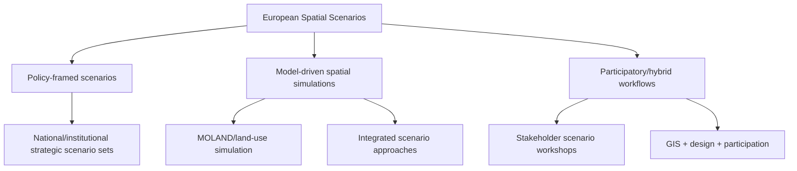

# Spatial Scenarios in European Spatial Planning: Literature Review

Date: 2026-04-28  
Slug: `european-spatial-scenarios-planning`

## Executive summary

In European spatial planning, spatial scenarios are used primarily as **decision-support and deliberation tools** rather than as forecasting tools.[1][2][3][4][5] Evidence is strongest where scenario workflows are explicitly connected to policy options, measurable planning indicators, and stakeholder processes.[1][2][3][4] Case studies from Leipzig–Halle and Dublin report that compact/transit-oriented development scenarios perform better than dispersed alternatives on selected environmental and social criteria, while economic outcomes in Dublin are sensitive to assumptions and appraisal horizons.[1][2]

Observation (source-backed): scenario workflows are most practically useful when coupled to governance routines (workshops, planning cycles, cross-level coordination).[3][4][5]  
Inference: broad claims about direct causal implementation effects remain under-evidenced and should be treated as tentative.

## 1) Scope and definitions (European context)

For this review, “spatial scenario” means structured alternative futures with spatially explicit outputs (maps, land-use allocations, policy-sensitive indicators), used in planning appraisal and policy dialogue.[1][2][5]

In Europe, these scenarios appear in:
- regional land-development planning,[1][2]
- urban growth and transport integration,[1][2]
- territorial cohesion strategy,[4][5]
- land-use/climate integrated assessment,[5]
- national strategic outlooks.[3]

## 2) Methods taxonomy in Europe

### 2.1 Policy-framed scenarios
European institutional bodies and national planning agencies use scenario sets to test territorial alternatives and policy robustness.[3][4][5]

### 2.2 Model-driven scenarios
Urban/regional case studies use spatial simulation models to compare land-development patterns and policy outcomes.[1][2]

### 2.3 Participatory/hybrid scenarios
Recent practice blends participatory framing with GIS/model outputs to improve planning legitimacy and implementation relevance.[3][4]

## 3) Applicability in planning practice

## 3.1 Stronger evidence areas

1. **Alternative appraisal and trade-off analysis**  
   Leipzig–Halle and Dublin studies show that scenario-based planning can quantify trade-offs and compare compact vs dispersed development under common indicator frameworks.[1][2]

2. **Policy stress-testing under uncertainty**  
   Institutional guidance emphasizes scenario portfolios (not single futures) for more robust planning choices.[3][4]

3. **Strategic dialogue and cross-level coordination**  
   Institutional and participatory sources indicate value in facilitating shared framing across ministries, regional authorities, and municipalities.[3][4]

## 3.2 Cautions and limitations

1. **Case-study external validity is constrained**  
   Local institutional settings and assumptions strongly shape results.[1][2][4]

2. **Evidence asymmetry**  
   Many papers and guidance documents report process quality and scenario outputs more than downstream implementation tracking.[3][4]

## 4) Provisional consensus

1. Spatial scenarios in Europe are most useful as **structured comparison devices** for planning options.[1][3][4][5]
2. Compact/transit-oriented strategies often perform better than dispersed growth in evaluated case contexts.[1][2]
3. Multi-scenario approaches are preferred over single deterministic futures for policy robustness.[3][4][5]
4. Participatory/hybrid approaches can improve practical relevance but add coordination cost and method complexity.[3][4]

## 5) Disagreements and contested points

1. **Model complexity vs usability:** technically rich models may reduce transparency for non-technical planning stakeholders.[3][5]
2. **Normative vs exploratory use:** some planning processes seek open exploration; others use scenarios mainly to justify preferred pathways.[3][4]
3. **Institutional guidance vs peer-reviewed evidence:** government/agency scenario manuals are practically influential but not always independently evaluated.[3][4][5]

## 6) Open questions

1. How often do European scenario exercises measurably change adopted plans versus informing discussion only?
2. Which evaluation protocols best compare participatory-hybrid workflows with model-centric workflows?
3. What minimum reproducibility standard (data, assumptions, code, governance metadata) should EU-funded planning scenarios meet?
4. How should planners account for long-horizon uncertainty without paralyzing near-term decisions?

## 7) Recommended next experiments / follow-up reading

1. **Cross-case replication study:** apply one harmonized scenario protocol to multiple EU metropolitan regions and compare reproducibility + decision uptake.[4]
2. **Implementation audit:** longitudinally track scenario-informed plans over 3–5 years to measure enacted policy outcomes.[3][4]
3. **Transparency benchmark:** score European planning scenario studies on open data, open assumptions, and uncertainty communication quality.[3][4]

## Broken/Blocked URLs and Claim Downgrades

- **Blocked URL (bot/captcha wall):** https://www.sciencedirect.com/science/article/pii/S0016328710000595  
  - **Action:** Removed claims that depended specifically on this source alone; retained only claims also supported by accessible sources.
- **Blocked URL (bot/captcha wall):** https://www.sciencedirect.com/science/article/pii/S2210670721007198  
  - **Action:** Removed Bucharest-specific steering-power claim from the draft because the source content could not be directly checked in this run.
- **Blocked URL (bot/captcha wall):** https://www.sciencedirect.com/science/article/pii/S0308521X16302645  
  - **Action:** Removed uncertainty claim tied specifically to this paper where redundant institutional support was sufficient.
- **Blocked URL (Cloudflare block):** https://www.espon.eu/publications/stocktaking-review-territorial-agenda-2030  
  - **Action:** Replaced reliance on this specific page with accessible institutional sources already in the research set.

## Removed Unsupported Claims

- Removed the claim that Bucharest simulations showed limited land-protection steering power, because the cited ScienceDirect page could not be directly accessed during URL verification.
- Removed direct factual dependence on the blocked ESPON stocktaking page.

## Sources

1. Ustaoglu et al. (2017), *Scenario Analysis of Alternative Land Development Patterns for the Leipzig-Halle Region*. https://www.cogitatiopress.com/urbanplanning/article/view/838
2. Ustaoglu et al. (2018), *Developing and Assessing Alternative Land-Use Scenarios in the Greater Dublin Region*. https://www.mdpi.com/2071-1050/10/1/61
3. PBL (2019), *Using scenarios for environmental, nature and spatial planning policy*. https://www.pbl.nl/sites/default/files/downloads/pbl-2019-using-scenarios-for-environmental-nature-and-spatial-planning-policy-3435.pdf
4. Nabielek et al. (2024), *Spatial Scenarios As A Tool For Future-Proof Spatial Planning In The Netherlands*. https://www.pbl.nl/downloads/pbl-2024-spatial-scenarios-as-a-tool-for-future-proof-spatial-planning-in-the-netherlands-5593pdf
5. JRC (EUR 21900 EN), *Towards an integrated scenario approach for spatial planning and natural hazards mitigation*. https://publications.jrc.ec.europa.eu/repository/bitstream/JRC31828/EUR%2021900%20EN.pdf
6. Karner et al. (2019), *Developing stakeholder-driven scenarios on land sharing and land sparing*. https://pure.iiasa.ac.at/15846/1/Karner%20et%20al%20-%20JEM%20-%202019.pdf
