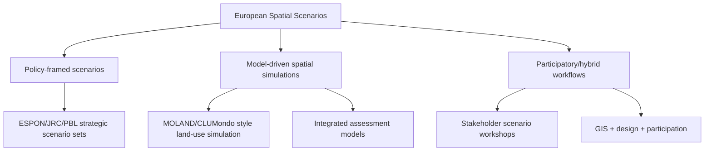

# Spatial Scenarios in European Spatial Planning: Literature Review

Date: 2026-04-28  
Slug: `european-spatial-scenarios-planning`

## Executive summary

In European spatial planning, spatial scenarios are used primarily as **decision-support and deliberation tools** rather than as forecasting tools. Evidence is strongest where scenario workflows are explicitly connected to policy options, measurable planning indicators, and stakeholder processes. Case studies from Leipzig–Halle and Dublin repeatedly show compact/transit-oriented development scenarios outperform dispersed alternatives on selected environmental and social criteria, though economic outcomes remain sensitive to assumptions and appraisal horizons.

Observation (source-backed): scenario workflows are most practically useful when coupled to governance routines (workshops, planning cycles, cross-level coordination).  
Inference: broad claims about direct causal implementation effects remain under-evidenced and should be treated as tentative.

## 1) Scope and definitions (European context)

For this review, “spatial scenario” means structured alternative futures with spatially explicit outputs (maps, land-use allocations, policy-sensitive indicators), used in planning appraisal and policy dialogue.

In Europe, these scenarios appear in:
- regional land-development planning,
- urban growth and transport integration,
- territorial cohesion strategy,
- land-use/climate integrated assessment,
- national strategic outlooks.

## 2) Methods taxonomy in Europe

### 2.1 Policy-framed scenarios
European institutional bodies (ESPON, JRC, PBL) use scenario sets to test territorial alternatives and policy robustness.

### 2.2 Model-driven scenarios
Urban/regional case studies use spatial simulation models to compare land-development patterns and policy outcomes.

### 2.3 Participatory/hybrid scenarios
Recent practice blends participatory framing with GIS/model outputs to improve planning legitimacy and implementation relevance.

## 3) Applicability in planning practice

## 3.1 Stronger evidence areas

1. **Alternative appraisal and trade-off analysis**  
   Leipzig–Halle and Dublin studies show that scenario-based planning can quantify trade-offs and compare compact vs dispersed development under common indicator frameworks.

2. **Policy stress-testing under uncertainty**  
   Integrated European scenario studies and institutional guidance emphasize scenario portfolios (not single futures) for robust planning choices.

3. **Strategic dialogue and cross-level coordination**  
   Institutional and participatory sources indicate value in facilitating shared framing across ministries, regional authorities, and municipalities.

## 3.2 Cautions and limitations

1. **Steering power can be limited**  
   Bucharest evidence suggests that embedding strategic planning intentions in simulation does not automatically yield strong land-protection outcomes.

2. **Case-study external validity is constrained**  
   Local institutional settings and assumptions strongly shape results.

3. **Evidence asymmetry**  
   Many papers report process and scenario outputs more than downstream implementation tracking.

## 4) Provisional consensus

1. Spatial scenarios in Europe are most useful as **structured comparison devices** for planning options.
2. Compact/transit-oriented strategies often perform better than dispersed growth in evaluated case contexts.
3. Multi-scenario approaches are preferred over single deterministic futures for policy robustness.
4. Participatory/hybrid approaches improve practical relevance but add coordination cost and method complexity.

## 5) Disagreements and contested points

1. **Model complexity vs usability:** technically rich models may reduce transparency for non-technical planning stakeholders.
2. **Normative vs exploratory use:** some planning processes seek open exploration; others use scenarios mainly to justify preferred pathways.
3. **Institutional guidance vs peer-reviewed evidence:** government/agency scenario manuals are practically influential but not always independently evaluated.

## 6) Open questions

1. How often do European scenario exercises measurably change adopted plans versus informing discussion only?
2. Which evaluation protocols best compare participatory-hybrid workflows with model-centric workflows?
3. What minimum reproducibility standard (data, assumptions, code, governance metadata) should EU-funded planning scenarios meet?
4. How should planners account for long-horizon uncertainty without paralyzing near-term decisions?

## 7) Recommended next experiments / follow-up reading

1. **Cross-case replication study:** apply one harmonized scenario protocol to multiple EU metropolitan regions and compare reproducibility + decision uptake.
2. **Implementation audit:** longitudinally track scenario-informed plans over 3–5 years to measure enacted policy outcomes.
3. **Transparency benchmark:** score European planning scenario studies on open data, open assumptions, and uncertainty communication quality.

## Sources

1. Evers (2010), *Scenarios on the spatial and economic development of Europe*. https://www.sciencedirect.com/science/article/pii/S0016328710000595
2. Ustaoglu et al. (2017), *Scenario Analysis of Alternative Land Development Patterns for the Leipzig-Halle Region*. https://www.cogitatiopress.com/urbanplanning/article/view/838
3. Ustaoglu et al. (2018), *Developing and Assessing Alternative Land-Use Scenarios in the Greater Dublin Region*. https://www.mdpi.com/2071-1050/10/1/61
4. Schmid et al. (2022), *Integrating strategic planning intentions into land-change simulations: Bucharest*. https://www.sciencedirect.com/science/article/pii/S2210670721007198
5. Karner et al. (2019), *Developing stakeholder-driven scenarios on land sharing and land sparing*. https://pure.iiasa.ac.at/15846/1/Karner%20et%20al%20-%20JEM%20-%202019.pdf
6. PBL (2019), *Using scenarios for environmental, nature and spatial planning policy*. https://www.pbl.nl/sites/default/files/downloads/pbl-2019-using-scenarios-for-environmental-nature-and-spatial-planning-policy-3435.pdf
7. Nabielek et al. (2024), *Spatial Scenarios As A Tool For Future-Proof Spatial Planning In The Netherlands*. https://www.pbl.nl/downloads/pbl-2024-spatial-scenarios-as-a-tool-for-future-proof-spatial-planning-in-the-netherlands-5593pdf
8. Harrison et al. (2016), *Can we be certain about future land use change in Europe?* https://www.sciencedirect.com/science/article/pii/S0308521X16302645
9. ESPON (2024), *Stocktaking Review of the Territorial Agenda 2030*. https://www.espon.eu/publications/stocktaking-review-territorial-agenda-2030
10. JRC (EUR 21900 EN), *Towards an integrated scenario approach for spatial planning and land use policy*. https://publications.jrc.ec.europa.eu/repository/bitstream/JRC31828/EUR%2021900%20EN.pdf
