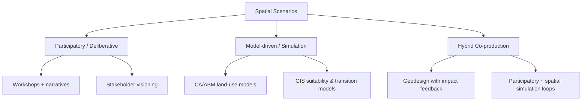

# Spatial Scenarios and Applicability in Practice: Literature Review

Date: 2026-04-28  
Slug: `spatial-scenarios-practice`

## Executive summary

Spatial scenarios are structured representations of alternative futures that are explicitly tied to place (maps, land-use patterns, spatial indicators, or geospatial simulations). Across the literature, they are used less as prediction engines and more as **decision-support instruments** for comparing plausible pathways under uncertainty. In practice, strongest adoption appears in urban/regional planning and land-use policy appraisal, especially when participatory design is combined with GIS/simulation tools.

Observation (source-backed): Multi-case and review papers report recurring benefits in stakeholder learning, exploration of trade-offs, and policy dialogue support.  
Inference (author): Evidence for **direct implementation outcomes** (e.g., policy enacted because of scenario process) is thinner and often case-specific, so claims of broad practical impact should be cautious.

## 1) What counts as a spatial scenario?

A cross-paper common definition is: a scenario process that links narrative or quantified assumptions to **spatially explicit outputs** (maps, spatial allocations, urban growth patterns, risk surfaces, or ecosystem-use mosaics). This includes:
- participatory socio-ecological scenario planning,
- GIS-supported planning scenarios,
- land-use/land-cover simulation pipelines (CA, ABM, hybrids),
- geodesign workflows with alternative spatial interventions.

## 2) Taxonomy of methods used in practice

### 2.1 Participatory scenario planning (PSP)
Multi-case evidence from 23 social-ecological case studies shows PSP is commonly used to structure local futures discussions, integrate local knowledge, and improve transparency of assumptions. (Oteros-Rozas et al., 2015)

### 2.2 Simulation-centric spatial scenarios
Land-use model reviews describe spatially explicit scenarios as computational laboratories for testing policy alternatives when real-world experiments are costly or impossible. (van Vliet et al., 2016; Rosa et al., 2020; Dutta et al., 2023)

### 2.3 Hybrid geodesign/boundary-work workflows
Geodesign literature positions scenario-making as iterative co-design where alternatives are rapidly assessed for multi-criteria impacts, improving plan deliberation quality in urban contexts. (Gottwald et al., 2025)

## 3) Practical applicability: where it works best

## 3.1 Urban and regional planning
Case studies (Nanjing, Bucharest, Stockholm) show practical applicability in:
- evaluating alternative growth patterns,
- testing consistency of strategic intentions against simulated land-use outcomes,
- supporting collaborative planning around trade-offs (housing, ecosystem services, transport).  

Evidence level: mostly case-study based; transferability depends on governance and data context.

## 3.2 Land-use policy appraisal
Review literature emphasizes scenarios as ex-ante policy testing tools (e.g., zoning, conversion constraints, ecosystem-risk balancing). Their practical value is strongest when scenarios are tied to explicit policy levers and measurable indicators.

## 3.3 Climate risk and adaptation governance
IPCC WGII framing and AR6/AR7 scenario discussions support scenario use for risk-informed decision design under deep uncertainty, but practical impact depends on institutional uptake and decision-process integration.

## 4) Consensus findings

1. **Decision support > prediction**: Most literature frames spatial scenarios as structured learning and comparison tools, not point forecasts.
2. **Hybrid approaches perform better in practice**: Participatory + model-based workflows better address legitimacy and technical credibility together.
3. **Boundary qualities matter**: Credibility, salience, and legitimacy recur as practical adoption conditions.
4. **Evaluation gap persists**: Many studies report process outputs (maps, workshop outcomes) more than downstream implementation outcomes.

## 5) Main disagreements / tensions

1. **Complexity vs usability**: Advanced models may improve technical sophistication but reduce transparency and stakeholder trust in planning settings.
2. **Exploratory vs normative scenarios**: Some work prioritizes open exploration; others optimize toward policy targets, which can constrain plural futures.
3. **Generalizability**: Single-city or single-region success is frequently over-interpreted; external validity is often unclear.

## 6) Open questions

1. Which evaluation designs best isolate causal impact of spatial scenarios on actual policy decisions?
2. How can uncertainty communication be standardized without oversimplifying spatial heterogeneity?
3. What minimum reproducibility package (data, assumptions, code) is needed for planning agencies to reuse scenario studies?
4. How to compare participatory legitimacy gains against increased cost/time of co-production?

## 7) Recommended next experiments / follow-up reading

1. **Comparative protocol study:** Run the same planning problem with three modes (participatory-only, model-only, hybrid) and compare decision quality metrics.
2. **Implementation tracking:** Longitudinal follow-up of scenario-informed plans (2–5 years) to quantify adoption and policy enactment.
3. **Reproducibility audit:** Select 5 influential spatial scenario case papers and score availability of data, code, parameter documentation.

## 8) Evidence quality statement

- Strongest evidence: review papers and multi-case syntheses.
- Moderate evidence: recent single-case urban planning applications.
- Weakest area: quantified causal links from scenario exercise to implemented policy outcomes.

## Sources

1. Oteros-Rozas et al. (2015). *Participatory scenario planning in place-based social-ecological research: insights and experiences from 23 case studies.* Ecology and Society 20(4):32. https://www.ecologyandsociety.org/vol20/iss4/art32/
2. van Vliet et al. (2016). *A review and assessment of land-use change models: dynamics of space, time and human choice.* USDA GTR NE-297. https://www.nrs.fs.usda.gov/pubs/gtr/gtr_ne297.pdf
3. Dutta et al. (2023). *A Comprehensive Review on Land Use/Land Cover (LULC) Change Modeling for Urban Development.* https://mdpi-res.com/d_attachment/sustainability/sustainability-15-00903/article_deploy/sustainability-15-00903.pdf?version=1672821373
4. Rosa et al. (2020). *Environmental Scenario Analysis on Natural and Social-Ecological Systems: A Review of Methods, Approaches and Applications.* https://mdpi-res.com/d_attachment/sustainability/sustainability-12-07542/article_deploy/sustainability-12-07542.pdf?version=1599974642
5. White et al. (2010). *Credibility, Salience, and Legitimacy of Boundary Objects for Environmental Decision Making.* mirror used: https://academia.edu/458514/White_D_A_Wutich_T_Lant_K_Larson_P_Gober_and_C_Senneville_2010_Credibility_Salience_and_Legitimacy_of_Boundary_Objects_for_Environmental_Decision_Making_Water_Managers_Assessment_of_WaterSim_A_Dynamic_Simulation_Model_in_an_Immersive_Decision_Theater_Science_and_Public_Policy_37_3_219_232
6. Chen et al. (2020). *Spatial dynamic modelling for urban scenario planning: A case study of Nanjing, China.* https://ideas.repec.org/a/sae/envirb/v47y2020i8p1380-1396.html
7. Grădinaru et al. (2021). *Integrating strategic planning intentions into land-change simulations: Designing and assessing scenarios for Bucharest.* metadata: https://api.crossref.org/works/10.1016/j.scs.2021.103446 ; open file: https://hal.science/hal-03404805v1/file/1-s2.0-S2210670721007198-main.pdf
8. Gottwald et al. (2025). *Planning for transformative change with nature-based solutions: A geodesign application in Stockholm.* metadata: https://api.crossref.org/works/10.1016/j.landurbplan.2025.105303
9. Sietchiping et al. (2022). *Spatial Planning Implementation Effectiveness: Review and Research Prospects.* https://www.mdpi.com/2073-445X/11/8/1279
10. IPCC AR6 WGII Chapter 17 (2022). *Decision Making Options for Managing Risk.* https://www.ipcc.ch/report/ar6/wg2/downloads/report/IPCC_AR6_WGII_Chapter17.pdf
11. van Vuuren et al. (2023). *Scenarios in IPCC assessments: lessons from AR6 and opportunities for AR7.* https://www.nature.com/articles/s44168-023-00082-1
