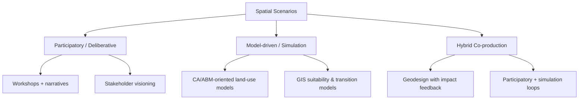

# Spatial Scenarios and Applicability in Practice: Literature Review

Date: 2026-04-28  
Slug: `spatial-scenarios-practice`

## Executive summary

Spatial scenarios are structured representations of alternative futures tied to place (e.g., maps, land-use patterns, geospatial indicators, simulation outputs) [1][2][4]. Across the reviewed literature, they are primarily used as **decision-support tools** rather than point-prediction engines [1][4][10][11].

**Observation (source-backed):** Review and multi-case papers report recurring benefits in stakeholder learning, trade-off exploration, and structured policy dialogue [1][4][10].  
**Inference (author):** Evidence for direct downstream implementation impact remains limited and often case-specific; strong causal claims should be treated as unverified in this corpus [9][10].

## Methods note (how this review was derived)

This review used a targeted sweep (2010–2026 plus older foundational work) and included sources that were retrievable in this environment and relevant to spatial scenario methods or practice outcomes. The taxonomy below is an **illustrative typology** (not a formal meta-analysis): papers were grouped by dominant mechanism (participatory, simulation, or hybrid co-production). City-specific papers with metadata-only access were used only as low-confidence contextual signals.

## 1) Working definition of spatial scenarios

A cross-paper working definition is: a scenario process linking narrative and/or quantitative assumptions to **spatially explicit representations** (e.g., mapped allocations, urban growth surfaces, risk maps, ecosystem mosaics) [1][2][4].

## 2) Illustrative taxonomy of methods in practice

### 2.1 Participatory scenario planning
PSP case synthesis (23 social-ecological cases) shows use for local knowledge integration and assumption transparency [1].

### 2.2 Simulation-centric approaches
Land-use review literature positions spatial scenarios as ex-ante testbeds for alternative policy pathways where real-world experimentation is difficult [2][3][4].

### 2.3 Hybrid approaches
Hybrid participatory-modeling workflows are presented as mechanisms to balance technical analysis with deliberative legitimacy, though evidence quality varies by case and source accessibility [1][8].

## 3) Practical applicability (confidence-graded)

### 3.1 Higher-confidence pattern: land-use and planning support
Across review papers, applicability is strongest for **ex-ante comparison of alternatives** (e.g., zoning, conversion constraints, policy bundles) and structured decision support [2][3][4][9].  
**Confidence:** Moderate (multiple reviews, but heterogeneous methods).

### 3.2 Moderate-confidence pattern: participatory governance support
Participatory scenario studies indicate usefulness for deliberation, shared framing, and stakeholder engagement quality [1][10].  
**Confidence:** Moderate (multi-case + assessment framing; limited causal policy-outcome evidence).

### 3.3 Low-confidence, illustrative city-case signals
Nanjing is supported by an accessible paper-level record [6]. Bucharest and Stockholm were identifiable, but in this run only metadata-level records were reliably accessible due anti-bot/blocked full-text routes [7][8]. Therefore these are treated as **illustrative, not confirmatory**.

## 4) Provisional cross-source patterns (not firm consensus)

1. **Decision support dominates over prediction framing** [1][4][10][11].  
   Evidence grade: **Moderate**.
2. **Hybrid designs may improve both usability and legitimacy** [1][8].  
   Evidence grade: **Low-to-Moderate** (partly metadata-dependent in this run).
3. **Credibility/salience/legitimacy conditions are emphasized in assessment and decision-making guidance** [10].  
   Evidence grade: **Low** (this review did not rely on a fully verified publisher copy of the 2010 boundary-object article).
4. **Implementation-evaluation gap persists**: process outputs are reported more often than realized policy outcomes [1][9].  
   Evidence grade: **Moderate**.

## 5) Disagreements and tensions

1. **Complexity vs usability:** richer models can reduce interpretability for non-technical planning stakeholders [2][3][9].
2. **Exploratory vs normative design:** open-future exploration can conflict with target-driven planning mandates [4][10][11].
3. **Transferability limits:** single-region success does not imply broad external validity [6][9].

## 6) Open questions

1. Which evaluation designs can isolate causal impact of scenario exercises on policy adoption? [9][10]
2. How should uncertainty communication be standardized without suppressing local heterogeneity? [10][11]
3. What reproducibility minimum (data, assumptions, code, governance context) is practical for agencies? [3][9]
4. How should institutions compare participatory legitimacy gains against added time/cost burdens? [1][9]

## 7) Recommended next steps

1. **Protocol comparison experiment:** same planning problem, three modes (participatory-only, model-only, hybrid), pre-registered evaluation metrics.
2. **Longitudinal implementation tracking:** monitor scenario-informed plans for 2–5 years to measure enacted vs proposed actions.
3. **Reproducibility audit:** score influential studies for open data/code/assumption traceability.

## Sources

1. Oteros-Rozas et al. (2015). *Participatory scenario planning in place-based social-ecological research: insights and experiences from 23 case studies.* Ecology and Society 20(4):32. https://www.ecologyandsociety.org/vol20/iss4/art32/
2. Agarwal et al. (USDA GTR NE-297). *A Review and Assessment of Land-Use Change Models: Dynamics of Space, Time, and Human Choice.* https://www.nrs.fs.usda.gov/pubs/gtr/gtr_ne297.pdf
3. Dutta et al. (2023). *A Comprehensive Review on Land Use/Land Cover (LULC) Change Modeling for Urban Development.* https://mdpi-res.com/d_attachment/sustainability/sustainability-15-00903/article_deploy/sustainability-15-00903.pdf?version=1672821373
4. Rosa et al. (2020). *Environmental Scenario Analysis on Natural and Social-Ecological Systems: A Review of Methods, Approaches and Applications.* https://mdpi-res.com/d_attachment/sustainability/sustainability-12-07542/article_deploy/sustainability-12-07542.pdf?version=1599974642
5. White et al. (2010). *Credibility, Salience, and Legitimacy of Boundary Objects for Environmental Decision Making.* Mirror used: https://academia.edu/458514/White_D_A_Wutich_T_Lant_K_Larson_P_Gober_and_C_Senneville_2010_Credibility_Salience_and_Legitimacy_of_Boundary_Objects_for_Environmental_Decision_Making_Water_Managers_Assessment_of_WaterSim_A_Dynamic_Simulation_Model_in_an_Immersive_Decision_Theater_Science_and_Public_Policy_37_3_219_232
6. Chen et al. (2020). *Spatial dynamic modelling for urban scenario planning: A case study of Nanjing, China.* https://ideas.repec.org/a/sae/envirb/v47y2020i8p1380-1396.html
7. Grădinaru et al. (2021). *Integrating strategic planning intentions into land-change simulations: Designing and assessing scenarios for Bucharest.* Metadata: https://api.crossref.org/works/10.1016/j.scs.2021.103446
8. Gottwald et al. (2025). *Planning for transformative change with nature-based solutions: A geodesign application in Stockholm.* Metadata: https://api.crossref.org/works/10.1016/j.landurbplan.2025.105303
9. Sietchiping et al. (2022). *Spatial Planning Implementation Effectiveness: Review and Research Prospects.* https://www.mdpi.com/2073-445X/11/8/1279
10. IPCC AR6 WGII Chapter 17 (2022). *Decision Making Options for Managing Risk.* https://www.ipcc.ch/report/ar6/wg2/downloads/report/IPCC_AR6_WGII_Chapter17.pdf
11. van Vuuren et al. (2023). *Scenarios in IPCC assessments: lessons from AR6 and opportunities for AR7.* https://www.nature.com/articles/s44168-023-00082-1
