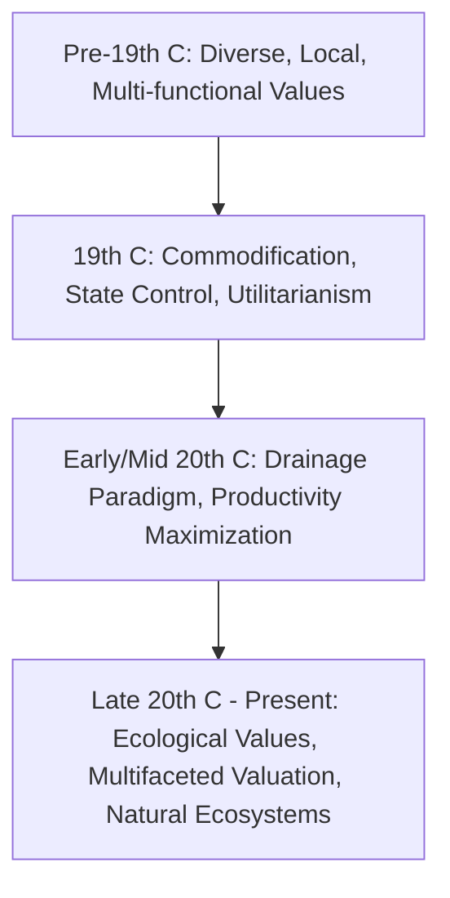

# Values in the History of Spatial Transformation in Land-Water Interaction in Europe: A Literature Review

## Executive summary
This review of a **selected, English-language corpus** on land-water interaction in Europe suggests a dynamic evolution of dominant values. The narrative indicates a shift from early multi-functional, localized appreciations towards state-led control, commodification, and maximizing productivity. Subsequently, the literature points to an eventual incorporation of significant ecological and holistic considerations. Based on the accessible texts and abstracts in this corpus, key phases can be observed: (1) pre-19th century diverse local uses, (2) 19th-century state-led control and commodification, (3) 20th-century large-scale drainage and agricultural intensification, and (4) late 20th/21st-century ecological integration and multifaceted valuation. Key actors and scientific advancements consistently appear to have shaped these value transformations. Claims relying on sources with limited full-text access (noted in "Sources") are interpreted as hypotheses or indications from abstracts. The Anglophone focus of this corpus means that a broader range of European perspectives and historical narratives may not be fully captured. [2, 3, 4, 5, 6, 7, 8, 9, 10, 11, 12, 13]

## Search strategy and inclusion criteria
- **Base corpus:** Generated by `researcher` subagent output (`outputs/europe-land-water-values-research-1.md`). The subagent employed a semantic search strategy across AlphaXiv, Perplexity, and publisher sites using keywords: "values," "history," "spatial transformation," "land water interaction," and "Europe."
- **Focus:** English-language peer-reviewed papers, book chapters, and monographs in environmental history and water management.
- **Time frame:** Early modern period (c. 16th century) to present (publications through 2024-2025).
- **Inclusion priority:** Sources explicitly discussing values, aims, drivers, and actor perspectives.
- **Exclusion/deweighting:** General accounts without explicit value analysis. Claims from abstract-only sources are labeled as indicative.

## Historical periodization of dominant values

### Phase 1: Pre-19th Century – Diverse and Multi-functional Values
Before the 19th century, water management often reflected localized, multi-functional values [4]. Water was valued for drinking, commerce, waste, defense, transport, and hydropower [4]. Managed through empirical practices, the abstract of [5] suggests the existence of "hydraulic communities" that may have sought equilibrium with nature. In regions like Venice and Holland, land reclamation was driven by productivity, yet with nascent awareness of environmental impact [3].

### Phase 2: 19th Century – Commodification, Control, and Utilitarianism
The 19th century suggests a significant shift toward viewing water as a commodity controlled by administrative states [9, 10, 11]. This involved the "universalization" of provision and commodification in centers like Paris [9]. Indications from [5, 10, 11, 13] suggest "administrative states" asserted centralized control, often clashing with traditional local "hydraulic communities." Industrialization intensified utilitarian values for industry and households, leading to complex infrastructure [4, 10] and the marginalization of traditional networks [4]. The abstract of [8] suggests that the discovery of water's "compound nature" may have facilitated its conceptualization as a uniform commodity.

### Phase 3: 20th Century – Drainage Paradigm and Intensification
This era was characterized by a dominant "drainage paradigm" [2]. State bureaucracies prioritized agricultural productivity, valuing wetlands as "unused" land to be converted through large-scale drainage [2]. This era saw continued land-management intensification driven by technological and institutional changes [6].

### Phase 4: Late 20th Century to Present – Ecological Integration
Growing environmental awareness challenged productivity-focused values [2]. Scientists and activists questioned the impacts of large-scale interventions, advocating for the protection of socio-ecological systems [2]. Contemporary water management shows a progression to recognize ecological values. Abstracts suggest this includes "working with natural water ecosystems" [7] and a re-appreciation of water's qualitative diversity [8].

## Key actors and their value perspectives
- **Local Communities:** Historically valued water for subsistence and diverse local uses [4]. Abstracts suggest the presence of "hydraulic communities" [5].
- **State Engineers:** Emphasized centralized control and large-scale engineering for state objectives [2, 5, 10, 11].
- **Agronomists/Hydraulic Theorists:** Abstracts suggest some (e.g., Jaubert de Passa, Cattaneo) advocated for localized understanding, while others supported state-led rationalization [5, 10].
- **Industrialists:** Valued water for processes and waste disposal, later seeking its replacement by alternative technologies [4].
- **Scientists/Activists (Late 20th C):** Challenged existing paradigms, advocating for ecological protection and wetland conservation [2].

## Influence of science and technology on values
- **Hydraulic Technologies:** Facilitated exploitation (canals, dams). Abstracts suggest local technical cultures emerged around these [3, 4, 5].
- **Industrial Technologies:** Reinforced commodification; new technologies (railroads, electricity) replaced traditional functions, leading to marginalization [4, 10].
- **Large-Scale Engineering:** Enabled the "drainage paradigm," cementing productivity and control [2].
- **Ecological Science:** Provided the basis for challenging practices, highlighting ecosystem services and interconnectivity [2].

## Regional variations
- **Venice and Holland:** Exemplars of early modern mastery over water land-making [3].
- **Munich:** Case study of urban water transitioning from integration to industrial pollution and technological replacement [4].
- **France and Italy:** Abstracts highlight tension between local communities and administrative control [5, 10].
- **Central/Eastern Europe:** Abstract of [1] notes river transformations driven by agricultural production and flood protection.

## Recurring patterns in this limited corpus
1. This corpus suggests a trajectory from localized, multi-functional management to state-led control, followed by a re-integration of ecological considerations. [2, 3, 4, 5, 6, 7, 8, 9, 10, 11]
2. Technology and science consistently appear fundamental in enabling these transformations and shaping values [2, 3, 4, 5, 6, 7, 8, 10].
3. Conflict between local practices and centralized management seems to be a recurring theme, notably in the 19th century [4, 5, 10, 13].

## Open Research Avenues and Hypotheses from Limited Corpus
1. **Pace and Drivers:** The precise timing and local drivers of value shifts require deeper comparative analysis across non-Anglophone linguistic contexts.
2. **Success of Integration:** The extent to which ecological values are genuinely integrated in practice vs. rhetorical policy goals remains an open question.
3. **Agency:** The degree to which local movements effectively contested dominant values requires further investigation.
4. **Methodology:** How can value-based historical analysis be expanded beyond the Anglophone focus?
5. **Full-text verification:** Hypotheses suggested by abstracts (e.g., "hydraulic communities" [5] or "compound nature" discovery [8]) require full-text verification to become established findings.

## Sources
1. Comiti, F., & Scorpio, V. (2019). *Historical Changes in European Rivers*. (Abstract/Metadata only).
2. Bruisch, K., & van de Grift, L. (2020). *3 Reclaiming the Land*. De Gruyter. (Content retrieved).
3. Ciriacono, S. (2006). *Building on Water*. Berghahn Books. (Content retrieved).
4. Schölz, T., & Krüpe, F. (2016). *Munich’s early modern water network*. Water History. (Content retrieved).
5. Ingold, A. (2009). *Hydraulic Communities and Administrative States*. (Abstract/Metadata only).
6. Jepsen, M. R., et al. (2015). *Transitions in European land-management regimes*. (Content retrieved).
7. van Wijk, J. S. K. A., et al. (2024). *Valuing water*. (Abstract/Metadata only).
8. O'Riordan, T. T. J. (2000). *'Waters' or 'Water'?*. (Abstract/Metadata only).
9. Barre, A. (2010). *Universalizing provision of water in Paris*. (Content retrieved).
10. Douet, M. (2016). *Infrastructure development*. (Abstract only).
11. Dellaporta, F. (2010). *Water Property Models*. (Content retrieved).
12. Toussaint, P. (2000). *Sustainability of water policies*. (Abstract only).
13. Lintsen, H. (2022). *Dutch Regional Water Authorities*. (Abstract only).

## Evidence caveats
- A substantial portion of the cited sources ([1, 5, 7, 8, 10, 12, 13]) were accessed only via abstracts or metadata. Claims derived from these are treated as indicative hypotheses rather than definitive findings.
- The review is limited to English-language scholarship, which may omit diverse regional perspectives.
- No quantitative meta-analysis was performed.
