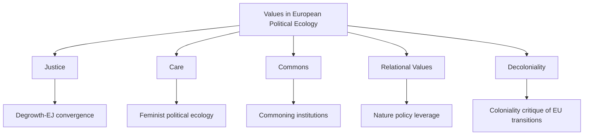

# Values in European Political Ecology: A Literature Review

## Summary
European political ecology literature increasingly treats **values** as explicitly political, contested, and institutional: not just preferences, but normative commitments about justice, care, commoning, and human–nature relations. Across 2014–2026 work, three linked trajectories stand out: (1) convergence between environmental justice and degrowth, (2) growth of decolonial and feminist critiques of EU policy framings, and (3) uptake of relational values language in biodiversity and bioeconomy debates. Evidence is strongest for conceptual synthesis and policy critique; thinner for comparative causal evaluation of which value frameworks produce better ecological and justice outcomes.

## Search strategy and inclusion
- Primary corpus started from delegated triage (`outputs/european-political-ecology-values-research-1.md`) focused on 2014–2026 plus canonical anchors.
- Inclusion priority: peer-reviewed papers and book chapters directly addressing values in European political ecology or adjacent European environmental governance with political-ecology framing.
- Exclusion/deweighting: sources with only metadata/snippet access used cautiously; claims from these are labeled as lower-confidence.

## Conceptualizations of values

### 1) Justice-centered values
A consistent line of work connects environmental justice and degrowth, arguing that value conflict is materially grounded in unequal resource throughput and ecological burdens, not only discourse-level disagreement. This is explicit in socio-metabolic analyses and movement-focused political economy.

### 2) Care and social reproduction
Feminist political ecology contributions position care as both an ethical and organizational principle, shifting attention from output-maximization toward maintenance, reproduction, and collective wellbeing.

### 3) Commons and commoning
Commons-oriented municipal and institutional analysis frames values as co-governance commitments (shared stewardship, use-value, collective rights) rather than market-mediated preferences.

### 4) Relational values
Recent European nature-policy scholarship emphasizes relational values (attachment, reciprocity, responsibility), often as an alternative/complement to intrinsic vs instrumental binaries.

### 5) Decolonial values
Decolonial political ecology critiques Eurocentric universals and highlights colonial continuities in knowledge and extraction relations, challenging policy narratives that claim justice while externalizing harms.

## Thematic evidence by domain
- **Bioeconomy and transition policy:** Strong critique of pro-growth framings; recurring calls for justice-oriented, relational, and decolonial redesign.
- **Conservation/nature policy:** Relational values increasingly operationalized in policy discourse, though implementation evidence remains limited.
- **Urban governance/commoning:** Case evidence suggests value shifts toward co-management and public-common hybrids, but empirical base is still narrow.
- **Movement studies (degrowth/EJ):** Well-developed normative-theoretical integration; limited longitudinal impact evaluation.

## Methods landscape
Dominant methods are conceptual synthesis, discourse/policy analysis, socio-metabolic framing, and qualitative case comparison. There is comparatively less mixed-method or longitudinal evaluation linking specific value framings to measured socioecological outcomes.

## Consensus
1. Values are politically structured and conflictual, not neutral inputs.
2. Justice is central but increasingly articulated alongside care, relationality, and decolonial critique.
3. Growth-centric sustainability narratives are a core target of critique in European political ecology.
4. EU policy arenas are key sites where value pluralism is acknowledged rhetorically but often weakly institutionalized.

## Disagreements and fault lines
1. **Reform vs transformation:** whether EU institutions can internalize political-ecology values through reform, or whether deeper systemic rupture is required.
2. **Universalist vs plural/decolonial normativity:** whether shared universal frameworks are politically necessary or epistemically violent.
3. **Policy pragmatism vs movement radicalism:** tension between implementable policy instruments and anti-extractivist political demands.

## Open questions
1. Which institutional mechanisms best embed plural values without reducing them to market metrics?
2. Under what conditions do relational-value framings change budgets, regulation, or land-use outcomes (not only discourse)?
3. How can European policy evaluation include externalized socioecological impacts along supply chains?
4. What comparative evidence exists across European regions for care/commoning institutions at scale?

## Recommended next steps
- Build a structured review dataset (paper-level coding: value frame, domain, method, evidentiary strength, policy mechanism).
- Conduct a focused comparative review on two policy arenas (e.g., EU bioeconomy vs biodiversity governance) with explicit causal-process tracing.
- Add empirical follow-up on outcome metrics (distributional justice, participation quality, ecological integrity) to complement conceptual critiques.

## Sources
- Scheidel, A. & Schaffartzik, A. (2019). *A socio-metabolic perspective on environmental justice and degrowth movements*. Ecological Economics, 161. https://ddd.uab.cat/pub/artpub/2019/203987/ecoeco_a2019v161p330pp.pdf
- Akbulut, B., Demaria, F., Gerber, J.-F., & Martinez-Alier, J. (2019). *Who promotes sustainability? Five theses on the relationships between the degrowth and the environmental justice movements*. Ecological Economics. https://www.sciencedirect.com/science/article/abs/pii/S0921800919306160
- Schöneberg, J. (2022). *Envisioning just transformations in and beyond the EU bioeconomy*. Sustainability Science. https://link.springer.com/article/10.1007/s11625-022-01091-5
- Ramcilovic-Suominen, S. et al. (2022). *From pro-growth and planetary limits to degrowth and decoloniality*. Forest Policy and Economics. https://www.sciencedirect.com/science/article/pii/S1389934122001320
- Ramcilovic-Suominen, S. et al. (2024). *How can relational, decolonial and feminist approaches inform the EU bioeconomy?* Sustainability Science. https://link.springer.com/article/10.1007/s11625-024-01613-3
- Schulz, K. A. (2017). *Decolonizing political ecology*. Journal of Political Ecology. https://doi.org/10.2458/v24i1.20789
- Balázsi, Á. et al. (2024). *Relational values of nature: leverage points for nature policy in Europe*. https://research.wur.nl/en/publications/relational-values-of-nature-leverage-points-for-nature-policy-in-/
- Ferragina, E. et al. (2025). *The human-nature divide in European Union environmental policy*. Journal of Political Ecology. https://journals.librarypublishing.arizona.edu/jpe/article/id/5795/
- Buijs, A. et al. (2022). *Policy discourses for reconnecting nature with society*. Land Use Policy. https://www.sciencedirect.com/science/article/pii/S0264837721006888
- Scala, A. et al. (2022). *The commonification of the public under new municipalism*. https://ddd.uab.cat/pub/artpub/2022/261102/SA_The_commonification_of_the_public_under_new_municipalism-_commons-state_institutions_in_Naples_and_Barcelona.pdf
- Barca, S. et al. (2023). *Caring Communities for Radical Change*. https://link.springer.com/chapter/10.1007/978-3-031-20928-4_8

## Evidence caveats
- Several items above were available only as abstract/metadata or partial snippets in this run; those sources were used for directional support, not sole support for critical claims.
- No quantitative meta-analysis was run in this review.
