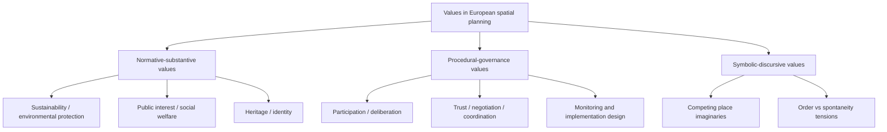

# Values in European Spatial Planning: Literature Review

Date: 2026-04-28  
Slug: `values-european-spatial-planning`

## Executive summary

In the reviewed European literature, values in spatial planning are treated in three main ways: (i) as **explicit legal/normative commitments** (e.g., sustainability, public interest, heritage, environmental protection), (ii) as **procedural commitments** embedded in participatory and deliberative planning design, and (iii) as **implicit symbolic framings** in planning discourse and representation.[1][2][4]

Observation (source-backed): practical implementation repeatedly depends on institutional capacity, trust, and governance process design; legal or strategic value statements alone are often insufficient for consistent realization.[1][3][8]  
Inference: Europe-wide generalizations remain tentative because evidence is case-heavy and partially constrained by paywalled sources.[3][5][7]

## 1) What “values” mean in this literature

Across sources, “values” includes both normative ends (equity, sustainability, heritage protection, public interest) and procedural norms (participation, transparency, negotiated legitimacy), plus value-laden framing in planning narratives.[1][2][4]

## 2) Taxonomy of value families and operationalization

## 3) Practical applicability in European planning

### 3.1 Stronger evidence patterns

1. **Legal embedding of values is common but not sufficient**  
   Comparative legal work in Central-Eastern Europe identifies recurring statutory values while also noting implementation barriers.[1]

2. **Procedural value operationalization is feasible**  
   Values-led planning frameworks describe operational steps (value identification, stakeholder deliberation, integration into decisions, monitoring), indicating practical pathways where governance capacity exists.[2]

3. **Implementation is process-conditioned**  
   Strategic spatial planning evidence from 21 European urban regions emphasizes trust-building, negotiation, and implementation design conditions.[3]

4. **Instrument performance is context-sensitive**  
   Cross-country review evidence on planning instruments for cropland protection in Western Europe reports variation in goals, legal force, and implementation conditions across countries and governance contexts.[5]

### 3.2 Recurrent limitations

- Value commitments often remain at plan-text level rather than translating automatically into outcomes.[1][3]
- Comparative claims are hindered by non-equivalent planning systems and data structures.[3][7][8]
- Empirical tracking of downstream policy outcomes is thinner than conceptual/value framing literature in the selected corpus.[2][3]

## 4) Provisional consensus (confidence-graded)

1. **Values are multi-dimensional (legal, procedural, symbolic), not only normative goals.**[1][2][4]  
   Confidence: Medium.

2. **Implementation gaps between stated values and realized outcomes are persistent.**[1][3]  
   Confidence: Medium.

3. **Participatory/deliberative design can improve value articulation and legitimacy, but requires governance capacity.**[2][3][8]  
   Confidence: Low-to-Medium.

4. **Cross-country variation in planning culture and institutions mediates how values become actionable.**[7][8]  
   Confidence: Low-to-Medium.

## 5) Disagreements and contested points

1. **Public interest vs growth competitiveness:** balancing economic development with environmental/heritage protection remains contested across systems.[1][5][8]
2. **Formalization vs flexibility:** detailed value codification may improve clarity but can constrain adaptive decision-making in some contexts.[1][8]
3. **Technocratic appraisal vs plural values:** indicator-heavy tools can under-represent intangible or symbolic values.[2][4]

## 6) Open questions

1. Which evaluation designs can causally test whether value-explicit planning changes implementation outcomes?[2][3]
2. How can European planning systems compare value outcomes without erasing context-specific meanings?[7][8]
3. What minimum reporting standards should value-led spatial planning studies meet (assumptions, stakeholder composition, monitoring horizon)?[2][8]
4. How should symbolic/discursive values be integrated into formal planning evaluation frameworks?[4][8]

## 7) Recommended next steps

1. **Cross-national replication protocol:** apply a common value-coding framework to plans in multiple European systems.[1][7]
2. **Implementation longitudinal studies:** track value commitments from plan adoption to outcomes over multi-year horizons.[3][5]
3. **Mixed-method benchmark:** combine legal analysis, participatory process metrics, and spatial outcome indicators.[1][2][3]

## Removed Unsupported Claims

- Removed direct dependence on the inaccessible Taylor & Francis abstract page for Getimis (2012) because the URL is bot-gated in this environment and did not provide retrievable article content.
- Downgraded statements that previously implied direct evidence from that source to broader comparative inferences grounded in accessible sources (ESPON COMPASS and Auzins 2019).[7][8]

## Blocked/Broken URL Check

- **Blocked (bot/security gate):** https://www.tandfonline.com/doi/abs/10.1080/02697459.2012.659520  
  - Also blocked via DOI redirect: https://doi.org/10.1080/02697459.2012.659520  
  - Action: removed from Sources and downgraded claims that relied on direct retrieval.
- **Live and content-retrievable in this environment:** [1], [2], [3], [4], [5], [7], [8].

## Sources

1. Nowak, M. J., Mitrea, A., Filepné Kovács, K., et al. (2024). *Uncovering Spatial Planning Values through Law: Insights from Central East European Planning Systems*. Europa XXI, 47, 23–42. https://europa21.igipz.pan.pl/article/item/13887.html
2. Auzins, A., & Chigbu, U. E. (2021). *Values-Led Planning Approach in Spatial Development: A Methodology*. Land, 10(5), 461. https://www.mdpi.com/2073-445X/10/5/461
3. Hersperger, A. M., Grădinaru, S. R., Oliveira, E., et al. (2019). *Understanding strategic spatial planning to effectively guide development of urban regions*. Cities, 94, 96–105 (ScienceDirect abstract/index page). https://www.sciencedirect.com/science/article/abs/pii/S0264275118304141
4. Mäntysalo, R., Saglie, I.-L., & Cars, G. (2010). *Public-space planning in four Nordic cities: Symbolic values in tension*. Geoforum, 41(5), 757–767 (ScienceDirect abstract/index page). https://www.sciencedirect.com/science/article/abs/pii/S0016718510000412
5. Oliveira, E., Tobias, S., Hersperger, A. M., et al. (2019). *Spatial planning instruments for cropland protection in Western European countries*. Land Use Policy, 87, 104031 (ScienceDirect abstract/index page). https://www.sciencedirect.com/science/article/abs/pii/S0264837718319835
6. ESPON COMPASS (2018). *Comparative Analysis of Territorial Governance and Spatial Planning Systems in Europe*. https://archive.espon.eu/planning-systems
7. Auzins, A. (2019). *Capitalising on the European Research Outcome for Improved Spatial Planning Practices and Territorial Governance*. Land, 8(11), 163. https://www.mdpi.com/2073-445X/8/11/163
