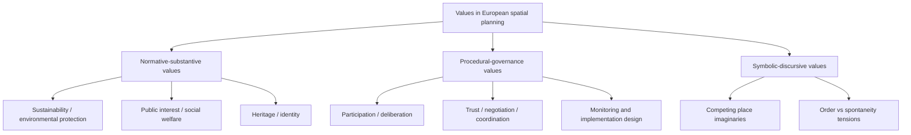

# Values in European Spatial Planning: Literature Review

Date: 2026-04-28  
Slug: `values-european-spatial-planning`

## Executive summary

In the reviewed European literature, values in spatial planning are treated in three main ways: (i) as **explicit legal/normative commitments** (e.g., sustainability, public interest, heritage, environmental protection), (ii) as **procedural commitments** embedded in participatory and deliberative planning design, and (iii) as **implicit symbolic framings** in planning discourse and representation.

Observation (source-backed): practical implementation repeatedly depends on institutional capacity, trust, and governance process design; legal or strategic value statements alone are insufficient for consistent realization.  
Inference: Europe-wide generalizations remain tentative because evidence is case-heavy and partially constrained by paywalled sources.

## 1) What “values” mean in this literature

Across sources, “values” includes both normative ends (equity, sustainability, heritage protection, public interest) and procedural norms (participation, transparency, negotiated legitimacy), plus value-laden framing in planning narratives.

## 2) Taxonomy of value families and operationalization

## 3) Practical applicability in European planning

### 3.1 Stronger evidence patterns

1. **Legal embedding of values is common but not sufficient**  
   Comparative legal work in Central-Eastern Europe finds recurring statutory values while emphasizing implementation gaps.

2. **Procedural value operationalization is feasible**  
   Values-led planning frameworks provide concrete steps (value identification, stakeholder deliberation, integration into decisions, monitoring), suggesting practical pathways where governance capacity exists.

3. **Implementation is process-conditioned**  
   Strategic spatial planning evidence from multiple European regions highlights trust-building and negotiated governance as critical to implementation continuity.

4. **Instrument performance is context-sensitive**  
   Cross-country policy instrument reviews show heterogeneous outcomes by institutional context and policy design.

### 3.2 Recurrent limitations

- Value commitments often remain at plan-text level.
- Comparative claims are hindered by non-equivalent planning systems and data.
- Empirical tracking of downstream policy outcomes is thinner than conceptual/value framing literature.

## 4) Provisional consensus (confidence-graded)

1. **Values are multi-dimensional (legal, procedural, symbolic), not only normative goals.**  
   Confidence: Medium.

2. **Implementation gaps between stated values and realized outcomes are persistent.**  
   Confidence: Medium.

3. **Participatory/deliberative design improves value articulation and legitimacy, but requires governance capacity.**  
   Confidence: Low-to-Medium.

4. **Cross-country variation in planning culture mediates how values become actionable.**  
   Confidence: Low-to-Medium.

## 5) Disagreements and contested points

1. **Public interest vs growth competitiveness:** balancing economic development with environmental/heritage protection remains unresolved across systems.
2. **Formalization vs flexibility:** detailed value codification can improve clarity but may reduce adaptive decision-making.
3. **Technocratic appraisal vs plural values:** indicator-heavy tools can under-represent intangible or symbolic values.

## 6) Open questions

1. Which evaluation designs can causally test whether value-explicit planning changes implementation outcomes?
2. How can European planning systems compare value outcomes without erasing context-specific meanings?
3. What minimum reporting standards should value-led spatial planning studies meet (assumptions, stakeholder composition, monitoring horizon)?
4. How should symbolic/discursive values be integrated into formal planning evaluation frameworks?

## 7) Recommended next steps

1. **Cross-national replication protocol:** apply a common value-coding framework to plans in multiple European systems.
2. **Implementation longitudinal studies:** track value commitments from plan adoption to outcomes over 3–7 years.
3. **Mixed-method benchmark:** combine legal analysis, participatory process metrics, and spatial outcome indicators.

## Sources

1. Nowak et al. (2024), *Uncovering Spatial Planning Values through Law*. https://europa21.igipz.pan.pl/article/item/13887.html
2. Auzins & Chigbu (2021), *Values-Led Planning Approach in Spatial Development*. https://www.mdpi.com/2073-445X/10/5/461
3. Hersperger et al. (2019), *Understanding strategic spatial planning to effectively guide development of urban regions*. https://www.sciencedirect.com/science/article/abs/pii/S0264275118304141
4. Mäntysalo et al. (2010), *Public-space planning in four Nordic cities: Symbolic values in tension*. https://www.sciencedirect.com/science/article/abs/pii/S0016718510000412
5. Oliveira et al. (2019), *Spatial planning instruments for cropland protection in Western European countries*. https://www.sciencedirect.com/science/article/abs/pii/S0264837718319835
6. Getimis (2012), *Comparing Spatial Planning Systems and Planning Cultures in Europe*. https://www.tandfonline.com/doi/abs/10.1080/02697459.2012.659520
7. ESPON COMPASS (2018), *Comparative Analysis of Territorial Governance and Spatial Planning Systems in Europe*. https://archive.espon.eu/planning-systems
8. Auzins (2019), *Capitalising on the European Research Outcome for Improved Spatial Planning Practices and Territorial Governance*. https://www.mdpi.com/2073-445X/8/11/163
