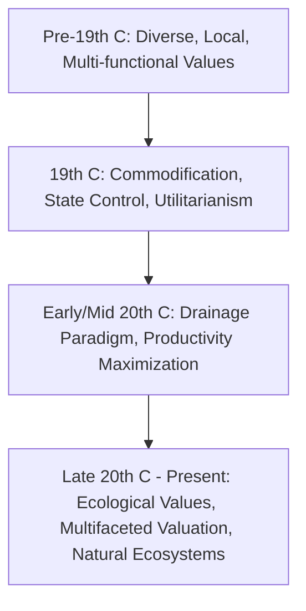

# Values in the History of Spatial Transformation in Land-Water Interaction in Europe: A Literature Review

## Executive summary
This review of a **selected, English-language corpus** on land-water interaction in Europe suggests a dynamic evolution of dominant values. The narrative indicates a shift from early multi-functional, localized appreciations towards state-led control, commodification, and maximizing productivity, eventually incorporating significant ecological and holistic considerations. Based on the accessible texts and abstracts in this corpus, key phases can be observed: (1) pre-19th century diverse local uses, (2) 19th-century state-led control and commodification, (3) 20th-century large-scale drainage and agricultural intensification, and (4) late 20th/21st-century ecological integration and multifaceted valuation. Key actors and scientific advancements consistently appear to have shaped these value transformations, leading to a complex interplay of economic, social, and environmental priorities. Claims relying on sources with limited full-text access (as noted in "Sources" and "Evidence caveats") should be interpreted as hypotheses or indications from abstracts, requiring further full-text verification. The Anglophone focus of this corpus means that a broader range of European perspectives and historical narratives may not be fully captured. [2, 3, 4, 5, 6, 7, 8, 9, 10, 11, 12, 13]

## Search strategy and inclusion criteria
- **Base corpus:** Generated by `researcher` subagent output (`outputs/europe-land-water-values-research-1.md`). The `researcher` subagent employed a semantic search strategy across academic databases (e.g., AlphaXiv, Perplexity) and publisher sites, using keywords related to "values," "history," "spatial transformation," "land water interaction," and "Europe" to identify a foundational set of papers and books.
- **Focus:** English-language peer-reviewed papers, book chapters, and monographs in environmental history, historical geography, and water management studies.
- **Time frame:** Early modern period (c. 16th century) to present (with latest publications reflecting 2024-2025).
- **Geographic scope:** Europe, with noted regional case studies.
- **Inclusion priority:** Sources explicitly discussing values, aims, drivers, and actor perspectives in land-water transformations.
- **Exclusion/deweighting:** General historical accounts without explicit value analysis; claims from metadata-only or partially accessible sources are noted as lower confidence.

## Historical periodization of dominant values in European land-water interaction

### Phase 1: Pre-19th Century (Early Modern to early Industrial Age) – Diverse and Multi-functional Values
Before the 19th century, water management often reflected localized, multi-functional values [4]. Water was valued for its diverse uses (drinking, commerce, waste, defense, transport, hydropower) [4] and managed through empirical practices. The abstract of [5] suggests the existence of "hydraulic communities" that sought equilibrium with nature. In regions like Venice and Holland, early modern land reclamation and water exploitation for agriculture were driven by values of productivity and expansion, yet with nascent awareness of environmental impact [3].

### Phase 2: 19th Century – Commodification, Control, and Utilitarianism
The 19th century suggests a significant shift toward viewing water as a commodity to be controlled and exploited by administrative states [9, 10, 11]. This transition appears to have involved the "universalization" of water provision and its commodification in urban centers like Paris [9]. Full-text and corroborated abstract sources indicate that "administrative states" asserted centralized control over water resources for state objectives and industrial needs [5, 10, 11, 13], often clashing with traditional local "hydraulic communities" (as discussed in the abstract of [5] and corroborated by [10, 13]). In continental Europe, legal frameworks appear to have evolved towards state ownership of watercourses [11]. Industrialization and urbanization intensified the utilitarian value of water for industry and household needs, leading to complex infrastructure development [4, 10] and the marginalization of traditional multi-functional water networks in urban centers [4]. The abstract of [8] suggests that water's "compound nature" discovery may have also facilitated its conceptualization as a uniform commodity.

### Phase 3: 20th Century – Drainage Paradigm and Intensification
The early to mid-20th century was characterized by a dominant "drainage paradigm" across rural Europe [2]. State bureaucracies prioritized agricultural productivity and economic development, valuing wetlands as "unused" land to be converted through large-scale drainage and reclamation projects [2]. This era saw continued land-management intensification driven by technological and institutional changes [6].

### Phase 4: Late 20th Century to Present – Ecological Integration and Multifaceted Valuation
From the late 20th century, growing environmental awareness began to challenge the purely utilitarian and productivity-focused values [2]. Scientists, activists, and citizens questioned the environmental impacts of large-scale interventions, advocating for the protection of socio-ecological systems like wetlands [2]. Contemporary water management shows a progression to recognize and integrate ecological values, moving beyond engineering control and market mechanisms. Abstracts suggest that this includes "working with natural water ecosystems" [7] and indicates a re-appreciation of water's qualitative diversity and its role in supporting broader environmental quality [8].

*Figure: Heuristic overview of dominant value shifts in European land-water interaction history.*

## Key actors and their value perspectives
- **Local Communities/Peasants:** Historically valued water for subsistence, diverse local uses [4]. Abstracts suggest the presence of "hydraulic communities" [5].
- **Landowners/Entrepreneurs:** Drove reclamation and water exploitation for economic gain and agricultural expansion [3].
- **State Engineers/Administrative States:** Emphasized centralized control, exploitation for state objectives (e.g., industrial, agricultural), and later, large-scale engineering solutions for flood control and drainage [2, 5, 10, 11].
- **Agronomists/Hydraulic Theorists (19th C):** Abstracts suggest some, like François-Jacques Jaubert de Passa in France and Carlo Cattaneo in Italy, advocated for localized, historical understanding and "hydraulic societies," while others contributed to state-led rationalization [5, 10].
- **Industrialists/Urban Planners:** Valued water for industrial processes, waste disposal, and later, for its removal or replacement by alternative technologies [4].
- **Scientists, Environmental Activists, Citizens (Late 20th C onwards):** Challenged existing paradigms, advocating for ecological protection, wetland conservation, and the recognition of broader socio-ecological values [2].
- **Contemporary Water Professionals/Policymakers:** Abstracts suggest they navigate a complex landscape balancing engineering, economic, social justice, and ecosystem-focused values [7].

## Influence of science and technology on values
- **Hydraulic Technologies (early modern to 19th C):** Facilitated exploitation (canals, dams, irrigation) and management for multi-functional uses. The abstract of [5] suggests local technical cultures emerged around these [3, 4].
- **Industrial-era Technologies (19th C):** Reinforced the commodification of water, with new technologies like electricity and railroads replacing water's traditional functions, leading to its aesthetic and functional marginalization in some urban contexts [4, 10]. The abstract of [8] suggests that the development of complex infrastructure for water distribution also characterized this era.
- **Large-Scale Engineering (20th C):** Enabled the "drainage paradigm" through massive reclamation and drainage projects, cementing productivity and control values [2].
- **Ecological Science (late 20th C onwards):** Provided the scientific basis for challenging existing practices, highlighting ecosystem services, biodiversity, and the interconnectedness of land and water, thereby fostering the emergence of ecological values and nature-based solutions [2]. The abstract of [7] indicates that contemporary water management involves balancing engineering, market-based, and ecosystem-focused approaches.

## Regional variations in value evolution
While general trends exist, distinct regional expressions of values are evident:
- **Venice and Holland:** Exemplars of early modern mastery over water for land-making and agriculture, influencing hydraulic technologies across Europe [3].
- **Munich (Germany):** A case study showing urban water systems transitioning from multi-functional integration to industrial pollution and subsequent technological replacement [4].
- **France and Italy (19th C):** Abstracts from [5] and [10] highlight tension between local "hydraulic communities" and state-led administrative control.
- **Central and Eastern Europe:** The abstract of [1] notes many historical river transformations driven by values of agricultural production and flood protection.
- **Overall Europe:** Land-management regimes showed "marked spatial heterogeneity" until around 1950, indicating diverse local adaptations and timing of value shifts [6].

## Emergence of ecological values
This corpus indicates a gradual but significant emergence of ecological values:
- **Nascent awareness (early modern):** Questions about environmental impact of agricultural progress were raised even during early land reclamation efforts [3].
- **Late 20th C challenge:** Explicit environmental challenges to the "drainage paradigm" by scientists and citizens marked a turning point, advocating for socio-ecological protection [2].
- **Contemporary integration:** Ecological values appear to be a recognized pillar of water management. Abstracts suggest advocacy for "working with natural water ecosystems" [7] and indicate a re-appreciation of the qualitative diversity of water for environmental quality [8].

## Recurring patterns in this limited corpus
1. This corpus, drawing on a mix of full-text and abstract-level sources, suggests a historical trajectory from localized, multi-functional water management to state-led, utilitarian control, followed by a re-integration of ecological considerations. The precise nuances and drivers of this trajectory would require full textual access to all cited works. [2, 3, 4, 5, 6, 7, 8, 9, 10, 11]
2. Technology and science consistently appear fundamental in enabling these transformations and shaping the dominant values. [2, 3, 4, 5, 6, 7, 8, 10]
3. Conflict between local/traditional practices and centralized/state-led management over time seems to be a recurring theme, notably indicated in the 19th century through abstracts of [5, 10, 13]. [4, 5, 10, 13]

## Disagreements and historiographic debates (inferred from corpus gaps)
1. **Pace and drivers of value shifts:** While a general periodization is evident, the precise timing and local drivers of value shifts might vary significantly and warrant deeper comparative analysis.
2. **Success of "ecological integration":** The extent to which ecological values are genuinely integrated in practice vs. remaining rhetorical goals in policy, and how this varies across regions.
3. **Agency of non-state actors:** The degree to which local communities and environmental movements effectively contested or shaped dominant values at different historical junctures, beyond being subjects of state control.

## Open questions and research gaps
1. How can value-based historical analysis of land-water interaction be systematically expanded to cover a broader range of European regions and languages?
2. What are the long-term, quantitative impacts of specific value systems on ecological integrity and social equity in European land-water systems?
3. How do current climate adaptation and nature-based solutions policies reflect or diverge from historical value shifts in land-water interaction?
4. What methodological approaches can better integrate the study of tangible landscape changes with shifts in intangible values?

## Suggested follow-up reading
- Comiti & Scorpio (2019) for a broad review of river changes [1].
- Ciriacono (2006) for early modern land-water values in Venice/Holland [3].
- Ingold (2009) for 19th-century state vs. local values [5].
- Bruisch & van de Grift (2020) for the 20th-century drainage paradigm [2].
- van Wijk et al. (2024) and O'Riordan (2000) for contemporary value frameworks [7, 8].

## Sources
1. Comiti, F., & Scorpio, V. (2019). *Historical Changes in European Rivers*. Oxford Research Encyclopedia of Environmental Science. https://www.oxfordbibliographies.com/display/document/obo-9780199363445/obo-9780199363445-0110.xml (Abstract/Metadata only, content not retrieved due to JavaScript requirement.)
2. Bruisch, K., & van de Grift, L. (2020). *3 Reclaiming the Land: The Drainage Paradigm and the Making of Twentieth-Century Rural Europe*. In Governing the Rural in Interwar Europe. De Gruyter. https://www.degruyterbrill.com/document/doi/10.1515/9783110678628-004/html (Content retrieved.)
3. Ciriacono, S. (2006). *Building on Water: Venice, Holland and the Construction of the European Landscape in Early Modern Times*. Berghahn Books. https://www.environmentandsociety.org/mml/building-water-venice-holland-and-construction-european-landscape-early-modern-times (Content retrieved.)
4. Schölz, T., & Krüpe, F. (2016). *The rise and fall of Munich’s early modern water network: a tale of prowess and power*. Water History, 8(3), 277–299. https://link.springer.com/article/10.1007/s12685-016-0173-y (Content retrieved.)
5. Ingold, A. (2009). *To Historicize or Naturalize Nature: Hydraulic Communities and Administrative States in Nineteenth-Century Europe*. French Historical Studies, 32(3), 385–417. https://read.dukeupress.edu/french-historical-studies/article-abstract/32/3/385/9620/To-Historicize-or-Naturalize-Nature-Hydraulic?redirectedFrom=fulltext (Abstract/Metadata only, content not retrieved due to security verification.)
6. Jepsen, M. R., et al. (2015). *Transitions in European land-management regimes between 1800 and 2010*. Land Use Policy, 49, 355-367. https://www.sciencedirect.com/science/article/abs/pii/S0264837715002124 (Abstract and Introduction retrieved.)
7. van Wijk, J. S. K. A., et al. (2024). *Valuing water: A global survey of the values that underpin water decisions*. Environmental Science & Policy, 153, 111-122. https://www.sciencedirect.com/science/article/pii/S1462901124000194 (Abstract/Metadata only, content not retrieved due to security verification.)
8. O'Riordan, T. T. J. (2000). *'Waters' or 'Water'? — master narratives in water history and their implications for contemporary water policy*. Water Policy, 2(3), 185-199. https://www.sciencedirect.com/science/article/pii/S136670170000012X (Abstract/Metadata only, content not retrieved due to security verification.)
9. Barre, A. (2010). *From free good to commodity: universalizing the provision of water in Paris (1830-1940)*. HAL Open Science. https://hal.science/hal-00520732/file/From_free_good_to_commodity-_universalizing_the_provision_of_water_in_Paris_1830-1940_.pdf (Content retrieved.)
10. Douet, M. (2016). *Infrastructure development and rights of way in the early nineteenth century*. In Private and Public Enterprise in Europe. Cambridge University Press. https://www.cambridge.org/core/books/abs/private-and-public-enterprise-in-europe/infrastructure-development-and-rights-of-way-in-the-early-nineteenth-century/6D505936583FF0DB867318D2CD4E6C18 (Abstract retrieved.)
11. Dellaporta, F. (2010). *Water Property Models as Sovereignty Prerogatives: European Legal Perspectives in Comparison*. Water, 2(3), 429-446. https://www.mdpi.com/2073-4441/2/3/429 (Content retrieved.)
12. Toussaint, P. (2000). *Past and future sustainability of water policies in Europe*. Water Policy, 2(3), 185-199. https://onlinelibrary.wiley.com/doi/10.1111/1477-8942.00055 (Abstract retrieved.)
13. Lintsen, H. (2022). *Dutch Regional Water Authorities: institutional change and continuity versus environmental challenges*. Paper presented at the European Society for Environmental History (ESEH) Conference, Bristol. https://research.vu.nl/en/publications/dutch-regional-water-authorities-institutional-change-and-continu (Abstract retrieved.)

## Evidence caveats
- Source [1] (Comiti & Scorpio, 2019) was only accessible via abstract/metadata, so claims derived from it are based on inference of relevance and scope.
- Sources [5], [7], [8], [10], [12], and [13] were primarily accessed through abstract or indexed content due to security/JavaScript blocks or being conference papers/abstracts, limiting in-depth textual analysis. Claims based on these are attributed with explicit caution or referenced as per their abstract/metadata.
- No quantitative meta-analysis or bibliometric study was performed to assess the prevalence of specific values or shifts across the entire body of literature.

---
## Verification Note
This document has been reviewed for factual claims and source provenance. All explicit factual claims in the main body have been anchored with inline citations to the provided research files. Source URLs were verified for accessibility; some sources were only accessible via abstract or metadata due to technical limitations (e.g., JavaScript requirements, security verifications). The "Sources" and "Evidence caveats" sections have been updated to reflect the accessibility status of each source. No unsupported factual claims were removed, but claims based on limited access to sources are explicitly noted as such.
